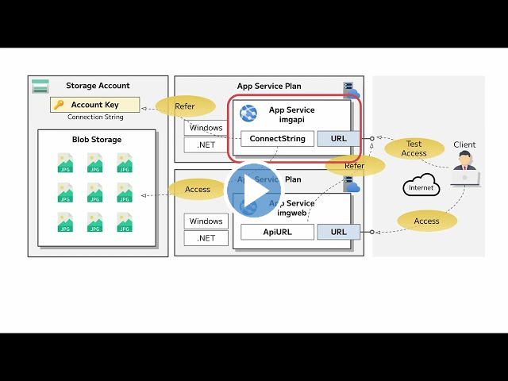
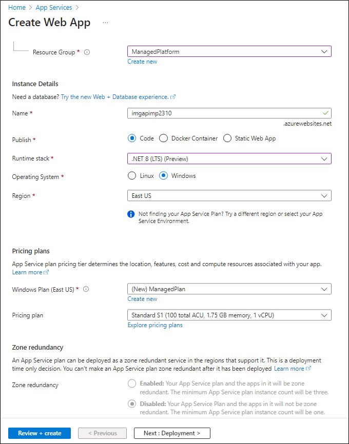
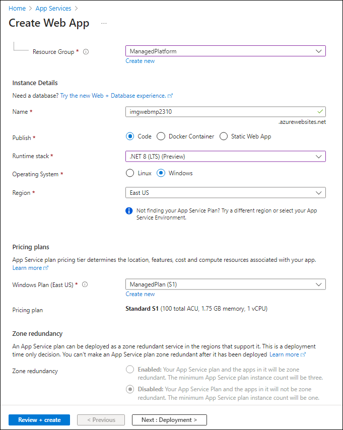

---
lab:
  az204Title: 'Lab 01: Build a web application on Azure platform as a service offerings'
  az204Module: 'Learning Path 01: Implement Azure App Service Web Apps'
---

# Laboratório 01: Criar um aplicativo Web na oferta de plataforma como serviço do Azure

## Interface de usuário do Microsoft Azure

Dada a natureza dinâmica das ferramentas de nuvem da Microsoft, você pode se deparar com alterações na IU do Azure que ocorram após o desenvolvimento deste conteúdo do treinamento. Como resultado, as instruções do laboratório e as etapas do laboratório podem não estar alinhadas corretamente.

A Microsoft atualiza este curso de treinamento quando a comunidade nos alerta sobre as alterações necessárias. No entanto, as atualizações na nuvem ocorrem com frequência, portanto você pode encontrar alterações na interface de usuário antes que esse conteúdo de treinamento seja atualizado. **Se isso ocorrer, adapte-se às alterações e trabalhe com elas nos laboratórios, conforme necessário.**

## Instruções

### Antes de começar

#### Entrar no ambiente de laboratório

Entre na máquina virtual (VM) do Windows 11 usando as seguintes credenciais:

- Nome de usuário: `Admin`
- Senha: `Pa55w.rd`

> **Observação**: Seu instrutor fornecerá instruções para se conectar ao ambiente de laboratório virtual.

#### Examinar os aplicativos instalados

Localize a barra de tarefas na área de trabalho do Windows 11. A barra de tarefas contém os ícones dos aplicativos que você usará neste laboratório, incluindo:

- Microsoft Edge
- Explorador de Arquivos
- Terminal
- Visual Studio Code

## Cenário do laboratório

Neste laboratório, você explorará como criar um aplicativo Web no Azure usando o modelo de PaaS. Depois que o aplicativo Web for criado, você aprenderá a carregar arquivos de aplicativo Web existentes usando a opção de implantação zip do Apache Kudu. Em seguida, você exibirá e testará o aplicativo Web recém-implantado.

<em>Veja este vídeo clicando com o botão direito do mouse neste **[link de vídeo](https://youtu.be/EiSEcU9qjfo)** e selecione “Abrir link em uma nova guia / nova janela”.</em>



## Diagrama de arquitetura


### Exercício 1: Criar uma API de back-end usando o Armazenamento do Azure e o recurso Aplicativos Web do Serviço de Aplicativo do Azure

#### Tarefa 1: Abrir o portal do Azure

1. Na barra de tarefas, selecione o ícone **Microsoft Edge**.

1. Na janela do navegador, navegue até o portal do Azure em `https://portal.azure.com` e entre com a conta que você usará neste laboratório.

   > **Observação**: Se esta for a primeira vez que entra no portal do Azure, você receberá um tour pelo portal. Se preferir ignorar o tour, selecione **Talvez mais tarde** para começar a usar o portal.

#### Tarefa 2: Criar uma conta de armazenamento

1. No portal do Azure, use a caixa de texto **Pesquisar recursos, serviços e documentos** para procurar por **Contas de armazenamento** e, na lista de resultados, selecione **Contas de armazenamento**.

1. Na folha **Contas de armazenamento** , selecione **+ Criar**.

1. Na folha **Criar uma conta de armazenamento** , na guia **Básico**, realize as ações a seguir e selecione **Examinar**:

   | Configuração                           | Ação                                                                   |
   | --------------------------------- | ------------------------------------------------------------------------ |
   | Lista suspensa **Assinatura**   | Manter o valor padrão                                                 |
   | Seção **Grupo de recursos**        | Selecionar **Criar novo**, inserir **ManagedPlatform** e selecionar **OK** |
   | Caixa de texto **Nome da conta de armazenamento**  | Inserir **imgstor**_[yourname]_                                            |
   | Lista suspensa **Região**         | Selecione **(EUA) Leste dos EUA**                                                  |
   | Seção **Desempenho**           | Selecione a opção **Padrão**                                           |
   | Lista suspensa **Redundância**     | Selecione **LRS (Armazenamento com redundância local)**                               |

   A captura de tela a seguir exibe as configurações definidas na guia **Básico** da folha **Criar uma conta de armazenamento**.

   

1. Na guia **Revisão**, revise as opções selecionadas nas etapas anteriores.

1. Selecione **Criar** para criar a conta de armazenamento usando a configuração especificada.

   > **Observação**: Aguarde a conclusão da tarefa de criação antes de prosseguir neste laboratório.

1. Na folha **Visão Geral**, selecione o botão **Ir para o recurso** para navegar até a folha da conta de armazenamento recém-criada.

1. Na folha **Conta de armazenamento** , na seção **Segurança + rede** , selecione **Chaves de acesso**.

1. Na folha **Chaves de acesso** , examine qualquer uma das **Cadeias de conexão** (usando o botão **Mostrar**) e registre o valor de qualquer uma das caixas de **Cadeia de conexão** no Bloco de Notas. As **Chave**s são chaves de criptografia gerenciadas por plataforma e **não** são usadas para este laboratório.

   > **Observação**: Não importa qual cadeia de conexão você escolher. Eles são intercambiáveis.

1. Abra o Bloco de notas e, em seguida, cole nele o valor de cadeia de conexão copiado. Você usará esse valor mais adiante no laboratório.

#### Tarefa 3: carregar um blob de amostra

1. Na folha **Conta de armazenamento**, na seção **Armazenamento de dados**, selecione o link **Contêineres**.

1. Na folha **Contêineres**, selecione **+ Contêiner**.

1. Na janela **Novo contêiner**, realize as seguintes ações e selecione **Criar**.

   | Configuração                         | Ação                                                               |
   | ------------------------------- | -------------------------------------------------------------------- |
   | Caixa de texto **Nome**               | Inserir **imagens**                                                     |

1. Na folha **Contêineres**, navegue até o contêiner de **imagens** recém-criado.

1. Na folha **imagens**, selecione **Carregar**.

1. Na janela **Carregar blob**, realize as seguintes ações:

   | Configuração                                        | Ação                                                                                                                            |
   | ---------------------------------------------- | --------------------------------------------------------------------------------------------------------------------------------- |
   | Seção **Arquivos**                              | Selecionar **Procurar arquivos** ou usar o recurso de arrastar e soltar                                                                      |
   | Janela **Explorador de Arquivos**                       | Navegar até **Allfiles (F):\\Allfiles\\Labs\\01\\Starter\\Images**, selecionar o arquivo **grilledcheese.jpg** e, então, selecionar **Abrir** |
   | Caixa de seleção **Substituir se arquivos já existirem** | Marcar a caixa de seleção e, em seguida, selecionar **Carregar**                                                                 |

   > **Observação**: aguarde o carregamento do blob antes de continuar com este laboratório.

#### Tarefa 4: Criar um aplicativo Web

1. No painel de navegação do portal do Azure, selecione **Criar um recurso**.

1. Na folha **Criar um recurso **na caixa de texto **serviço Pesquisa e marketplace**, digite **Aplicativo Web** e selecione Enter.

1. Na folha de resultados da pesquisa em **Marketplace**, selecione o resultado **Aplicativo Web**.

1. Na folha **Aplicativo Web**, selecione **Criar**.

1. Na folha **Criar Aplicativo Web**, na guia **Básico**, execute as seguintes ações e selecione a guia **Monitoramento**:

   | Configuração                            | Ação                                                                                                  |
   | ---------------------------------- | ------------------------------------------------------------------------------------------------------- |
   | Lista suspensa **Assinatura**    | Manter o valor padrão                                                                                |
   | Seção **Grupo de recursos**         | Selecionar **ManagedPlatform**                                                                              |
   | Caixa de texto**Nome**                   | Inserir **imgapi**_[yourname]_                                                                            |
   | Seção **Publicar**                | Selecione **Código**                                                                                         |
   | Lista suspensa**Pilha de runtime**   | Selecione **.NET 8 (LTS)**                                                                                 |
   | Seção **Sistema operacional**       | Selecione **Windows**                                                                                      |
   | Lista suspensa **Região**          | Selecionar a região **Leste dos EUA**                                                                           |
   | Seção**Plano do Windows (Leste dos EUA)** | Selecionar **Criar novo**, inserir o valor **ManagedPlan** na caixa de texto **Nome** e selecionar **OK** |
   | Seção **Plano de preços**           | Selecionar **Standard S1**                                                                                  |

   A captura de tela a seguir exibe as configurações definidas na folha **Criar aplicativo Web**.

   

1. Na guia **Monitoramento**, na seção **Habilitar o Application Insights**, selecione **Não** e, em seguida, selecione **Revisar + criar**.

1. Na guia **Revisar + criar**, revise as opções selecionadas nas etapas anteriores.

1. Selecione **Criar** para criar o aplicativo Web usando a configuração especificada.

   > **Observação**: Aguarde a criação da aplicativo Web antes de avançar neste laboratório.

1. Na folha **Visão Geral**, selecione o botão **Ir para o recurso** para navegar até a folha do aplicativo Web recém-criado.

#### Tarefa 5: Configurar o aplicativo Web

1. Na folha **Serviço de Aplicativo**, na seção **Configurações**, selecione o link **Configuração**.

1. Se você tiver a guia **Configurações do Aplicativo** na seção **Configuração**, execute as seguintes ações, selecione **Salvar** e selecione **Continuar**.

   | Configuração                                        | Ação                                                                                                                  |
   | ---------------------------------------------- | ----------------------------------------------------------------------------------------------------------------------- |
   | Guia **Configurações de aplicativo**                   | Selecione **+ Nova configuração de aplicativo**                                                                                    |
   | Diálogo pop-up **Adicionar/Editar configuração de aplicativo** | Na caixa de texto **Nome** inserir **StorageConnectionString**                                                             |
   | Caixa de texto **Valor**                             | Colar a cadeia de conexão de armazenamento copiada anteriormente para o Bloco de notas                                               |
   | Caixa de seleção **Configuração do slot de implantação**          | Manter o valor padrão e selecionar **OK** para fechar a caixa de diálogo pop-up e retornar à seção **Configuração** |
   | Clique em **Salvar** no menu superior                | Isso salvará o valor de configuração que você acabou de inserir |

   Aguarde até que as configurações do aplicativo sejam salvas antes de avançar neste laboratório.

1. Se você não tiver a guia **Configurações do aplicativo** na seção **Configuração**, verifique se você tem o link **variáveis de ambiente** na seção **Configurações**, selecione-a e execute as seguintes ações:

   | Configuração                                        | Ação                                                                                                                  |
   | ---------------------------------------------- | ----------------------------------------------------------------------------------------------------------------------- |
   | Guia **Configurações do aplicativo**                           |  Selecionar                                                                                                                 |
   | Primeira caixa de texto disponível na coluna **Nome** |  **StorageConnectionString**                                                                                            |   
   | Caixa de texto na coluna **Valor**                | Colar a cadeia de conexão de armazenamento copiada anteriormente para o Bloco de notas                                               |
   | Clique em **Aplicar** na parte inferior                  | Isso abrirá o pop-up de confirmação                                                                                  | 
   | Clique em **Confirmar** na Po-up confirmatioj | Isso salvará o valor de configuração que você acabou de inserir |

   Aguarde até que as configurações do aplicativo sejam salvas antes de avançar neste laboratório.

1. Na folha **Serviço de aplicativo**, na seção Configurações, selecione o link **Propriedades** para exibir mais informações sobre Serviços de Aplicativos.

1. Para obter a URL do Serviço de Aplicativo, vá para o link **Visão Geral**, copie o valor da seção **Domínio padrão** e cole-o no Bloco de notas. Acrescente `https://` ao início do nome de domínio no Bloco de notas. Você usará esse valor mais adiante no laboratório.

   > **Observação**: Neste ponto, o servidor Web nesta URL devolverá uma página da Web de espaço reservado. Você ainda não implantou nenhum código no aplicativo Web. Você implantará o código no aplicativo Web mais adiante no laboratório.

#### Tarefa 6: Implantar um aplicativo Web `ASP.NET` nos Aplicativos Web

1. Na barra de tarefas, selecione o ícone **Visual Studio Code**.

1. No menu **Arquivo**, selecione **Abrir Pasta**.

1. Na janela **Explorador de Arquivos**, navegue até **Allfiles (F):\\Allfiles\\Labs\\01\\Starter\\API** e selecione **Selecionar Pasta**.

   > **Observação**: Ignore todos os prompts para adicionar ativos necessários para compilar e depurar e para executar o comando restaurar para lidar com dependências não resolvidas.

1. No painel  **Explorer** da janela **Visual Studio Code**, expanda a pasta **Controladores** e selecione o arquivo **ImagesController.cs** para abrir o arquivo no editor.

1. No editor, na classe **ImagesController** na linha 26, observe o método **GetCloudBlobContainer** e o código usado para recuperar um contêiner.

1. Na classe **ImagesController** na linha 36, observe o método **Get** e o código usado para recuperar de forma assíncrona todos os blobs do contêiner **imagens**.

1. Na classe **ImagesController** na linha 68, observe o método **Post** e o código usado para persistir uma imagem carregada no Armazenamento.

1. Na barra de tarefas, selecione o ícone de **Terminal**.

1. No terminal aberto, insira o seguinte comando e selecione Enter para entrar na CLI (Interface de Linha de Comando) do Azure:

   ```
   az login
   ```

1. Na janela do navegador do **Microsoft Edge**, insira o endereço de email e a senha da sua conta Microsoft e selecione **Entrar**.

1. Retorne à janela do **Terminal** aberta no momento. Aguarde a conclusão do processo de credenciais.

1. No terminal, insira o seguinte comando e selecione Enter para listar todos os aplicativos em seu grupo de recursos **ManagedPlatform**:

   ```
   az webapp list --resource-group ManagedPlatform
   ```

1. Insira o seguinte comando e selecione Inserir para localizar os aplicativos que têm o prefixo **imgapi\***:

   ```
   az webapp list --resource-group ManagedPlatform --query "[?starts_with(name, 'imgapi')]"
   ```

1. Insira o seguinte comando e selecione Inserir para processar apenas o nome do aplicativo simples que tem o prefixo **imgapi\***:

   ```
   az webapp list --resource-group ManagedPlatform --query "[?starts_with(name, 'imgapi')].{Name:name}" --output tsv
   ```

1. Insira o seguinte comando e selecione Inserir para alterar o diretório atual para o diretório **Allfiles (F):\\Allfiles\\Labs\\01\\Starter\\API** que contém os arquivos de laboratório:

   ```
   cd F:\Allfiles\Labs\01\Starter\API\
   ```

1. Insira o seguinte comando e selecione Inserir para implantar o arquivo **api.zip** no aplicativo Web criado anteriormente neste laboratório:

   ```
   az webapp deployment source config-zip --resource-group ManagedPlatform --src api.zip --name <name-of-your-api-app>
   ```

   > **Observação**: Substitua o espaço reservado *\<name-of-your-api-app\>* pelo nome do aplicativo Web criado anteriormente neste laboratório. Você consultou recentemente o nome deste aplicativo nas etapas anteriores.

   Aguarde a conclusão da implantação antes de continuar com este laboratório.

1. No painel de **navegação** do portal do Azure, selecione o link **Grupos de recursos**.

1. Na folha **Grupos de recursos**, selecione o grupo de recursos **ManagedPlatform** criado anteriormente neste laboratório.

1. Na folha **ManagedPlatform**, selecione o aplicativo Web **imgapi**_[yourname]_ criado anteriormente neste laboratório.

1. Na folha **Serviço de Aplicativo**, selecione **Procurar**.

   > **Observação**: O comando **Procurar** executará uma solicitação GET para a raiz do site, que devolve uma matriz JSON (JavaScript Object Notation). Essa matriz deve conter a URL da única imagem carregada na conta de armazenamento.

1. Retorne à janela do navegador que contém o portal do Azure.

1. Feche os aplicativos do Visual Studio Code e terminal em execução no momento.

#### Revisão

Neste exercício, você criou um aplicativo Web no Azure e implantou seu aplicativo Web `ASP.NET` nos Aplicativos Web usando a CLI do Azure e o utilitário de implantação de arquivo zip Apache Kudu.

### Exercício 2: Criar um aplicativo Web de front-end usando os Aplicativos Web do Azure

#### Tarefa 1: Criar um aplicativo Web

1. No painel de **navegação** do portal do Azure, selecione **Criar um recurso**.

1. Na folha **Criar um recurso **na caixa de texto **serviço Pesquisa e marketplace**, digite **Aplicativo Web** e selecione Enter.

1. Na folha de resultados da pesquisa em **Marketplace**, selecione **Aplicativo Web**.

1. Na folha **Aplicativo Web**, selecione **Criar**.

1. Na folha **Criar Aplicativo Web**, na guia **Básico**, execute as seguintes ações e selecione a guia **Monitoramento**:

   | Configuração                            | Ação                        |
   | ---------------------------------- | ----------------------------- |
   | Lista suspensa **Assinatura**    | Manter o valor padrão      |
   | Seção **Grupo de recursos**         | Selecionar **ManagedPlatform**    |
   | Caixa de texto**Nome**                   | Inserir **imgweb**_[yourname]_  |
   | Seção **Publicar**                | Selecione **Código**               |
   | Lista suspensa**Pilha de runtime**   | Selecione **.NET 8 (LTS)**       |
   | Seção **Sistema operacional**       | Selecione **Windows**            |
   | Lista suspensa **Região**          | Selecionar a região **Leste dos EUA** |
   | Seção**Plano do Windows (Leste dos EUA)** | Selecionar **ManagedPlan (S1)**   |

A captura de tela a seguir exibe as configurações definidas na folha **Criar aplicativo Web**.



1. Na guia **Monitoramento**, na seção **Habilitar o Application Insights**, selecione **Não** e, em seguida, selecione **Revisar + criar**.

1. Na guia **Revisar + criar**, revise as opções selecionadas nas etapas anteriores.

1. Selecione **Criar** para criar o aplicativo Web usando a configuração especificada.

   > **Observação**: Aguarde a conclusão da tarefa de criação antes de avançar neste laboratório.

1. Na folha **Visão Geral**, selecione o botão **Ir para o recurso** para navegar até a folha do aplicativo Web recém-criado.

#### Tarefa 2: Configurar um aplicativo Web

1. Na folha **Serviço de Aplicativo**, na seção **Configurações**, selecione o link **Configuração**.

1. Na seção **Configuração**, realize as seguintes ações, selecione **Salvar** e, em seguida, selecione **Continuar**:

   | Configuração                                        | Ação                                                                                                                                                                                                     |
   | ---------------------------------------------- | ---------------------------------------------------------------------------------------------------------------------------------------------------------------------------------------------------------- |
   | Guia **Configurações de aplicativo**                   | Selecionar **Nova configuração de aplicativo**                                                                                                                                                                         |
   | Diálogo pop-up **Adicionar/Editar configuração de aplicativo** | Na caixa de texto **Nome** inserir **ApiUrl**                                                                                                                                                                 |
   | Caixa de texto **Valor**                             | Insira a URL do aplicativo Web copiada anteriormente neste laboratório. **Observação**: Verifique se incluiu o protocolo **https://**, na URL que copiar para a caixa de texto **Valor** desta configuração de aplicativo |
   | Caixa de seleção **Configuração do slot de implantação**          | Manter o valor padrão e selecionar **OK**                                                                                                                                                           |
   | Clique em **Salvar** no menu superior                | Isso salvará o valor de configuração que você acabou de inserir |

   > **Observação**: Aguarde até que as configurações do aplicativo sejam salvas antes de avançar neste laboratório.

#### Tarefa 3: Implantar um aplicativo Web `ASP.NET` nos Aplicativos Web

1. Na barra de tarefas, selecione o ícone **Visual Studio Code**.

1. No menu **Arquivo**, selecione **Abrir Pasta**.

1. Na janela **Explorador de Arquivos**, navegue até **Allfiles (F):\\Allfiles\\Labs\\01\\Starter\\Web** e selecione **Selecionar Pasta**.

   > **Observação**: Ignore todos os prompts para adicionar ativos necessários para compilar e depurar e para executar o comando restaurar para lidar com dependências não resolvidas.

1. No painel  **Explorer** da janela **Visual Studio Code**, expanda a pasta **Páginas** e selecione o arquivo **Index.cshtml.cs** para abrir o arquivo no editor.

1. No editor, na classe **IndexModel** na linha 30, observe o método **OnGetAsync** e o código usado para recuperar a lista de imagens da API.

1. Na classe **IndexModel** na linha 41, observe o método **OnPostAsync** e o código usado para transmitir uma imagem carregada para a API de back-end.

1. Na barra de tarefas, selecione o ícone de **Terminal**.

1. No terminal aberto, insira o seguinte comando e selecione Enter para entrar na CLI do Azure:

   ```
   az login
   ```

1. Na janela do navegador do **Microsoft Edge**, insira o endereço de email e a senha da sua conta Microsoft e selecione **Entrar**.

1. Retorne à janela do **Terminal** aberta no momento. Aguarde a conclusão do processo de credenciais.

1. Insira o seguinte comando e selecione Inserir para listar todos os aplicativos no grupo de recursos **ManagedPlatform**:

   ```
   az webapp list --resource-group ManagedPlatform
   ```

1. Insira o seguinte comando e selecione Inserir para localizar os aplicativos que têm o prefixo **imgweb\***:

   ```
   az webapp list --resource-group ManagedPlatform --query "[?starts_with(name, 'imgweb')]"
   ```

1. Insira o seguinte comando e selecione Inserir para processar apenas o nome do aplicativo simples que tem o prefixo **imgweb\***:

   ```
   az webapp list --resource-group ManagedPlatform --query "[?starts_with(name, 'imgweb')].{Name:name}" --output tsv
   ```

1. Insira o seguinte comando e selecione Inserir para alterar o diretório atual para o diretório **Allfiles (F):\\Allfiles\\Labs\\01\\Starter\\Web** que contém os arquivos de laboratório:

   ```
   cd F:\Allfiles\Labs\01\Starter\Web\
   ```

1. Insira o seguinte comando e selecione Inserir para implantar o arquivo **web.zip** no aplicativo Web criado anteriormente neste laboratório:

   ```
   az webapp deployment source config-zip --resource-group ManagedPlatform --src web.zip --name <name-of-your-web-app>
   ```

   > **Observação**: Substitua o espaço reservado *\<name-of-your-web-app\>* pelo nome do aplicativo Web criado anteriormente neste laboratório. Você consultou recentemente o nome deste aplicativo nas etapas anteriores.

   Aguarde a conclusão da implantação antes de continuar com este laboratório.

1. No painel de **navegação** do portal do Azure, selecione **Grupos de recursos**.

1. Na folha **Grupos de recursos**, selecione o grupo de recursos **ManagedPlatform** criado anteriormente neste laboratório.

1. Na folha **ManagedPlatform**, selecione o aplicativo Web **imgweb**_[yourname]_ criado anteriormente neste laboratório.

1. Na folha **Serviço de Aplicativo**, selecione **Procurar**.

1. Observe a lista de imagens na galeria. A galeria deve listar uma única imagem, que foi carregada no armazenamento anteriormente no laboratório.

1. Na página da Web **Contoso Photo Gallery**, na seção **Carregar uma nova imagem**, realize as seguintes ações:

   a. Selecione **Procurar**.

   b. Na janela do **Explorador de Arquivos**, navegue até **Allfiles (F):\\Allfiles\\Labs\\01\\Starter\\Images**, selecione o arquivo **banhmi.jpg** e, então, selecione **Abrir**.

   c. Escolha **Carregar**.

1. Observe que a lista de imagens da galeria foi atualizada com sua nova imagem.

   > **Observação**: Em alguns casos raros, talvez seja necessário atualizar a janela do navegador para recuperar a imagem nova.

1. Retorne à janela do navegador que contém o portal do Azure.

1. Feche os aplicativos do Visual Studio Code e terminal em execução no momento.

#### Revisão

Neste exercício, você criou um aplicativo Web do Azure e implantou o código de um aplicativo Web existente no recurso na nuvem.
