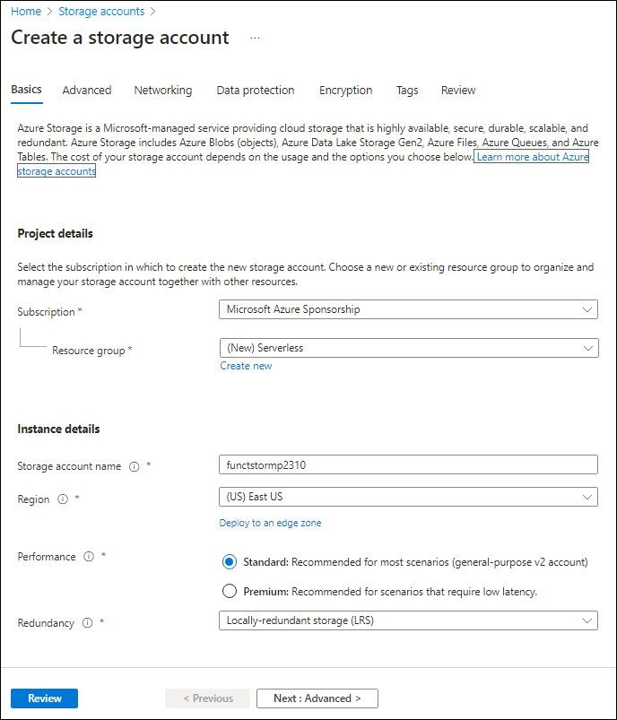

---
lab:
  az204Title: 'Lab 02: Implement task processing logic by using Azure Functions'
  az204Module: 'Learning Path 02: Implement Azure Functions'
---

# Laboratório 02: Implementar lógica de processamento de tarefas usando o Azure Functions

## Interface de usuário do Microsoft Azure

Dada a natureza dinâmica das ferramentas de nuvem da Microsoft, você pode se deparar com alterações na IU do Azure que ocorram após o desenvolvimento deste conteúdo do treinamento. Como resultado, as instruções do laboratório e as etapas do laboratório podem não estar alinhadas corretamente.

A Microsoft atualiza este curso de treinamento quando a comunidade nos alerta sobre as alterações necessárias. No entanto, as atualizações na nuvem ocorrem com frequência, portanto você pode encontrar alterações na interface de usuário antes que esse conteúdo de treinamento seja atualizado. **Se isso ocorrer, adapte-se às alterações e trabalhe com elas nos laboratórios, conforme necessário.**

## Instruções

### Antes de começar

#### Entrar no ambiente de laboratório

Entre na máquina virtual (VM) do Windows 11 usando as seguintes credenciais:

- Nome de usuário: `Admin`
- Senha: `Pa55w.rd`

> **Observação**: Seu instrutor fornecerá instruções para se conectar ao ambiente de laboratório virtual.

#### Examinar os aplicativos instalados

Localize a barra de tarefas na área de trabalho do Windows 11. A barra de tarefas contém os ícones dos aplicativos que você usará neste laboratório, incluindo:

- Microsoft Edge
- Explorador de Arquivos
- Terminal
- Visual Studio Code

## Cenário do laboratório

Neste laboratório, você demonstrará a capacidade de criar uma função simples do Azure que ecoa o texto inserido e enviado para a função usando comandos HTTP POST. Isso ilustrará como a função pode ser disparada por HTTP. 

Além disso, você demonstrará como executar uma função do Azure configurando-a para ser executada em um cronograma fixo. A função gravará uma mensagem em um log cada vez que o cronograma for disparado.

Por fim, você demonstrará como uma função do Azure pode se conectar a outros recursos do Azure, tais como uma conta de armazenamento. A função se conectará a uma conta de armazenamento criada por você e devolverá o conteúdo de um arquivo armazenado na conta de armazenamento do Azure.

<em>Veja este vídeo clicando com o botão direito do mouse neste **[link de vídeo](https://youtu.be/-3tneDvkYDo)** e selecione “Abrir link em uma nova guia / nova janela”.</em>

 

### Diagrama de arquitetura


### Exercício 1: Criar recursos do Azure

#### Tarefa 1: Abrir o portal do Azure

1. Na barra de tarefas, selecione o ícone **Microsoft Edge**.
1. Na janela do navegador, navegue até o portal do Azure em `https://portal.azure.com` e entre com a conta que você usará neste laboratório.

    > **Observação**: Se esta for a primeira vez que entra no portal do Azure, você receberá um tour pelo portal. Se preferir ignorar o tour, selecione **Introdução** para começar a usar o portal.

#### Tarefa 2: Criar uma conta de armazenamento do Azure

1. No portal do Azure, use a caixa de texto **Pesquisar recursos, serviços e documentos** para procurar por **Contas de armazenamento** e, na lista de resultados, selecione **Contas de armazenamento**.

1. Na folha **Contas de armazenamento** , selecione **+ Criar**.

1. Na folha **Criar uma conta de armazenamento**, na guia **Básico**, realize as ações a seguir e, em seguida, selecione **Examinar**:

    | Configuração | Ação |
    | -- | -- |
    | Lista suspensa **Assinatura** | Manter o valor padrão |
    | Seção **Grupo de recursos** | Selecionar **Criar novo**, inserir **Sem servidor** e selecionar **OK** |
    | Caixa de texto **Nome da conta de armazenamento**  | Inserir **funcstor**_[yourname]_ |
    | Lista suspensa **Região** | Selecione **(EUA) Leste dos EUA** |
    | Seção **Desempenho** | Selecione a opção **Padrão** |
    | Lista suspensa **Redundância** | Selecione **LRS (Armazenamento com redundância local)** |

    A captura de tela a seguir exibe as configurações definidas na folha **Criar uma conta de armazenamento**.

    

1. Na guia **Revisão**, revise as opções selecionadas nas etapas anteriores.

1. Selecione **Criar** para criar a conta de armazenamento usando a configuração especificada.

    > **Observação**: Aguarde a conclusão da tarefa de criação antes de prosseguir neste laboratório.

1. Na folha **Visão Geral**, selecione o botão **Ir para o recurso** para navegar até a folha da conta de armazenamento recém-criada.

1. Na folha **Conta de armazenamento** , na seção **Segurança + rede** , selecione **Chaves de acesso**.

1. Na folha **Chaves de acesso** , selecione **Mostrar chaves**.

1. Na folha **Chaves de acesso** , examine qualquer uma das **Cadeias de conexão** (usando o botão **Mostrar**) e registre o valor de qualquer uma das caixas de **Cadeia de conexão** no Bloco de Notas. As **Chave**s são chaves de criptografia gerenciadas por plataforma e **não** são usadas para este laboratório.

   > **Observação**: Não importa qual cadeia de conexão você escolher. Eles são intercambiáveis.

1. Abra o Bloco de notas e, em seguida, cole nele o valor de cadeia de conexão copiado. Você usará esse valor mais adiante no laboratório.

#### Tarefa 3: Criar um aplicativo de funções

1. No painel de navegação do portal do Azure, selecione o link **Criar um recurso**.

1. Na folha **Criar um recurso** na caixa de texto **serviço Pesquisa e marketplace**, insira **Função** e selecione Enter.

1. Na folha de resultados da pesquisa em **Marketplace**, selecione o resultado **Instâncias de Aplicativo de funções**.

1. Na folha **Aplicativo de funções**, selecione **Criar**.

1. Na folha **Criar aplicativo de funções**, na guia **Básico**, realize as seguintes ações e selecione **Avançar: Armazenamento**:

    | Configuração | Ação |
    | -- | -- |
    | Lista suspensa **Assinatura** | Manter o valor padrão |
    | Seção **Grupo de recursos** | Selecionar **Sem servidor**. |
    | Caixa de texto **Nome do aplicativo de funções**  | Inserir **funclogic**_[yourname]_ |
    | Seção **Publicar** | Selecione **Código** |
    | Lista suspensa**Pilha de runtime** | Selecionar **.NET** |
    | Lista suspensa **Versão** | Selecione **8 (LTS), modelo de trabalho isolado ** |
    | Lista suspensa **Região** | Selecionar a região **Leste dos EUA** |
    | Opção **Sistema operacional** | Selecione **Linux** |
    | Lista suspensa **Tipo de plano** | Selecionar **Consumo (sem servidor)** |

    A captura de tela a seguir exibe as configurações definidas na folha **Criar aplicativo de funções**.

    

1. Na guia **Armazenamento**, realize as seguintes ações e selecione **Revisar + criar**:

    | Configuração | Ação |
    | -- | -- |
    | Lista suspensa **Conta de armazenamento** | Selecionar a conta de armazenamento **funcstor**_[yourname]_ |

1. Na guia **Revisar + criar**, revise as opções selecionadas nas etapas anteriores.

1. Selecione **Criar** para criar o aplicativo de funções usando a configuração especificada.

    > **Observação**: Aguarde a conclusão da tarefa de criação antes de avançar neste laboratório.

#### Revisão

Neste exercício, você criou todos os recursos que usará neste laboratório.

### Exercício 2: Configurar um projeto do Azure Functions local

#### Tarefa 1: Inicializar um projeto de função

1. Na barra de tarefas, selecione o ícone de **Terminal**.

1. Execute o seguinte comando para alterar o diretório atual para o diretório vazio **Allfiles (F):\\Allfiles\\Labs\\02\\Starter\\func**:

    ```powershell
    cd F:\Allfiles\Labs\02\Starter\func
    ```

    > **Observação**: No Windows Explorer, remova o atributo **Somente leitura** do arquivo **F:\\Allfiles\\Labs\\02\\Starter\\func\\.gitignore**.

1. Execute o seguinte comando para usar o **Azure Functions Core Tools** para criar um novo projeto local do Azure Functions no diretório atual usando o runtime **dotnet-isolated**:

    ```powershell
    func init --worker-runtime dotnet-isolated --target-framework net8.0 --force
    ```

    > **Observação**: Você pode examinar a documentação para [create a new project][azure-functions-core-tools-new-project] usando **Azure Functions Core Tools**.
    
1. Close the **Terminal** application.

#### Tarefa 2: Configurar uma cadeia de conexão

1. Na tela **inicial**, selecione o bloco **Visual Studio Code**.
1. No menu **Arquivo**, selecione **Abrir Pasta**.
1. Na janela **Explorador de Arquivos** que se abre, navegue até **Allfiles (F):\\Allfiles\\Labs\\02\\Starter\\func** e selecione **Selecionar Pasta**.
1. No painel **Explorer** da janela do **Visual Studio Code**, abra o arquivo **local.settings.json**.
1. Observe o valor atual da configuração **AzureWebJobsStorage**:

    ```json
    "AzureWebJobsStorage": "UseDevelopmentStorage=true",
    ```

1. Altere o valor do elemento **AzureWebJobsStorage** para a **cadeia de conexão** da conta de armazenamento registrada anteriormente neste laboratório.
1. Salve o arquivo **local.settings.json**.

#### Tarefa 3: Compilar e validar um projeto

1. Na barra de tarefas, selecione o ícone de **Terminal**.
1. Execute o seguinte comando para alterar o diretório atual para o diretório **Allfiles (F):\\Allfiles\\Labs\\02\\Starter\\func**:

    ```powershell
    cd F:\Allfiles\Labs\02\Starter\func
    ```

1. Execute o seguinte comando para **compilação** do projeto do .NET:

    ```powershell
    dotnet build
    ```

#### Revisão

Neste exercício, você criou um projeto local que usará para o desenvolvimento do Azure Functions.

### Exercício 3: Criar uma função disparada por uma solicitação HTTP

#### Tarefa 1: Criar uma função disparada por HTTP

1. Na barra de tarefas, selecione o ícone de **Terminal**.
1. Execute o seguinte comando para alterar o diretório atual para o diretório **Allfiles (F):\\Allfiles\\Labs\\02\\Starter\\func**:

    ```powershell
    cd F:\Allfiles\Labs\02\Starter\func
    ```

1. Execute o comando a seguir para usar **Azure Functions Core Tools** para criar uma nova função chamada **Eco** usando o modelo de **gatilho de HTTP**:

    ```powershell
    func new --template "HTTP trigger" --name "Echo"
    ```

    > **Observação**: você pode examinar a documentação para [create a new function][azure-functions-core-tools-new-function] usando **Azure Functions Core Tools**.

1. Feche o aplicativo de **Terminal** em execução no momento.

#### Tarefa 2: Gravar código de função disparado por HTTP

1. Na tela **inicial**, selecione o bloco **Visual Studio Code**.
1. No menu **Arquivo**, selecione **Abrir Pasta**.
1. Na janela **Explorador de Arquivos** que se abre, navegue até **Allfiles (F):\\Allfiles\\Labs\\02\\Starter\\func** e selecione **Selecionar Pasta**.
1. No painel **Explorer** da janela do **Visual Studio Code**, abra o arquivo **Echo.cs**.

1. Exclua todo o conteúdo do arquivo **Echo.cs** e adicione o código a seguir. Ele define uma função disparada por HTTP chamada "Echo" que recebe uma solicitação POST e retorna o corpo da solicitação. A interface ILogger também é usada para registrar informações em log. Essa função pode ser usada para testar solicitações e respostas HTTP.

    ```csharp
    using System.Net;
    using Microsoft.Azure.Functions.Worker;
    using Microsoft.Azure.Functions.Worker.Http;
    using Microsoft.Extensions.Logging;
    
    namespace func
    {
        public class Echo
        {
            private readonly ILogger _logger;

            public Echo(ILoggerFactory loggerFactory)
            {
                _logger = loggerFactory.CreateLogger<Echo>();
            }

            [Function("Echo")]
            public HttpResponseData Run([HttpTrigger(AuthorizationLevel.Function, "get", "post")] HttpRequestData req)
            {
                _logger.LogInformation("C# HTTP trigger function processed a request.");

                var response = req.CreateResponse(HttpStatusCode.OK);
                response.Headers.Add("Content-Type", "text/plain; charset=utf-8");

                StreamReader reader = new StreamReader(req.Body);
                string requestBody = reader.ReadToEnd();
                response.WriteString(requestBody);

                return response;
            }
        }
    }
    ```

1. Selecione **Salvar** para salvar as alterações no arquivo **Echo.cs**.

#### Tarefa 3: Testar a função disparada por HTTP usando curl

1. Na barra de tarefas, selecione o ícone de **Terminal**.
1. Execute o seguinte comando para alterar o diretório atual para o diretório **Allfiles (F):\\Allfiles\\Labs\\02\\Starter\\func**:

    ```powershell
    cd F:\Allfiles\Labs\02\Starter\func
    ```

1. Execute o seguinte comando para executar o projeto de aplicativo de funções:

    ```powershell
    func start --build
    ```

    > **Observação**: Você pode examinar a documentação para [iniciar o projeto do aplicativo de funções localmente](https://docs.microsoft.com/azure/azure-functions/functions-develop-local) usando **Azure Functions Core Tools**.
    
1. No computador do laboratório, inicie um **Prompt de comando**.

1. Execute o seguinte comando para executar o teste da chamada à API REST **POST** em `http://localhost:7071/api/echo` com o corpo da solicitação HTTP definido como um valor numérico de **3**:

   ```powershell
   curl -X POST -i http://localhost:7071/api/echo -d 3
   ```

1. Execute o seguinte comando para testar a chamada à API REST **POST** em `http://localhost:7071/api/echo` com o corpo da solicitação HTTP definido como um valor numérico de **5**:

   ```powershell
   curl -X POST -i http://localhost:7071/api/echo -d 5
   ```

1. Execute o seguinte comando para testar a chamada à API REST **POST** em `http://localhost:7071/api/echo` com o corpo da solicitação HTTP definido como um valor de cadeia de caracteres de **Hello**:

   ```powershell
   curl -X POST -i http://localhost:7071/api/echo -d "Hello"
   ```

1. Execute o seguinte comando para testar a chamada à API REST **POST** em `http://localhost:7071/api/echo` com o corpo da solicitação HTTP definido como um valor JSON (JavaScript Object Notation) de **{"msg": "Bem-sucedido"}**:

   ```powershell
   curl -X POST -i http://localhost:7071/api/echo -d "{"msg": "Successful"}"
   ```

1. Feche todas as instâncias em execução no momento do aplicativo **Terminal** e o aplicativo **Prompt de comando**.

#### Revisão

Neste exercício, você criou uma função básica que ecoa o conteúdo enviado por meio de uma solicitação HTTP POST.

### Exercício 4: Criar uma função disparada por um cronograma

#### Tarefa 1: Criar uma função disparada por cronograma

1. Na barra de tarefas, selecione o ícone de **Terminal**.
1. Execute o seguinte comando para alterar o diretório atual para o diretório **Allfiles (F):\\Allfiles\\Labs\\02\\Starter\\func**:

    ```powershell
    cd F:\Allfiles\Labs\02\Starter\func
    ```

1. No terminal, execute o seguinte comando para usar o **Azure Functions Core Tools** para criar uma nova função chamada **Recorrente**, usando o modelo de **Gatilho do temporizador**:

    ```powershell
    func new --template "Timer trigger" --name "Recurring"
    ```

    > **Observação**: você pode examinar a documentação para [create a new function][azure-functions-core-tools-new-function] usando **Azure Functions Core Tools**.
    
1. Feche o aplicativo de **Terminal** em execução no momento.

#### Tarefa 2: Observar código de função

1. Na tela **inicial**, selecione o bloco **Visual Studio Code**.
1. No menu **Arquivo**, selecione **Abrir Pasta**.
1. Na janela **Explorador de Arquivos** que se abre, navegue até **Allfiles (F):\\Allfiles\\Labs\\02\\Starter\\func** e selecione **Selecionar Pasta**.
1. No painel **Explorer** da janela do **Visual Studio Code**, abra o arquivo **Recurring.cs**.
1. No editor de código, observe a implementação:

    ```csharp
    using System;
    using Microsoft.Azure.Functions.Worker;
    using Microsoft.Extensions.Logging;

    namespace func
    {
        public class Recurring
        {
            private readonly ILogger _logger;

            public Recurring(ILoggerFactory loggerFactory)
            {
                _logger = loggerFactory.CreateLogger<Recurring>();
            }

            [Function("Recurring")]
            public void Run([TimerTrigger("0 */5 * * * *")] TimerInfo myTimer)
            {
                _logger.LogInformation($"C# Timer trigger function executed at: {DateTime.Now}");

                if (myTimer.ScheduleStatus is not null)
                {
                    _logger.LogInformation($"Next timer schedule at: {myTimer.ScheduleStatus.Next}");
                }
            }
        }
    }
    ```

1. Na linha 17, substitua `"0 */5 * * * *"` por `"0 */1 * * * *"` para definir o intervalo de frequência recorrente como 1 minuto em vez de 5 minutos e salve a alteração.

#### Tarefa 3: Observar execuções de função

1. Na barra de tarefas, selecione o ícone de **Terminal**.
1. Execute o seguinte comando para alterar o diretório atual para o diretório **Allfiles (F):\\Allfiles\\Labs\\02\\Starter\\func**:

    ```powershell
    cd F:\Allfiles\Labs\02\Starter\func
    ```

1. No terminal, execute o seguinte comando para executar o projeto do aplicativo de funções:

    ```powershell
    func start --build
    ```

    > **Observação**: Você pode examinar a documentação para [start the function app project locally][azure-functions-core-tools-start-function] usando **Azure Functions Core Tools**.
    
1. Observe a execução da função que ocorre a cada um minuto. Cada execução de função deve processar uma mensagem simples no log.
1. Feche o aplicativo de **Terminal** em execução no momento.
1. Feche a janela do Visual Studio Code.

#### Revisão

Neste exercício, você criou uma função que é executada automaticamente com base em um cronograma fixo.

### Exercício 5: Criar uma função que se integra a outros serviços

#### Tarefa 1: Carregar conteúdo de amostra no Armazenamento de Blobs do Azure

1. No painel de **navegação** do portal do Azure, selecione o link **Grupos de recursos**.
1. Na folha **Grupos de recursos**, selecione o grupo de recursos **Sem servidor** criado anteriormente neste laboratório.
1. Na folha **Sem servidor**, selecione a conta de armazenamento **funcstor**_[yourname]_ criada anteriormente neste laboratório.
1. Na folha **Conta de armazenamento**, selecione o link **Contêineres** na seção **Armazenamento de dados**.
1. Na seção **Contêineres**, selecione **+ Contêiner**.
1. Na janela pop-up **Novo contêiner**, realize as seguintes ações e selecione **Criar**:

    | Configuração | Ação |
    | -- | -- |
    | Caixa de texto **Nome**  | Inserir **conteúdo** |

1. Volte para a seção **Contêineres** e selecione o contêiner **conteúdo** recém-criado.
1. Na folha **Contêiner**, selecione **Carregar**.
1. Na janela **Carregar blob**, realize as seguintes ações e selecione **Carregar**:

    | Configuração | Ação |
    | -- | -- |
    | Seção **Arquivos**  | Selecionar **Procurar arquivos** ou usar o recurso de arrastar e soltar |
    | Janela **Explorador de Arquivos**  | Navegue até **Allfiles (F):\\Allfiles\\Labs\\02\\Starter**, selecione o arquivo **settings.json** e, então, selecione **Abrir** |
    | Caixa de seleção **Substituir se arquivos já existirem** | Verificar se essa caixa de seleção está marcada |

      > **Observação**: aguarde o carregamento do blob antes de continuar com este laboratório.

#### Tarefa 2: Criar uma função disparada por HTTP

1. Na barra de tarefas, selecione o ícone de **Terminal**.
1. Execute o seguinte comando para alterar o diretório atual para o diretório **Allfiles (F):\\Allfiles\\Labs\\02\\Starter\\func**:

    ```powershell
    cd F:\Allfiles\Labs\02\Starter\func
    ```

1. No terminal, execute o seguinte comando para usar o **Azure Functions Core Tools** para criar uma nova função chamada **GetSettingInfo**, usando o modelo de **Gatilho HTTP**:

    ```powershell
    func new --template "HTTP trigger" --name "GetSettingInfo"
    ```

    > **Observação**: você pode examinar a documentação para [create a new function][azure-functions-core-tools-new-function] usando **Azure Functions Core Tools**.
1. Feche o aplicativo de **Terminal** em execução no momento.

#### Tarefa 3: Registrar extensões do Azure Storage Blob

1. Na barra de tarefas, selecione o ícone de **Terminal**.
1. Execute o seguinte comando para alterar o diretório atual para o diretório **Allfiles (F):\\Allfiles\\Labs\\02\\Starter\\func**:

    ```powershell
    cd F:\Allfiles\Labs\02\Starter\func
    ```

1. No terminal, execute o seguinte comando para registrar a extensão [Microsoft.Azure.Functions.Worker.Extensions.Storage](https://www.nuget.org/packages/Microsoft.Azure.Functions.Worker.Extensions.Storage/6.2.0):

    ```powershell
    dotnet add package Microsoft.Azure.Functions.Worker.Extensions.Storage --version 6.2.0
    ```

#### Tarefa 4: Escrever código de função disparado por HTTP com entrada de blob

1. Na tela **inicial**, selecione o bloco **Visual Studio Code**.
1. No menu **Arquivo**, selecione **Abrir Pasta**.
1. Na janela **Explorador de Arquivos** que se abre, navegue até **Allfiles (F):\\Allfiles\\Labs\\02\\Starter\\func** e selecione **Selecionar Pasta**.
1. No painel **Explorer** da janela do **Visual Studio Code**, abra o arquivo **GetSettingInfo.cs**.
1. Substitua o conteúdo do código gerado automaticamente da função **GetSettingInfo** começando com a linha 17 com o seguinte código:

    ```csharp
            [Function("GetSettingInfo")]
            public HttpResponseData Run([HttpTrigger(AuthorizationLevel.Function, "get", "post")] HttpRequestData req, 
                [BlobInput("content/settings.json", Connection = "AzureWebJobsStorage")] string blobContent
                )
            {
                _logger.LogInformation("C# HTTP trigger function processed a request.");
                _logger.LogInformation($"{blobContent}");

                var response = req.CreateResponse(HttpStatusCode.OK);
                response.Headers.Add("Content-Type", "text/plain; charset=utf-8");
                response.WriteString($"{blobContent}");

                return response;
            }
    ```

1. Revise o código resultante, que deve consistir no seguinte conteúdo (esse código retorna o conteúdo de um arquivo JSON em um contêiner de Armazenamento de Blobs do Azure em resposta a uma solicitação HTTP GET):

    ```csharp
    using System.Net;
    using Microsoft.Azure.Functions.Worker;
    using Microsoft.Azure.Functions.Worker.Http;
    using Microsoft.Extensions.Logging;

    namespace func
    {
        public class GetSettingInfo
        {
            private readonly ILogger _logger;

            public GetSettingInfo(ILoggerFactory loggerFactory)
            {
                _logger = loggerFactory.CreateLogger<GetSettingInfo>();
            }

            [Function("GetSettingInfo")]
            public HttpResponseData Run([HttpTrigger(AuthorizationLevel.Function, "get", "post")] HttpRequestData req,
                [BlobInput("content/settings.json", Connection = "AzureWebJobsStorage")] string blobContent
                )
            {
                _logger.LogInformation("C# HTTP trigger function processed a request.");
                _logger.LogInformation($"{blobContent}");

                var response = req.CreateResponse(HttpStatusCode.OK);
                response.Headers.Add("Content-Type", "text/plain; charset=utf-8");
                response.WriteString($"{blobContent}");

                return response;
            }
        }
    }
    ```

1. Selecione **Salvar** para salvar as alterações no arquivo **GetSettingInfo.cs**.


#### Tarefa 5: Testar a função usando o cURL

1. Na barra de tarefas, selecione o ícone de **Terminal**.
1. No terminal, execute o seguinte comando para executar o projeto do aplicativo de funções:

    ```powershell
    func start --build
    ```

    > **Observação**: Você pode examinar a documentação para [start the function app project locally][azure-functions-core-tools-start-function] usando **Azure Functions Core Tools**.

1. No computador do laboratório, inicie um **Prompt de comando**.

1. Execute o seguinte comando para testar a chamada à API REST **GET** em `http://localhost:7071/api/GetSettingInfo`:

   ```powershell
   curl -X GET -i http://localhost:7071/api/GetSettingInfo
   ```

1. Observe o conteúdo JSON da resposta do aplicativo de funções, que agora deve incluir:

    ```json
    {
        "version": "0.2.4",
        "root": "/usr/libexec/mews_principal/",
        "device": {
            "id": "21e46d2b2b926cba031a23c6919"
        },
        "notifications": {
            "email": "joseph.price@contoso.com",
            "phone": "(425) 555-0162 x4151"
        }
    }
    ```

1. Feche todas as instâncias atualmente em execução do aplicativo **Terminal** e o aplicativo **Pormpt de Comando**.

#### Revisão

Neste exercício, você criou uma função que retorna o conteúdo de um arquivo JSON de uma conta de armazenamento.

### Exercício 6: Implantar um projeto de função local em um aplicativo do Azure Functions

#### Tarefa 1: Implantar usando Azure Functions Core Tools

1. Na barra de tarefas, selecione o ícone de **Terminal**.
1. Execute o seguinte comando para alterar o diretório atual para o diretório **Allfiles (F):\\Allfiles\\Labs\\02\\Starter\\func**:

    ```powershell
    cd F:\Allfiles\Labs\02\Starter\func
    ```

1. No prompt de comando, execute o seguinte comando para fazer logon na interface de linha de comando (CLI) do Azure:

    ```powershell
    az login
    ```

1. Na janela do navegador **Microsoft Edge**, insira o nome e a senha da conta do Active Directory do Azure ou da Microsoft que está usando neste laboratório e selecione **Entrar**.
1. Retorne à janela do **Terminal** aberta no momento. Aguarde a conclusão do processo de credenciais.
1. No terminal, execute o seguinte comando para publicar o projeto do aplicativo de funções (substitua o espaço reservado `<function-app-name>` pelo nome do aplicativo de funções criado anteriormente neste laboratório):

    ```powershell
    func azure functionapp publish <function-app-name> --dotnet-version 8.0
    ```

    > **Observação**: Por exemplo, se o **nome do aplicativo de funções** for **funclogicstudent**, o comando será ``func azure functionapp publish funclogicstudent``. Você pode examinar a documentação para [publish the local function app project][azure-functions-core-tools-publish-azure] usando **Azure Functions Core Tools**.

1. Aguarde o término da implantação antes de avançar neste laboratório.
1. Feche o aplicativo de **Terminal** em execução no momento.

#### Tarefa 2: Validar implantação

1. Na barra de tarefas, selecione o ícone **Microsoft Edge** e, em seguida, selecione a guia que exibe o portal do Azure.
2. No painel de **navegação** do portal do Azure, selecione o link **Grupos de recursos**.
3. Na folha **Grupos de recursos**, selecione o grupo de recursos **Sem servidor** criado anteriormente neste laboratório.
4. Na folha **Sem servidor**, selecione o aplicativo de funções **funclogic**_[yourname]_ criado anteriormente neste laboratório.
5. Na folha **Visão Geral** em Aplicativo de Funções, selecione o painel **Funções**.
6. No painel **Funções**, selecione a função **GetSettingInfo** existente.
7. Na folha **Função**, selecione a opção **Codificar + Testar** da seção **Desenvolvedor**.
8. No editor de funções, selecione **Testar/Executar**.
9. No painel exibido automaticamente, na lista suspensa **Método HTTP**, selecione **GET**.
10. Selecione **Executar** para testar a função.
11. No **conteúdo de resposta HTTP**, examine os resultados do teste executado. O conteúdo JSON agora deve incluir o seguinte código:

    ```json
    {
        "version": "0.2.4",
        "root": "/usr/libexec/mews_principal/",
        "device": {
            "id": "21e46d2b2b926cba031a23c6919"
        },
        "notifications": {
            "email": "joseph.price@contoso.com",
            "phone": "(425) 555-0162 x4151"
        }
    }
    ```

#### Revisão

Neste exercício, você implantou um projeto de função local no Azure Functions e validou que as funções funcionam no Azure.
