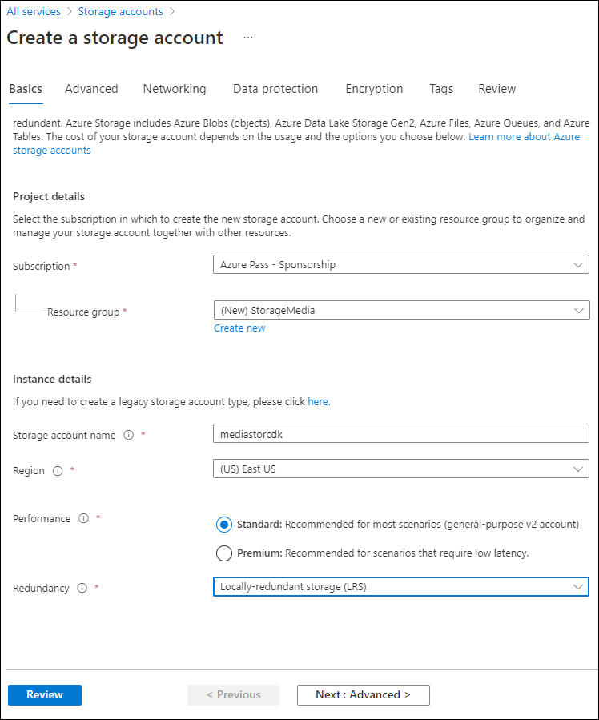
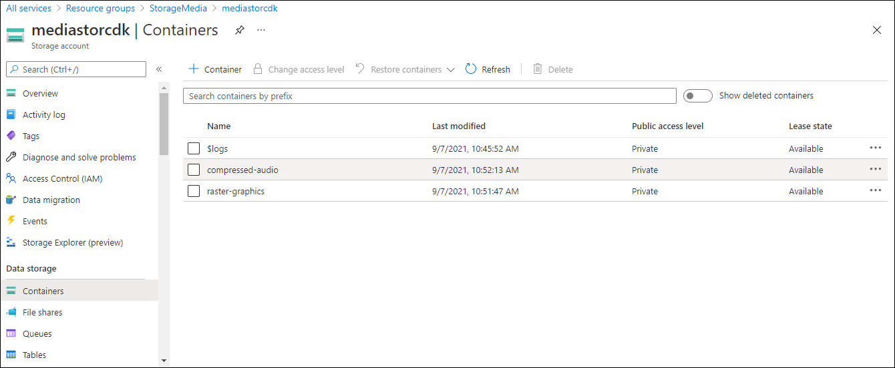

---
lab:
  az204Title: 'Lab 03: Retrieve Azure Storage resources and metadata by using the Azure Storage SDK for .NET'
  az204Module: 'Learning Path 03: Develop solutions that use blob storage'
---

# Laboratório 03: Recuperar recursos e metadados de armazenamento do Azure usando o SDK de armazenamento do Azure para .NET

## Interface de usuário do Microsoft Azure

Dada a natureza dinâmica das ferramentas de nuvem da Microsoft, você pode se deparar com alterações na interface de usuário (IU) do Azure que ocorram após o desenvolvimento deste conteúdo do treinamento. Como resultado, as instruções do laboratório e as etapas do laboratório podem não estar alinhadas corretamente.

A Microsoft atualiza este curso de treinamento quando a comunidade nos alerta sobre as alterações necessárias. No entanto, as atualizações na nuvem ocorrem com frequência, portanto você pode encontrar alterações na interface de usuário antes que esse conteúdo de treinamento seja atualizado. **Se isso ocorrer, adapte-se às alterações e trabalhe com elas nos laboratórios, conforme necessário.**

## Instruções

### Antes de começar

#### Entrar no ambiente de laboratório

Entre na máquina virtual (VM) do Windows 11 usando as seguintes credenciais:

- Nome de usuário: `Admin`
- Senha: `Pa55w.rd`

> **Observação**: Seu instrutor fornecerá instruções para se conectar ao ambiente de laboratório virtual.

#### Examinar os aplicativos instalados

Localize a barra de tarefas na área de trabalho do Windows 11. A barra de tarefas contém os ícones dos aplicativos que você usará neste laboratório, incluindo:

-   Microsoft Edge
-   Explorador de Arquivos

## Cenário do laboratório

Neste laboratório, você aprenderá a usar o SDK de armazenamento do Azure para acessar contêineres de armazenamento do Azure em um aplicativo C#. Você também aprenderá a acessar metadados e expor informações de URI para obter acesso ao conteúdo dos contêineres na conta de armazenamento. 

<em>Veja este vídeo clicando com o botão direito do mouse neste **[link de vídeo](https://youtu.be/UtDXcgLv8BQ)** e selecione “Abrir link em uma nova guia / nova janela”.</em>

 

## Diagrama de arquitetura


### Exercício 1: Criar recursos do Azure

#### Tarefa 1: Abrir o portal do Azure

1. Na barra de tarefas, selecione o ícone **Microsoft Edge**.

1. Na janela do navegador, navegue até o portal do Azure em `https://portal.azure.com` e entre com a conta que você usará neste laboratório.

   > **Observação**: Se esta for a primeira vez que entra no portal do Azure, você receberá um tour pelo portal. Selecione **Introdução** para ignorar o tour e começar a usar o portal.

#### Tarefa 2: Criar uma conta de armazenamento

1. No portal do Azure, use a caixa de texto **Pesquisar recursos, serviços e documentos** para procurar por **Contas de armazenamento** e, na lista de resultados, selecione **Contas de armazenamento**.

1. Na folha **Contas de armazenamento** , selecione **+ Criar**.

1. Na folha **Criar uma conta de armazenamento**, na guia **Informações básicas**, realize as seguintes ações e selecione **Próximo: Avançado**:

   | Configuração | Ação |
   | -- | -- |
   | Lista suspensa **Assinatura** | Manter o valor padrão |
   | Seção **Grupo de recursos** | Selecionar **Criar novo**, inserir **StorageMedia** e selecionar **OK** |
   | Caixa de texto **Nome da conta de armazenamento**  | Inserir **mediastor**_[yourname]_ |
   | Lista suspensa **Região** | Selecione **(EUA) Leste dos EUA** |
   | **Serviço principal** | Sem alterações |
   | Seção **Desempenho** | Selecione a opção **Padrão** |
   | Lista suspensa **Redundância** | Selecione **LRS (armazenamento com redundância local)** |

   A captura de tela a seguir exibe as configurações definidas na **folha Criar uma conta de armazenamento**.
 
   

1. Na guia **Avançado**, verifique se a opção **Permitir habilitar o acesso anônimo em contêineres individuais** está marcada. Marque a configuração, se ela não estiver habilitada, e selecione **Examinar**.
    
1. Na guia **Revisão**, revise as opções selecionadas nas etapas anteriores.

1. Selecione **Criar** para criar a conta de armazenamento usando a configuração especificada.

    > **Observação**: Aguarde a conclusão da tarefa de criação antes de avançar neste laboratório.

1. Selecione **Ir para o recurso**.

1. Na folha **Conta de armazenamento** , na seção **Configurações** , selecione o link **Pontos de extremidade** .

1. Na seção **Pontos de extremidade**, copie o valor da caixa de texto **Serviço Blob** para a área de transferência.

    > **Observação**: Você usará esse valor de ponto de extremidade mais adiante no laboratório.

1. Abra o Bloco de notas e, em seguida, cole nele o valor de serviço blob copiado.

1. Na folha **Conta de armazenamento**, na seção **Segurança + rede**, selecione **Chaves de acesso**.

1. Copie o valor **Nome da conta de armazenamento** para a área de transferência e, em seguida, cole-o no Bloco de notas.

1. Na folha **Chaves de acesso**, selecione **Mostrar** para uma das caixas de texto de **chave**. Não importa qual você usa, elas são intercambiáveis.

1. Examine qualquer uma das chaves, copie o valor de uma das caixas de **Chave** para a área de transferência e cole-o no Bloco de notas.

    > **Observação**: Você usará todos esses valores mais adiante no laboratório.

#### Revisão

Neste exercício, você criou uma nova conta de armazenamento que será usada no restante do laboratório.

### Exercício 2: Carregar um blob em um contêiner

#### Tarefa 1: Criar contêineres de conta de armazenamento

1. Na folha **Conta de armazenamento**, selecione o link **Contêineres** na seção **Armazenamento de dados**.

1. Na seção **Contêineres**, selecione **+ Contêiner**.

1. Na janela pop-up **Novo contêiner**, realize as seguintes ações e selecione **Criar**:

    | Configuração | Ação |
    | -- | -- |
    | Caixa de texto **Nome** | Insira **raster-graphics** |
    | Lista suspensa **Nível de acesso público** | Selecionar **Particular (sem acesso anônimo)** |

1. Na seção **Contêineres**, selecione **+ Contêiner**.

1. Na janela pop-up **Novo contêiner**, realize as seguintes ações e selecione **Criar**:

    | Configuração | Ação |
    | -- | -- |
    | Caixa de texto **Nome** | Insira **compressed-audio** |
    | Lista suspensa **Nível de acesso público** | Selecionar **Particular (sem acesso anônimo)** |

1. Na seção **Contêineres**, observe a lista de contêineres atualizada.

    A captura de tela a seguir exibe as configurações definidas na **folha Criar uma conta de armazenamento**.

    

#### Tarefa 2: Carregar um blob de conta de armazenamento

1. Na seção **Contêineres**, selecione o contêiner **raster-graphics** recém-criado.

1.  Na folha **Contêiner**, selecione **Carregar**.

1.  Na janela **Carregar blob**, realize as seguintes ações e selecione **Carregar**:

   | Configuração | Ação |
   | -- | -- |
   | Seção **Arquivos** | Selecionar **Procurar arquivos** ou usar o recurso de arrastar e soltar |
   | Janela **Explorador de Arquivos** | Navegue até **Allfiles (F):\\Allfiles\\Labs\\03\\Starter\\Images**, selecione o arquivo **graph.jpg** e, então, selecione **Abrir** |
   | Caixa de seleção **Substituir se arquivos já existirem** | Verificar se a caixa de seleção está marcada |
   
   > **Observação**: aguarde o carregamento do blob antes de continuar com este laboratório.

#### Revisão

Neste exercício, você criou contêineres de espaço reservado na conta de armazenamento e, em seguida, preencheu um dos contêineres com um blob.

### Exercício 3: Acessar contêineres usando o SDK do .NET

#### Tarefa 1: Criar projeto do .NET

1. Na tela **inicial**, selecione o bloco **Visual Studio Code**.

1. No menu **Arquivo**, selecione **Abrir Pasta**, navegue até **Allfiles (F):\\Allfiles\\Labs\\03\\Starter\\BlobManager** e selecione **Selecionar Pasta**.

1. Na janela **Visual Studio Code**, na Barra de menus, selecione **Terminal** e, em seguida, selecione **Novo Terminal**.

1. No terminal, execute o seguinte comando para criar um novo projeto do .NET chamado **BlobManager** na pasta atual:

    ```
    dotnet new console --framework net8.0 --name BlobManager --output .
    ```

    > **Observação**: O comando **dotnet new** cria um novo projeto de **console** em uma pasta com o mesmo nome que o projeto.

1. No terminal, execute o seguinte comando para importar a versão 12.18.0 de **Azure.Storage.Blobs** do NuGet:

    ```
    dotnet add package Azure.Storage.Blobs --version 12.18.0
    ```

    > **Observação**: O comando **dotnet add package** adicionará o pacote **Azure.Storage.Blobs** do NuGet. Para obter mais informações, consulte [Azure.Storage.Blobs](https://www.nuget.org/packages/Azure.Storage.Blobs/12.18.0).

1. No terminal, execute o seguinte comando para compilar o aplicativo Web do .NET:

    ```
    dotnet build
    ```

1. Selecione **Encerrar Terminal** ou o ícone da **Lixeira** para fechar o terminal aberto no momento e eventuais processos associados.

#### Tarefa 2: Modificar a classe do programa para acessar o armazenamento

1. No painel **Explorer** da janela do **Visual Studio Code**, abra o arquivo **Program.cs**.

1. Na guia do editor de código do arquivo **Program.cs** , exclua todo o código no arquivo existente.

1. Adicione os códigos a seguir:

    ```csharp
    using Azure.Storage;
    using Azure.Storage.Blobs;
    using Azure.Storage.Blobs.Models;
    using System;
    using System.Threading.Tasks;    
    public class Program
    {
        //Update the blobServiceEndpoint value that you recorded previously in this lab.        
        private const string blobServiceEndpoint = "<primary-blob-service-endpoint>";

        //Update the storageAccountName value that you recorded previously in this lab.
        private const string storageAccountName = "<storage-account-name>";

        //Update the storageAccountKey value that you recorded previously in this lab.
        private const string storageAccountKey = "<key>";    


        //The following code to create a new asynchronous Main method
        public static async Task Main(string[] args)
        { 
        }
    }
    ```

1. Atualize a constante da cadeia de caracteres **blobServiceEndpoint** definindo seu valor como **Ponto de extremidade de serviço blob primário** da conta de armazenamento registrada anteriormente neste laboratório.

1. Atualize a constante de cadeia de caracteres **storageAccountName** definindo seu valor como o **Nome da conta de armazenamento** da conta de armazenamento registrada anteriormente neste laboratório.

1. Atualize a constante da cadeia de caracteres **storageAccountKey** definindo seu valor como a **Chave** da conta de armazenamento registrada anteriormente neste laboratório.
  

#### Tarefa 3: Conectar-se ao ponto de extremidade de serviço blob do armazenamento do Azure

1. No método **Main**, adicione o seguinte código:
  
    ```csharp
     public static async Task Main(string[] args)
    {
        //The following line of code to create a new instance of the StorageSharedKeyCredential class by using the storageAccountName and storageAccountKey constants as constructor parameters
        StorageSharedKeyCredential accountCredentials = new StorageSharedKeyCredential(storageAccountName, storageAccountKey);

        //The following line of code to create a new instance of the BlobServiceClient class by using the blobServiceEndpoint constant and the accountCredentials variable as constructor parameters
        BlobServiceClient serviceClient = new BlobServiceClient(new Uri(blobServiceEndpoint), accountCredentials);

        //The following line of code to invoke the GetAccountInfoAsync method of the BlobServiceClient class to retrieve account metadata from the service
        AccountInfo info = await serviceClient.GetAccountInfoAsync();

        //Render a welcome message
        await Console.Out.WriteLineAsync($"Connected to Azure Storage Account");

        //Render the storage account's name
        await Console.Out.WriteLineAsync($"Account name:\t{storageAccountName}");

        //Render the type of storage account
        await Console.Out.WriteLineAsync($"Account kind:\t{info?.AccountKind}");

        //Render the currently selected stock keeping unit (SKU) for the storage account
        await Console.Out.WriteLineAsync($"Account sku:\t{info?.SkuName}");
    }
    ```

1. Salve o arquivo **Program.cs** .

1. Na janela **Visual Studio Code**, na Barra de menus, selecione **Terminal** e, em seguida, selecione **Novo Terminal**.

1. No terminal, execute o seguinte comando para executar o aplicativo Web do .NET:

    ```
    dotnet run
    ```

    > **Observação**: Se você encontrar algum erro de compilação, faça uma revisão do arquivo **Program.cs** na pasta **Allfiles (F):\\Allfiles\\Labs\\03\\Solution\\BlobManager**.

1. Observe a saída do aplicativo de console em execução no momento. A saída contém metadados da conta de armazenamento recuperada do serviço.

1. Selecione **Encerrar Terminal** ou o ícone da **Lixeira** para fechar o terminal aberto no momento e eventuais processos associados.

#### Tarefa 4: Enumerar os contêineres existentes

1. Na classe **Programa**, insira o código a seguir para criar um novo método **estático privado** chamado **EnumerateContainersAsync**, que é assíncrono e tem um único tipo de parâmetro **BlobServiceClient**:
   
    ```csharp
    private static async Task EnumerateContainersAsync(BlobServiceClient client)
    {   
        /*Create an asynchronous foreach loop that iterates over the results of 
            an invocation of the GetBlobContainersAsync method of the BlobServiceClient class. */    
        await foreach (BlobContainerItem container in client.GetBlobContainersAsync())
        {   
            //Print the name of each container
            await Console.Out.WriteLineAsync($"Container:\t{container.Name}");
        }
    }
    ```

1. No método **Main**, insira o código a seguir no final do método para invocar o método **EnumerateContainersAsync**, passando a variável *serviceClient* como parâmetro:

    ```csharp
    await EnumerateContainersAsync(serviceClient);
    ```

1. Observe o arquivo **Program.cs**, que agora deve incluir:
    ```csharp
    using Azure.Storage;
    using Azure.Storage.Blobs;
    using Azure.Storage.Blobs.Models;
    using System;
    using System.Threading.Tasks;
    
    public class Program
    {
        private const string blobServiceEndpoint = "your blobServiceEndpoint";
        private const string storageAccountName = "your storageAccountName";
        private const string storageAccountKey = "your storageAccountKey";    
        public static async Task Main(string[] args)
        {
            StorageSharedKeyCredential accountCredentials = new StorageSharedKeyCredential(storageAccountName, storageAccountKey);
            BlobServiceClient serviceClient = new     BlobServiceClient(new Uri(blobServiceEndpoint), accountCredentials);
            AccountInfo info = await serviceClient.GetAccountInfoAsync();
            await Console.Out.WriteLineAsync($"Connected to Azure Storage Account");
            await Console.Out.WriteLineAsync($"Account name:\t{storageAccountName}");
            await Console.Out.WriteLineAsync($"Account kind:\t{info?.AccountKind}");
            await Console.Out.WriteLineAsync($"Account sku:\t{info?.SkuName}");

            /* To invoke the EnumerateContainersAsync method, 
            passing in the serviceClient variable as a parameter */
            await EnumerateContainersAsync(serviceClient);
        }        
        private static async Task EnumerateContainersAsync(BlobServiceClient client)
        {        
            await foreach (BlobContainerItem container in client.GetBlobContainersAsync())
            {
                await Console.Out.WriteLineAsync($"Container:\t{container.Name}");
            }
    }
    }
    ```

1. Salve o arquivo **Program.cs** .

1. Na janela **Visual Studio Code**, na Barra de menus, selecione **Terminal** e, em seguida, selecione **Novo Terminal**.

1. No terminal, execute o seguinte comando para executar o aplicativo Web do .NET:

    ```
    dotnet run
    ```

    > **Observação**: Se você encontrar algum erro de compilação, faça uma revisão do arquivo **Program.cs** na pasta **Allfiles (F):\\Allfiles\\Labs\\03\\Solution\\BlobManager**.

1. Observe a saída do aplicativo de console em execução no momento. A saída atualizada inclui uma lista de todos os contêineres existentes na conta.

1. Selecione **Encerrar Terminal** ou o ícone da **Lixeira** para fechar o terminal aberto no momento e eventuais processos associados.

#### Revisão

Neste exercício, você acessou contêineres existentes usando o SDK de armazenamento do Azure.

### Exercício 4: Recuperar URIs (Uniform Resource Identifiers) do blob usando o SDK do .NET

#### Tarefa 1: Enumerar os blobs em um contêiner existente usando o SDK

1. Na classe **Programa**, insira o código a seguir para criar um novo método **estático privado** chamado **EnumerateBlobsAsync** que é assíncrono e tem dois tipos de parâmetro, **BlobServiceClient** e **cadeia de caracteres**:
  
    ```csharp
    private static async Task EnumerateBlobsAsync(BlobServiceClient client, string containerName)
    {   
        /* Get a new instance of the BlobContainerClient class by using the
           GetBlobContainerClient method of the BlobServiceClient class, 
           passing in the containerName parameter */   
        BlobContainerClient container = client.GetBlobContainerClient(containerName);

        /* Render the name of the container that will be enumerated */
        await Console.Out.WriteLineAsync($"Searching:\t{container.Name}");

        /* Create an asynchronous foreach loop that iterates over the results of
            an invocation of the GetBlobsAsync method of the BlobContainerClient class */
        await foreach (BlobItem blob in container.GetBlobsAsync())
        {     
            //Print the name of each blob    
            await Console.Out.WriteLineAsync($"Existing Blob:\t{blob.Name}");
        }
    }
    ```

1. No método **Main**, insira o código a seguir no final do método para criar uma variável chamada *existingContainerName* com um valor de **raster-graphics**:

    ```csharp
    string existingContainerName = "raster-graphics";
    ```

1. No método **Main** insira o código a seguir no final do método para invocar o método **EnumerateBlobsAsync**, passando as variáveis *serviceClient* e *existingContainerName* como parâmetros:

    ```csharp
    await EnumerateBlobsAsync(serviceClient, existingContainerName);
    ```

1. Observe o arquivo **Program.cs**, que agora deve incluir:
    ```csharp
    using Azure.Storage;
    using Azure.Storage.Blobs;
    using Azure.Storage.Blobs.Models;
    using System;
    using System.Threading.Tasks;    
    public class Program
    {
        private const string blobServiceEndpoint = "your blobServiceEndpoint";
        private const string storageAccountName = "your storageAccountName";
        private const string storageAccountKey = "your storageAccountKey";    
        public static async Task Main(string[] args)
        {
            StorageSharedKeyCredential accountCredentials = new StorageSharedKeyCredential(storageAccountName, storageAccountKey);
            BlobServiceClient serviceClient = new   BlobServiceClient(new Uri(blobServiceEndpoint), accountCredentials);
            AccountInfo info = await serviceClient.GetAccountInfoAsync();
            await Console.Out.WriteLineAsync($"Connected to Azure Storage Account");
            await Console.Out.WriteLineAsync($"Account name:\t{storageAccountName}");
            await Console.Out.WriteLineAsync($"Account kind:\t{info?.AccountKind}");
            await Console.Out.WriteLineAsync($"Account sku:\t{info?.SkuName}");
            await EnumerateContainersAsync(serviceClient);
            string existingContainerName = "raster-graphics";
            await EnumerateBlobsAsync(serviceClient, existingContainerName);
        }        
        private static async Task EnumerateContainersAsync(BlobServiceClient client)
        {        
            await foreach (BlobContainerItem container in client.GetBlobContainersAsync())
            {
                await Console.Out.WriteLineAsync($"Container:\t{container.Name}");
            }
        }        
        private static async Task EnumerateBlobsAsync(BlobServiceClient client, string containerName)
        {      
            BlobContainerClient container = client.GetBlobContainerClient(containerName);
            await Console.Out.WriteLineAsync($"Searching:\t{container.Name}");
            await foreach (BlobItem blob in container.GetBlobsAsync())
            {        
                await Console.Out.WriteLineAsync($"Existing Blob:\t{blob.Name}");
            }
        }
    }
    ```

1. Salve o arquivo **Program.cs** .

1. Na janela **Visual Studio Code**, na Barra de menus, selecione **Terminal** e, em seguida, selecione **Novo Terminal**.

1. No terminal, execute o seguinte comando para executar o aplicativo Web do .NET:

    ```
    dotnet run
    ```

    > **Observação**: Se você encontrar algum erro de compilação, faça uma revisão do arquivo **Program.cs** na pasta **Allfiles (F):\\Allfiles\\Labs\\03\\Solution\\BlobManager**.

1. Examine a saída do aplicativo de console em execução no momento. A saída atualizada inclui metadados sobre o contêiner e os blobs existentes.

1. Selecione **Encerrar Terminal** ou o ícone da **Lixeira** para fechar o terminal aberto no momento e eventuais processos associados.

#### Tarefa 2: Criar um novo contêiner usando o SDK

1. Na classe **Programa**, insira o código a seguir para criar um novo método **estático privado** chamado **GetContainerAsync** que é assíncrono e tem dois tipos de parâmetro, **BlobServiceClient** e **cadeia de caracteres**:

    ```csharp
    private static async Task<BlobContainerClient> GetContainerAsync(BlobServiceClient client, string containerName)
    {   
        /* Get a new instance of the BlobContainerClient class by using the
            GetBlobContainerClient method of the BlobServiceClient class,
            passing in the containerName parameter */   
        BlobContainerClient container = client.GetBlobContainerClient(containerName);

        /* Invoke the CreateIfNotExistsAsync method of the BlobContainerClient class */
        await container.CreateIfNotExistsAsync(PublicAccessType.Blob);

        /* Render the name of the container that was potentially created */
        await Console.Out.WriteLineAsync($"New Container:\t{container.Name}");

        /* Return the container as the result of the GetContainerAsync */        
        return container;
    }
    ```

1. No método **Main**, insira o código a seguir no final do método para criar uma variável chamada *newContainerName* com um valor de **vector-graphics**:

    ```csharp
    string newContainerName = "vector-graphics";
    ```

1. No método **Main**, insira o seguinte código no final do método para invocar o método **GetContainerAsync**, para passar as variáveis *serviceClient* e *newContainerName* como parâmetros e armazenar o resultado em uma variável chamada *containerClient* de tipo **BlobContainerClient**:

    ```csharp
    BlobContainerClient containerClient = await GetContainerAsync(serviceClient, newContainerName);
    ```

1. Examine o arquivo **Program.cs**, que agora deve incluir:
    ```csharp
    using Azure.Storage;
    using Azure.Storage.Blobs;
    using Azure.Storage.Blobs.Models;
    using System;
    using System.Threading.Tasks;    
    public class Program
    {
        private const string blobServiceEndpoint = "your blobServiceEndpoint";
        private const string storageAccountName = "your storageAccountName";
        private const string storageAccountKey = "your storageAccountKey";
        public static async Task Main(string[] args)
        {
            StorageSharedKeyCredential accountCredentials = new StorageSharedKeyCredential(storageAccountName, storageAccountKey);
            BlobServiceClient serviceClient = new BlobServiceClient(new Uri(blobServiceEndpoint), accountCredentials);
            AccountInfo info = await serviceClient.GetAccountInfoAsync();
            await Console.Out.WriteLineAsync($"Connected to Azure Storage Account");
            await Console.Out.WriteLineAsync($"Account name:\t{storageAccountName}");
            await Console.Out.WriteLineAsync($"Account kind:\t{info?.AccountKind}");
            await Console.Out.WriteLineAsync($"Account sku:\t{info?.SkuName}");
            await EnumerateContainersAsync(serviceClient);
            string existingContainerName = "raster-graphics";
            await EnumerateBlobsAsync(serviceClient, existingContainerName);
            string newContainerName = "vector-graphics";
            BlobContainerClient containerClient = await GetContainerAsync(serviceClient, newContainerName);
        }        
        private static async Task EnumerateContainersAsync(BlobServiceClient client)
        {        
            await foreach (BlobContainerItem container in client.GetBlobContainersAsync())
            {
                await Console.Out.WriteLineAsync($"Container:\t{container.Name}");
            }
        }        
        private static async Task EnumerateBlobsAsync(BlobServiceClient client, string containerName)
        {      
            BlobContainerClient container = client.GetBlobContainerClient(containerName);
            await Console.Out.WriteLineAsync($"Searching:\t{container.Name}");
            await foreach (BlobItem blob in container.GetBlobsAsync())
            {        
                await Console.Out.WriteLineAsync($"Existing Blob:\t{blob.Name}");
            }
        }        
        private static async Task<BlobContainerClient> GetContainerAsync(BlobServiceClient client, string containerName)
        {      
            BlobContainerClient container = client.GetBlobContainerClient(containerName);
            await container.CreateIfNotExistsAsync(PublicAccessType.Blob);
            await Console.Out.WriteLineAsync($"New Container:\t{container.Name}");
            return container;
        }
    }
    ```

1. Salve o arquivo **Program.cs** .

1. Na janela **Visual Studio Code**, na Barra de menus, selecione **Terminal** e, em seguida, selecione **Novo Terminal**.

1. No terminal, execute o seguinte comando para executar o aplicativo Web do .NET:

    ```
    dotnet run
    ```

    > **Observação**: Se você encontrar algum erro de compilação, faça uma revisão do arquivo **Program.cs** na pasta **Allfiles (F):\\Allfiles\\Labs\\03\\Solution\\BlobManager**.

1. Observe a saída do aplicativo de console em execução no momento. A saída atualizada inclui metadados sobre o contêiner e os blobs existentes.

1. Selecione **Encerrar Terminal** ou o ícone da **Lixeira** para fechar o terminal aberto no momento e eventuais processos associados.

#### Tarefa 3: Carregar um novo blob usando o portal

1. No painel de **navegação** do portal do Azure, selecione o link **Grupos de recursos**.

1. Na folha **Grupos de recursos**, selecione o grupo de recursos **StorageMedia** criado anteriormente neste laboratório.

1. Na folha **StorageMedia**, selecione a conta de armazenamento **mediastor**_[yourname]_ criada anteriormente neste laboratório.

1. Na folha **Conta de armazenamento**, selecione o link **Contêineres** na seção **Armazenamento de dados**.

1. Na seção **Contêineres**, selecione o contêiner **vector-graphics** recém-criado. Talvez seja necessário atualizar a página para observar o novo contêiner.

1.  Na folha **Contêiner**, selecione **Carregar**.

1.  Na janela **Carregar blob**, realize as seguintes ações e selecione **Carregar**:

    | Configuração | Ação |
    | -- | -- |
    | Seção **Arquivos** | Selecionar **Procurar arquivos** ou usar o recurso de arrastar e soltar |
    | Janela **Explorador de Arquivos** |  **Allfiles (F):\\Allfiles\\Labs\\03\\Starter\\Images**, selecione o arquivo **graph.svg** e, então, selecione **Abrir** |
    | Caixa de seleção **Substituir se arquivos já existirem** | Verificar se a caixa de seleção está marcada |

    > **Observação**: aguarde o carregamento do blob antes de continuar com este laboratório.

#### Tarefa 4: Acessar URI de blob usando o SDK

1. Alterne para a janela do **Visual Studio Code**.

1. Na classe **Programa**, insira o código a seguir para criar um novo método **estático privado** chamado **GetBlobAsync** que é assíncrono e tem dois tipos de parâmetro, **BlobContainerClient** e **cadeia de caracteres**:
   
    ```csharp
    private static async Task<BlobClient> GetBlobAsync(BlobContainerClient client, string blobName)
    {      
        BlobClient blob = client.GetBlobClient(blobName);
        bool exists = await blob.ExistsAsync();
        if (!exists)
        {
            await Console.Out.WriteLineAsync($"Blob {blob.Name} not found!");
            
        }
        else
            await Console.Out.WriteLineAsync($"Blob Found, URI:\t{blob.Uri}");
        return blob;
    }
    ```

1. No método **Main**, insira o código a seguir no final do método para criar uma variável chamada *uploadedBlobName* com um valor de **graph.svg**:

    ```csharp
    string uploadedBlobName = "graph.svg";
    ```

1. No método **Main**, insira o seguinte código no final do método para invocar o método **GetBlobAsync**, passando as variáveis *containerClient* e *uploadedBlobName* como parâmetros, e armazenar o resultado em uma variável chamada *blobClient* de tipo **BlobClient**:

    ```csharp
    BlobClient blobClient = await GetBlobAsync(containerClient, uploadedBlobName);
    ```

1. No método **Main**, insira o código a seguir no final do método para renderizar a propriedade **Uri** da variável *blobClient*:

    ```csharp
    await Console.Out.WriteLineAsync($"Blob Url:\t{blobClient.Uri}");
    ```

1. Observe o arquivo **Program.cs**, que agora deve incluir:
    ```csharp
    using Azure.Storage;
    using Azure.Storage.Blobs;
    using Azure.Storage.Blobs.Models;
    using System;
    using System.Threading.Tasks;    
    public class Program
    {
        private const string blobServiceEndpoint = "your blobServiceEndpoint";
        private const string storageAccountName = "your storageAccountName";
        private const string storageAccountKey = "your storageAccountKey";    
        public static async Task Main(string[] args)
        {
            StorageSharedKeyCredential accountCredentials = new StorageSharedKeyCredential(storageAccountName, storageAccountKey);
            BlobServiceClient serviceClient = new BlobServiceClient(new Uri(blobServiceEndpoint), accountCredentials);
            AccountInfo info = await serviceClient.GetAccountInfoAsync();
            await Console.Out.WriteLineAsync($"Connected to Azure Storage Account");
            await Console.Out.WriteLineAsync($"Account name:\t{storageAccountName}");
            await Console.Out.WriteLineAsync($"Account kind:\t{info?.AccountKind}");
            await Console.Out.WriteLineAsync($"Account sku:\t{info?.SkuName}");
            await EnumerateContainersAsync(serviceClient);
            string existingContainerName = "raster-graphics";
            await EnumerateBlobsAsync(serviceClient, existingContainerName);
            string newContainerName = "vector-graphics";
            BlobContainerClient containerClient = await GetContainerAsync(serviceClient, newContainerName);
            string uploadedBlobName = "graph.svg";
            BlobClient blobClient = await GetBlobAsync(containerClient, uploadedBlobName);
            await Console.Out.WriteLineAsync($"Blob Url:\t{blobClient.Uri}");
        }        
        private static async Task EnumerateContainersAsync(BlobServiceClient client)
        {        
            await foreach (BlobContainerItem container in client.GetBlobContainersAsync())
            {
                await Console.Out.WriteLineAsync($"Container:\t{container.Name}");
            }
        }        
        private static async Task EnumerateBlobsAsync(BlobServiceClient client, string containerName)
        {      
            BlobContainerClient container = client.GetBlobContainerClient(containerName);
            await Console.Out.WriteLineAsync($"Searching:\t{container.Name}");
            await foreach (BlobItem blob in container.GetBlobsAsync())
            {        
                await Console.Out.WriteLineAsync($"Existing Blob:\t{blob.Name}");
            }
        }        
        private static async Task<BlobContainerClient> GetContainerAsync(BlobServiceClient client, string containerName)
        {      
            BlobContainerClient container = client.GetBlobContainerClient(containerName);

            await container.CreateIfNotExistsAsync(PublicAccessType.Blob);
            await Console.Out.WriteLineAsync($"New Container:\t{container.Name}");
            return container;
        }        
        private static async Task<BlobClient> GetBlobAsync(BlobContainerClient client, string blobName)
        {      
            BlobClient blob = client.GetBlobClient(blobName);
            bool exists = await blob.ExistsAsync();
            if (!exists)
            {
                await Console.Out.WriteLineAsync($"Blob {blob.Name} not found!");
                
            }
            else
                await Console.Out.WriteLineAsync($"Blob Found, URI:\t{blob.Uri}");
            return blob;
        }
    }
    ```

1. Salve o arquivo **Program.cs** .

1. Na janela **Visual Studio Code**, na Barra de menus, selecione **Terminal** e, em seguida, selecione **Novo Terminal**.

1. No terminal, execute o seguinte comando para executar o aplicativo Web do .NET:

    ```
    dotnet run
    ```

    > **Observação**: Se você encontrar algum erro de compilação, faça uma revisão do arquivo **Program.cs** na pasta **Allfiles (F):\\Allfiles\\Labs\\03\\Solution\\BlobManager**.

1. Observe a saída do aplicativo de console em execução no momento. A saída atualizada inclui a URL final para acessar o blob online. Registre o valor dessa URL para usar posteriormente no laboratório.

    > **Observação**: A URL provavelmente será semelhante à seguinte cadeia de caracteres: `https://mediastor*[yourname]*.blob.core.windows.net/vector-graphics/graph.svg`

1. Selecione **Encerrar Terminal** ou o ícone da **Lixeira** para fechar o terminal aberto no momento e eventuais processos associados.

#### Tarefa 5: Testar o URI de blob usando um navegador

1. Na barra de tarefas, ative o menu de atalho para o ícone do **Microsoft Edge** e selecione **Nova janela**.

1. Na nova janela do navegador, consulte a URL copiada anteriormente neste laboratório para o blob.

1. Agora você deve notar o arquivo SVG (Elementos Gráficos Vetoriais Escaláveis) na janela do navegador.

#### Revisão

Neste exercício, você criou contêineres e gerenciou blobs usando o SDK de armazenamento.
