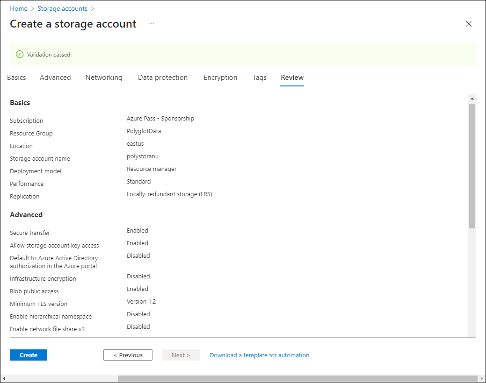
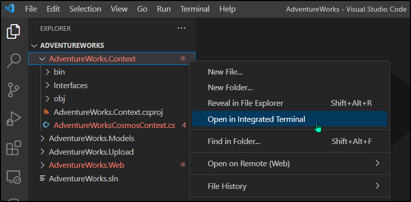

---
lab:
  az204Title: 'Lab 04: Construct a polyglot data solution'
  az204Module: 'Learning Path 04: Develop solutions that use Cosmos DB storage'
---

# Laboratório 04: Construir uma solução de dados poliglota

## Interface de usuário do Microsoft Azure

Dada a natureza dinâmica das ferramentas de nuvem da Microsoft, você pode se deparar com alterações na IU do Azure que ocorram após o desenvolvimento deste conteúdo do treinamento. Como resultado, as instruções do laboratório e as etapas do laboratório podem não estar alinhadas corretamente.

A Microsoft atualiza este curso de treinamento quando a comunidade nos alerta sobre as alterações necessárias. No entanto, as atualizações na nuvem ocorrem com frequência, portanto você pode encontrar alterações na interface de usuário antes que esse conteúdo de treinamento seja atualizado. **Se isso ocorrer, adapte-se às alterações e trabalhe com elas nos laboratórios, conforme necessário.**

## Instruções

### Antes de começar

#### Entrar no ambiente de laboratório

Entre na máquina virtual (VM) do Windows 10 usando as seguintes credenciais:

- Nome de usuário: `Admin`
- Senha: `Pa55w.rd`

> **Observação**: Seu instrutor fornecerá instruções para se conectar ao ambiente de laboratório virtual.

#### Examinar os aplicativos instalados

Encontre a barra de tarefas na área de trabalho do Windows 10. A barra de tarefas contém os ícones dos aplicativos que você usará neste laboratório, incluindo:

- Microsoft Edge
- Explorador de Arquivos
- Visual Studio Code

## Cenário do laboratório

Neste laboratório, você criará um recurso do Azure Cosmos DB e um recurso de conta de armazenamento. Usando C# e .NET, você acessará o recurso do Cosmos DB e carregará dados nele.

Além disso, como a Contoso pode querer acessar os dados no Cosmos DB por meio de uma interface amigável, você implementará uma solução do .NET que acessa e exibe os dados do Cosmos DB em um navegador da Web.

## Diagrama de arquitetura


### Exercício 1 ─ Criar recursos de armazenamento de dados no Azure

#### Tarefa 1: Abrir o portal do Azure

1. Na barra de tarefas, selecione o ícone **Microsoft Edge**.

1. Na janela aberta do navegador, navegue até o portal do Azure em `https://portal.azure.com` e entre com a conta que você usará para este laboratório.

   > **Observação**: Se esta for a primeira vez que entra no portal do Azure, você receberá um tour pelo portal. Selecione **Introdução** para ignorar o tour e começar a usar o portal.

#### Tarefa 2: Criar um recurso de conta do Azure Cosmos DB

1. No portal do Azure, use a caixa de texto **Pesquisar recursos, serviços e documentos** para procurar por **Azure Cosmos DB** e, na lista de resultados, selecione **Azure Cosmos DB**.

1. Na folha **Azure Cosmos DB**, selecione **+ Criar**.

1. Na folha **Criar uma conta do Azure Cosmos DB**, selecione **Criar** na caixa **Azure Cosmos DB for NoSQL**.

1. Na guia **Básico** da página **Criar conta do Azure Cosmos DB - Azure Cosmos DB for NoSQL**, realize as ações a seguir e selecione **Revisar + criar**:

   | Configuração                     | Ação                                                                                                                   |
   | --------------------------- | ------------------------------------------------------------------------------------------------------------------------ |
   | Lista de**Assinaturas**       | Manter padrões                                                                                                          |
   | Seção **Grupo de recursos**  | Selecione **Criar**                                                                                                    |
   | Caixa de texto **Nome**           | Inserir **Polyglotdata** e selecionar **OK**                                                                                 |
   | Caixa de texto**AccountName**    | Inserir **polycosmos**_[yourname]_                                                                                         |
   | Lista suspensa **Local** | Selecionar uma região do Azure que seja mais próxima do local do seu computador de laboratório e onde você possa criar uma conta do Cosmos DB |
   | Seção **Modo de capacidade**   | Selecionar **Sem servidor**.                                                                                                    |

   A captura de tela a seguir exibe as configurações definidas na página **Criar conta do Azure Cosmos DB - Azure Cosmos DB for NoSQL**.

   

1. Na guia **Revisar + Criar**da página **Criar conta do Azure Cosmos DB - Azure Cosmos DB for NoSQL**, revise as opções selecionadas durante as etapas anteriores.

1. Selecione **Criar** para criar a conta do Azure Cosmos DB usando a configuração especificada.

   > **Observação**: Aguarde a conclusão da tarefa de criação antes de avançar neste laboratório.

1. Selecione **Ir para o recurso**.

1. Na folha **Conta do Azure Cosmos DB**, encontre a seção **Configurações** e selecione o link **Chaves**.

1. No painel **Chaves**, na guia **Chaves de leitura/gravação**, registre os valores das caixas de texto **URI**, **CHAVE PRIMÁRIA** e **CADEIA DE CONEXÃO PRIMÁRIA**. Você usará esses valores mais adiante no laboratório.

#### Tarefa 3: Criar um recurso de conta de armazenamento do Azure

1. No portal do Azure, use a caixa de texto **Pesquisar recursos, serviços e documentos** para procurar por **Contas de armazenamento** e, na lista de resultados, selecione **Contas de armazenamento**.

1. Na folha **Contas de armazenamento**, selecione **+ Criar**.

1. Na guia **Básico** da folha **Criar uma conta de armazenamento**, realize as ações a seguir e selecione **Examinar**:

   | Configuração                           | Ação                                                                                  |
   | --------------------------------- | --------------------------------------------------------------------------------------- |
   | Lista de**Assinaturas**             | Manter padrões                                                                         |
   | Seção **Grupo de recursos**        | Selecionar **PolyglotData**                                                                 |
   | Caixa de texto **Nome da conta de armazenamento** | Inserir **polystor**_[yourname]_                                                          |
   | Lista suspensa **Região**         | Selecione a mesma região em que foi criada a conta do Cosmos DB anteriormente neste exercício |
   | Seção **Desempenho**           | Selecione **Standard**                                                                     |
   | Lista suspensa **Redundância**     | Selecione **LRS (Armazenamento com redundância local)**                                              |

   A captura de tela a seguir exibe as configurações definidas na folha **Criar uma conta de armazenamento**.

   

1. Na guia **Revisão** da folha **Criar uma conta de armazenamento**, revise as opções selecionadas nas etapas anteriores.

1. Selecione **Criar** para criar a conta de armazenamento usando a configuração especificada.

   > **Observação**: Aguarde a conclusão da tarefa de criação antes de prosseguir neste laboratório.

#### Revisão

Neste exercício, você criou os recursos do Azure necessários para a solução de dados poliglota que você implementará neste laboratório. Os recursos do Azure que você criou incluem uma conta do Azure Cosmos DB e uma conta de armazenamento do Azure.

### Exercício 2 ─ Examinar e carregar dados

#### Tarefa 1: Carregar imagens para o Armazenamento de Blobs do Azure

1. No painel de navegação do portal do Azure, navegue de volta para a folha **Contas de armazenamento** e selecione a conta de armazenamento **polystor**_[yourname]_ criada no exercício anterior deste laboratório.

1. Na folha de conta de armazenamento **polystor**_[yourname]_, selecione o link **Contêineres** na seção **Armazenamento de dados**.

1. Na seção **Contêineres**, selecione **+ Contêiner**.

1. Na janela pop-up **Novo contêiner**, realize as seguintes ações e selecione **Criar**:

   | Configuração                                | Ação                                   |
   | -------------------------------------- | ---------------------------------------- |
   | Caixa de texto **Nome**                      | Inserir **imagens**                         |
   | Lista suspensa **Nível de acesso público** | Selecionar **Particular (sem acesso anônimo)** |

1. Voltando para a seção **Contêineres**, selecione o contêiner **imagens** recém-criado.

1. Encontre a seção **Configurações** na folha **Contêiner** e selecione o link **Propriedades**.

1. No painel**Propriedades**, observe e registre o valor na caixa de texto **URL**. Você usará esse valor mais adiante no laboratório.

1. Clique em **Token de acesso compartilhado** em seguida e gere um token de acesso com as configurações padrão clicando em **Gerar token SAS e URL**. Observe o valor do **Token SAS de blob**, pois ele será necessário mais adiante.

1. Encontre e selecione o link **Visão Geral** na folha.
1. Na folha, selecione **Carregar**.

1. No pop-up **Carregar blob**, realize as seguintes ações:

   a. Na seção **Arquivos**, selecione **Procurar arquivos** ou use o recurso de arrastar e soltar.

   b. Na janela do **Explorador de Arquivos**, navegue até **Allfiles (F):\\Allfiles\\Labs\\04\\Starter\\Images**, selecione todos os 42 arquivos de imagem **.jpg** e, então, selecione **Abrir**.

   c. Verifique se a opção **Substituir se os arquivos já existirem** está selecionada e clique em **Carregar**.

   > **Observação**: Aguarde o carregamento de todos os blobs antes de continuar com este laboratório.

#### Tarefa 2: Examinar dados JSON

1. No computador do laboratório, inicie o Visual Studio Code.

1. No menu **Arquivo**, selecione **Abrir arquivo**, navegue até **Allfiles (F):\\Allfiles\\Labs\\04\\Starter\\AdventureWorks\\AdventureWorks.Upload**, selecione **models.json** e, então, selecione **Abrir**.

1. Examine o formato do arquivo **models.json** e observe que ele contém uma matriz de objetos JSON, com uma matriz aninhada de objetos que fazem parte da propriedade **Produtos**.

   > **Observação**: Isso determinará as classes que você definirá para desserializar o conteúdo do arquivo JSON antes de carregá-lo em uma coleção do Cosmos DB.

1. Dentro do arquivo **models.json**, observe que uma das propriedades é chamada **Categoria**.

   > **Observação**: Você usará a propriedade **Categoria** para definir o particionamento da coleção do Cosmos DB de destino.

1. Feche o Visual Studio Code.

#### Tarefa 3: Criar um banco de dados e uma coleção do Cosmos DB e realizar um carregamento de dados JSON

1. Na tela **inicial**, selecione o bloco **Visual Studio Code**.

1. No menu **Arquivo**, selecione **Abrir Pasta**.

1. Na janela **Explorador de Arquivos** que se abre, navegue até **Allfiles (F):\\Allfiles\\Labs\\04\\Starter\\AdventureWorks** e selecione **Selecionar Pasta**.

1. Na janela **Visual Studio Code**, na Barra de menus, selecione **Terminal** e, em seguida, selecione **Novo Terminal**.

1. No terminal, verifique se o diretório atual está definido como **AdventureWorks** (caso não esteja, altere-o para essa definição) e, então, execute o comando a seguir para alterar o contexto do terminal para a pasta **AdventureWorks.Upload**:

   ```
   cd .\AdventureWorks.Upload\
   ```

   > **Observação**: Antes de realizar a próxima etapa, abra o Windows Explorer e remova o atributo **Somente leitura** do arquivo **Allfiles (F):\\Allfiles\\Labs\\04\\Starter\\AdventureWorks\\AdventureWorks.Upload\\AdventureWorks.Upload.csproj**

1. No prompt do terminal, execute o seguinte comando para adicionar a biblioteca de clientes do .NET do Azure Cosmos DB ao projeto aberto no momento:

   > **Observação**: Antes de prosseguir com o seguinte comando, certifique-se de que está situado neste caminho: **(F):\\Allfiles\\Labs\\04\\Starter\\AdventureWorks\\AdventureWorks.Upload\\**

   ```
   dotnet add package Microsoft.Azure.Cosmos --version 3.28.0
   ```
   
   > **Observação**: O comando pacote**dotnet add package** adicionará o pacote **Microsoft.Azure.Cosmos** do **NuGet**. Para obter mais informações, consulte [Microsoft.Azure.Cosmos](https://www.nuget.org/packages/Microsoft.Azure.Cosmos).

1. Observe os resultados da compilação impressos no terminal. A compilação deve ser concluída sem mensagens de aviso nem erros.

1. No painel **Explorer** da janela do **Visual Studio Code**, expanda o projeto **AdventureWorks.Upload**.

1. Abra o arquivo **Program.cs**.

1. No arquivo **Program.cs**, examine as diretivas de **uso** e observe que elas incluem **Microsoft.Azure.Cosmos**, **System.IO;**, **System.Text.Json**, **System.Threading.Tasks** e **System.Collections.Generic**. Isso permite o carregamento assíncrono de itens JSON de um arquivo local no computador do laboratório para uma coleção em um banco de dados do Cosmos DB.

1. No arquivo **Program.cs**, na linha 14, defina o valor de **EndpointUrl** substituindo a cadeia de caracteres vazia pela propriedade **URI** da conta do Cosmos DB registrada anteriormente neste laboratório. Verifique se o valor está entre aspas duplas.

1. Na linha 15, defina o valor de **AuthorizationKey** substituindo a cadeia de caracteres vazia pela propriedade **CHAVE PRIMÁRIA** da conta do Cosmos DB registrada anteriormente neste laboratório. Verifique se o valor está entre aspas duplas.

1. Na linha 18, defina o valor de **PartitionKey** substituindo a cadeia de caracteres vazia por **"/Category"**.

1. Na linha 19, defina o valor de **JsonFilePath** substituindo a cadeia de caracteres vazia por **"F:\\\\Allfiles\\\\Labs\\\\04\\\\Starter\\\\AdventureWorks\\\\AdventureWorks.Upload\\\\models.json"**.

1. Dentro do bloco try, observe a invocação do método **CreateDatabaseIfNotExistsAsync** da classe **CosmosClient**. Isso criará um banco de dados se ele ainda não existir.

1. Observe a invocação do método **DefineContainer** da classe **Banco de dados**. Isso criará um contêiner que hospedará os itens JSON se ainda não existir.

   > **Observação**: O método **DefineContainer** inclui uma opção de minimização de custos pela qual é possível modificar a política de indexação padrão (que indexa automaticamente todos os atributos).

1. Observe a instrução de **uso** que depende de um objeto **StreamReader** para ler itens JSON de um arquivo de texto e os desserializa em objetos da classe **Modelo** mais definidos no arquivo **Program.cs**.

1. Observe o loop foreach que itera na coleção de objetos desserializados e insere de forma assíncrona cada um deles na coleção de destino.

1. Examine as classes **Modelo** e **Produto** que refletem o formato dos objetos armazenados no arquivo formatado em JSON examinado anteriormente neste laboratório.

1. Salve e feche o arquivo **Program.cs**.

   > **Observação**: Selecione **Substituir** caso tenha recebido um prompt de que o arquivo é somente leitura.

1. No terminal, execute o seguinte comando para restaurar quaisquer pacotes NuGet ausentes e compilar o projeto na pasta:

   ```
   dotnet build
   ```

   > **Observação**: O comando **dotnet build** restaurará de forma automática todos os pacotes do NuGet ausentes antes de compilar todos os projetos na pasta.

1. No prompt do terminal, execute o comando a seguir para executar o aplicativo de console do .NET Core:

   ```
   dotnet run
   ```

   > **Observação**: O comando **dotnet run** compilará automaticamente eventuais alterações no projeto e, em seguida, iniciará o aplicativo Web sem um depurador anexado. O comando fornecerá as mensagens indicando o progresso do carregamento de dados, incluindo o número de itens inseridos na coleção de destino e a duração da operação de inserção.

1. Observe os resultados da execução do comando impressos no terminal. A execução deve ser concluída com êxito, exibindo a mensagem sobre a existência de 119 itens inseridos na coleção do Cosmos DB de destino.

1. Selecione **Encerrar Terminal** (o ícone da **Lixeira**) para fechar o painel do terminal e eventuais processos associados.

#### Tarefa 4: Validar upload de dados JSON

1. No computador do laboratório, alterne para a janela do navegador do **Microsoft Edge** que está exibindo o portal do Azure.

1. No portal do Azure, selecione a caixa de texto **Pesquisar recursos, serviços e documentos**, na lista **Recursos recentes** e selecione a conta do Azure Cosmos DB **polycosmos**_[yourname]_ criada anteriormente neste laboratório.

1. Na folha **Conta do Azure Cosmos DB**, encontre e selecione o link **Data Explorer** na folha.

1. No painel **Data Explorer**, expanda o nó de banco de dados **Varejo**.

1. Expanda o nó de contêiner **Online** e selecione **Nova consulta SQL**.

   > **Observação**: A etiqueta desta opção pode estar oculta. Você pode exibir etiquetas passando o mouse sobre os ícones no painel**Data Explorer**.

1. Na guia de consultas, insira o texto a seguir:

   ```sql
   SELECT * FROM models
   ```

1. Selecione **Executar consulta** e observe a lista de itens JSON devolvidos pela consulta.

1. De volta ao editor de consultas, substitua o texto existente pelo seguinte texto:

   ```sql
   SELECT VALUE COUNT(1) FROM models
   ```

1. Selecione **Executar consulta** e observe o resultado da operação de agregação **COUNT**.

1. Alterne de volta para a janela do **Visual Studio Code**.

#### Revisão

Neste exercício, você usou o SDK do .NET para Azure Cosmos DB para inserir dados no Azure Cosmos DB. O aplicativo Web que você implementar em seguida usará esses dados.

### Exercício 3: Configurar um aplicativo Web .NET

#### Tarefa 1: Atualizar referências a armazenamentos de dados e criar o aplicativo Web

1. No painel **Explorer** da janela do **Visual Studio Code**, expanda o projeto **AdventureWorks.Web**.

1. Abra o arquivo **appsettings.json**.

1. No objeto JSON na linha 3, encontre o caminho **ConnectionStrings.AdventureWorksCosmosContext**. Observe que o valor atual está vazio:

   ```json
   "ConnectionStrings": {
       "AdventureWorksCosmosContext": "",
   },
   ```

1. Atualize o valor da propriedade **AdventureWorksCosmosContext** definindo o valor dela como a **CADEIA DE CONEXÃO PRIMÁRIA** da conta do Azure Cosmos DB registrada anteriormente neste laboratório.

1. No objeto JSON na linha 6, encontre o caminho **Settings.BlobContainerUrl**. Observe que o valor atual está vazio:

   ```json
   "Settings": {
       "BlobContainerUrl": "",
       "BlobSASToken": "",
       ...
   }
   ```

1. Atualize as propriedades **BlobContainerUrl** e **BlobSASToken** definindo o valor delas como a propriedade **URL** do contêiner de blobs do armazenamento do Azure chamado **imagens** e o valor do token SAS de blob registrado anteriormente neste laboratório de forma correspondente.

1. Salve o arquivo **appsettings.json** e feche-o.

   > **Observação**: Selecione **Substituir** caso tenha recebido um prompt de que o arquivo é somente leitura.

1. Na janela **Visual Studio Code**, clique com o botão direito do mouse na pasta **AdventureWorks.Context** no painel do explorador e selecione **Abrir em terminal integrado**.

   

   > **Observação**: Antes de realizar a próxima etapa, abra o Windows Explorer e remova o atributo Somente leitura do arquivo **Allfiles (F):\Allfiles\Labs\04\Starter\AdventureWorks\AdventureWorks.Context\AdventureWorks.Context.csproj**

1. No prompt do terminal, verifique se o diretório atual está definido como **AdventureWorks.Context** (caso não esteja, altere-o para essa definição) e, então, execute o comando a seguir para importar **Microsoft.Azure.Cosmos** do NuGet:

   > **Observação**: Antes de prosseguir com o seguinte comando, certifique-se de que está situado neste caminho: **(F):\\Allfiles\\Labs\\04\\Starter\\AdventureWorks\\AdventureWorks.Context\\**

   ```
   dotnet add package Microsoft.Azure.Cosmos --version 3.28.0
   ```

1. No prompt do terminal, execute o comando a seguir para compilar o projeto **AdventureWorks.Context**:

   ```
   dotnet build
   ```

1. Observe os resultados da compilação impressos no terminal. A compilação deve ser concluída sem mensagens de aviso nem erros.

#### Tarefa 2: Configurar conectividade com o Azure Cosmos DB

1. No painel **Explorer** da janela do **Visual Studio Code**, expanda o projeto **AdventureWorks.Context**.

1. No menu de atalho do nó da pasta **AdventureWorks.Context**, selecione **Novo arquivo**.

1. No novo prompt de arquivo, insira **AdventureWorksCosmosContext.cs**.

1. Na guia de editor de código do arquivo **AdventureWorksCosmosContext.cs**, adicione o seguinte código:

   ```csharp
   using AdventureWorks.Models;
   using Microsoft.Azure.Cosmos;
   using Microsoft.Azure.Cosmos.Linq;
   using System;
   using System.Collections.Generic;
   using System.Linq;
   using System.Threading.Tasks;

   namespace AdventureWorks.Context
   {
       /* AdventureWorksCosmosContext class will implement the
       IAdventureWorksProductContext interface */
      public class AdventureWorksCosmosContext : IAdventureWorksProductContext
      {
           /* Create a new read-only Container variable named _container */
           private readonly Container _container;

         public AdventureWorksCosmosContext(string connectionString, string database = "Retail", string container = "Online")
         {
           /* Create a new instance of the CosmosClient class, and then obtain
             both a Database and Container instance from the client */
           _container = new CosmosClient(connectionString)
           .GetDatabase(database)
           .GetContainer(container);
         }

         public async Task<Model> FindModelAsync(Guid id)
         {
           /* Create a LINQ query, transform it into an iterator, iterate over the result set,
              and then return the single item in the result set */
           var iterator = _container.GetItemLinqQueryable<Model>()
           .Where(m => m.id == id).ToFeedIterator<Model>();
           List<Model> matches = new List<Model>();
           while (iterator.HasMoreResults)
           {
               var next = await iterator.ReadNextAsync();
               matches.AddRange(next);
           }

           return matches.SingleOrDefault();
         }

         public async Task<List<Model>> GetModelsAsync()
         {
           /* Run an SQL query, get the query result iterator, iterate over the result set,
               and then return the union of all results */
           string query = $@"SELECT * FROM items";
           var iterator = _container.GetItemQueryIterator<Model>(query);
           List<Model> matches = new List<Model>();
           while (iterator.HasMoreResults)
           {
               var next = await iterator.ReadNextAsync();
               matches.AddRange(next);
           }

           return matches;
         }

         public async Task<Product> FindProductAsync(Guid id)
         {
           /* Run an SQL query, get the query result iterator, iterate over the result set,
              and then return the single item in the result set */
           string query = $@"SELECT VALUE products
                       FROM models
                       JOIN products in models.Products
                       WHERE products.id = '{id}'";
           var iterator = _container.GetItemQueryIterator<Product>(query);
           List<Product> matches = new List<Product>();
           while (iterator.HasMoreResults)
           {
               var next = await iterator.ReadNextAsync();
               matches.AddRange(next);
           }

           return matches.SingleOrDefault();
         }

      }
   }
   ```

1. Salve e feche o arquivo **AdventureWorksCosmosContext.cs**.
1. No prompt do terminal, com o diretório atual definido como **AdventureWorks.Context**, execute o seguinte comando para compilar o aplicativo Web do .NET:

   ```
   dotnet build
   ```

   > **Observação**: Se você encontrar algum erro de compilação, faça uma revisão do arquivo **AdventureWorksCosmosContext.cs** file na pasta **Allfiles    > (F):\\Allfiles\\Labs\\04\\Solution\\AdventureWorks\\AdventureWorks.Context**.

#### Tarefa 3: Examinar a lógica de inicialização do aplicativo do .NET

1. No painel **Explorer** da janela do **Visual Studio Code**, expanda o projeto **AdventureWorks.Web**.

1. Abra o arquivo **Startup.cs**.

1. Na classe **Inicialização**, observe o método existente **ConfigureProductService**:

   ```csharp
   public void ConfigureProductService(IServiceCollection services)
   {
       services.AddScoped<IAdventureWorksProductContext, AdventureWorksCosmosContext>(provider =>
           new AdventureWorksCosmosContext(
               _configuration.GetConnectionString(nameof(AdventureWorksCosmosContext))
           )
       );
   }
   ```

   > **Observação**: O serviço do produto usa o Cosmos DB como banco de dados.

1. Feche o arquivo **Startup.cs** sem fazer modificações.

#### Tarefa 4: Validar que o aplicativo do .NET se conecta com êxito a armazenamentos de dados

1. No Visual Studio Code, no prompt do terminal, execute o seguinte comando para alternar o contexto do terminal para a pasta **AdventureWorks.Web**:

   ```
   cd ..\AdventureWorks.Web\
   ```

1. No prompt do terminal, execute o comando a seguir para executar o aplicativo Web do ASP.NET:

   > **Observação**: Antes de prosseguir com o seguinte comando, certifique-se de que está situado neste caminho: **(F):\\Allfiles\\Labs\\04\\Starter\\AdventureWorks\\AdventureWorks.Web\\**

   ```
   dotnet run
   ```

   > **Observação**: O comando **dotnet run** compilará automaticamente eventuais alterações no projeto e, em seguida, iniciará o aplicativo Web sem um depurador anexado. O comando fornecerá a URL do aplicativo em execução e todas as portas atribuídas.

1. Na barra de tarefas, selecione o ícone **Microsoft Edge**.

1. Na janela aberta do navegador, navegue até o aplicativo Web em execução no momento (<http://localhost:5000>).

1. No aplicativo Web, observe a lista de modelos exibida na página frontal.

1. Encontre o modelo **Touring-1000** e selecione **Exibir detalhes**.

1. Na página de detalhes do produto **Touring-1000**, examine a listagem de opções.

1. Feche a janela do navegador que exibe o aplicativo Web.

1. Alterne para a janela do **Visual Studio Code** e selecione **Encerrar Terminal** (o ícone **Lixeira**) para fechar o terminal aberto no momento e eventuais processos associados.

#### Revisão

Neste exercício, você escreveu código C# para consultar uma coleção do Azure Cosmos DB usando o SDK do .NET.
