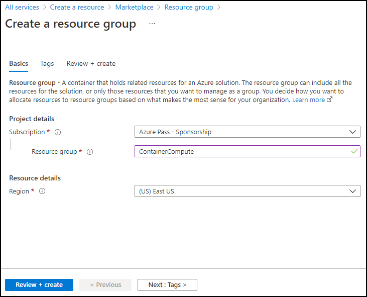

---
lab:
  az204Title: 'Lab 05: Deploy compute workloads by using images and containers'
  az204Module: 'Learning Path 05: Implement containerized solutions'
---

# Laboratório 05: Implantar cargas de trabalho de computação usando imagens e contêineres

## Interface de usuário do Microsoft Azure

Dada a natureza dinâmica das ferramentas de nuvem da Microsoft, você pode se deparar com alterações na IU do Azure que ocorram após o desenvolvimento deste conteúdo do treinamento. Como resultado, as instruções do laboratório e as etapas do laboratório podem não estar alinhadas corretamente.

A Microsoft atualiza este curso de treinamento quando a comunidade nos alerta sobre as alterações necessárias. No entanto, as atualizações na nuvem ocorrem com frequência, portanto você pode encontrar alterações na interface de usuário antes que esse conteúdo de treinamento seja atualizado. **Se isso ocorrer, adapte-se às alterações e trabalhe com elas nos laboratórios, conforme necessário.**

## Instruções

### Antes de começar

#### Entrar no ambiente de laboratório

Entre na máquina virtual (VM) do Windows 11 usando as seguintes credenciais:

- Nome de usuário: `Admin`
- Senha: `Pa55w.rd`

> **Observação**: Seu instrutor fornecerá instruções para se conectar ao ambiente de laboratório virtual.

#### Examinar os aplicativos instalados

Localize a barra de tarefas na área de trabalho do Windows 11. A barra de tarefas contém os ícones dos aplicativos que você usará neste laboratório, incluindo:

-   Microsoft Edge
-   Explorador de Arquivos

## Cenário do laboratório

Neste laboratório, você explorará como criar e implantar contêineres no Registro de Contêiner do Azure usando um aplicativo do .NET e arquivos docker. E também implantará uma solução em contêiner para Aplicativos de Contêiner do Azure.

## Diagrama de arquitetura


### Exercício 1: criar uma imagem de contêiner do Docker e implantá-la no Registro de Contêiner do Azure

#### Tarefa 1: Abrir o portal do Azure

1. Na barra de tarefas, selecione o ícone **Microsoft Edge**.

1. Na janela aberta do navegador, navegue até o portal do Azure em `https://portal.azure.com` e entre com a conta que você usará para este laboratório.

   > **Observação**: Se esta for a primeira vez que entra no portal do Azure, você receberá um tour pelo portal. Se preferir ignorar o tour, selecione **Introdução** para começar a usar o portal.

#### Tarefa 2: criar um grupo de recursos

1. No painel de navegação do portal do Azure, use a caixa de texto **Pesquisar recursos, serviços e documentos** para procurar por **Grupo de recursos** e, então, na lista de resultados, selecione **Grupos de recursos**.

1. Na folha **Grupos de recursos**, selecione **Criar**.

1. Na folha **Criar um grupo de recursos**, na guia **Básico**, realize as seguintes ações e selecione **Revisar + Criar**:

    | Configuração | Ação |
    | -- | -- |
    | Lista suspensa **Assinatura** | Manter o valor padrão  |
    | Caixa de texto **Grupo de recursos** | Inserir **ContainerCompute** |
    | Lista suspensa **Região** | Selecione **(EUA) Leste dos EUA** |

    A captura de tela a seguir exibe as configurações definidas na folha **Criar um grupo de recursos**.

    

1. Na guia **Revisar + criar**, revise as opções selecionadas nas etapas anteriores.

1. Selecione **Criar** para criar o grupo de recursos usando a configuração especificada.  

    > **Observação**: Aguarde a conclusão da tarefa de criação antes de avançar neste laboratório.


#### Tarefa 3: Iniciar o projeto de origem

1. Na barra de tarefas, selecione o ícone de **Terminal**.

1. Execute o seguinte comando para alterar o diretório atual para o diretório **Allfiles (F):\\Allfiles\\Labs\\05\\Starter**:

    ```powershell
    cd F:\Allfiles\Labs\05\Starter
    ```

1. Execute o seguinte comando para criar um novo aplicativo de console do .NET no diretório atual usando o .NET 8.0:

    ```powershell
    dotnet new console --output . --name ipcheck --framework net8.0
    ```

1. Execute o seguinte comando para criar um novo arquivo no diretório atual chamado **Dockerfile**:

    ```powershell
    New-Item -ItemType File Dockerfile
    ```

1. Execute o seguinte comando para abrir o diretório atual no Visual Studio Code:

    ```powershell
    code .
    ```

#### Tarefa 4: Criar e testar um aplicativo do .NET

1. No painel **Explorer** da janela **Visual Studio Code**, abra o arquivo **Program.cs**.

1. Exclua todo o conteúdo do arquivo **Program.cs**.

1. Copie e cole o seguinte código no arquivo **Program.cs**:

    ```csharp
    // Check if network is available
    if (System.Net.NetworkInformation.NetworkInterface.GetIsNetworkAvailable())
    {
        System.Console.WriteLine("Current IP Addresses:");

        // Get host entry for current hostname
        string hostname = System.Net.Dns.GetHostName();
        System.Net.IPHostEntry host = System.Net.Dns.GetHostEntry(hostname);
        
        // Iterate over each IP address and render their values
        foreach(System.Net.IPAddress address in host.AddressList)
        {
            System.Console.WriteLine($"\t{address}");
        }
    }
    else
    {
        System.Console.WriteLine("No Network Connection");
    }
    ```

1. Salve o arquivo **Program.cs**.

1. Exclua o arquivo **Starter.sln**.

    > **Observação**: Isso eliminará a necessidade de fazer referência explícita ao arquivo .csproj ao usar comandos dotnet.

1. Alterne para o aplicativo de **Terminal**.

1. Execute o comando a seguir para executar o aplicativo:

    ```powershell
    dotnet run
    ```

1. Revise os resultados. Pelo menos um endereço IP deve ser listado, representando o endereço IP atribuído ao seu computador.

1. Alterne de volta para Da janela do **Visual Studio Code** e, no painel **Explorer**, abra o arquivo **Dockerfile**.

1. Copie e cole o seguinte código no arquivo **Dockerfile**:

    ```
    # Start using the .NET 8.0 SDK container image
    FROM mcr.microsoft.com/dotnet/sdk:8.0 AS build

    # Change current working directory
    WORKDIR /app

    # Copy existing files from host machine
    COPY . ./

    # Publish application to the "out" folder
    RUN dotnet publish --configuration Release --output out

    # Start container by running application DLL
    ENTRYPOINT ["dotnet", "out/ipcheck.dll"]
    ```

1. Salve o arquivo **Dockerfile**.

    > **Observação**: Em seguida, você criará um arquivo contendo todo o arquivo do projeto. Isso simplificará o upload dos arquivos do projeto no Cloud Shell.

1. Alterne para o aplicativo de **Terminal**.

1. Execute o comando a seguir para executar o aplicativo:

    ```powershell
    Compress-Archive -Path .\* -DestinationPath .\lab05.zip
    ```

#### Tarefa 5: Criar um recurso do Registro de Contêiner

1. Alterne para a janela do navegador que está exibindo o portal do Azure. 

1. No portal do Azure, selecione o ícone **Cloud Shell**  para abrir uma nova sessão do Bash. Se o Cloud Shell tiver como padrão uma sessão do PowerShell, selecione **PowerShell** e, então, no menu suspenso, selecione **Bash**.

    > **Observação**: O ícone do **Cloud Shell** é representado por um sinal de maior que (\>) e caractere de sublinhado (\_).

    > **Observação**: se esta for a primeira vez que você está iniciando o **Cloud Shell**, quando solicitado a selecionar **Bash** ou **PowerShell**, selecione **Bash**. Quando receber a mensagem **Você não tem nenhum armazenamento montado**, selecione a assinatura que você está usando no laboratório e, então, selecione **Criar armazenamento**.  

1. **No painel Cloud Shell**, selecione o botão de upload/download (representado por uma página dobrada com duas setas apontando para direções opostas no canto inferior direito) e, no menu suspenso, selecione **Upload**.

1. Na caixa de diálogo **Abrir**, navegue até o diretório vazio **Allfiles (F):\\Allfiles\\Labs\\05\\Inicialização**, selecione **lab05.zip** e então clique em **Abrir**.

    > **Observação**: Isso fará o upload do arquivo para o diretório **/~** dentro da sessão do **Azure Cloud Shell**.

1. No prompt de comando do **Cloud Shell** no portal, execute o comando a seguir para criar um novo diretório chamado **ipcheck** no diretório **\~**:

    ```bash
    mkdir ~/ipcheck
    ```

1. Execute o comando a seguir para extrair o conteúdo do arquivo carregado para o diretório **\~/ipcheck** recém-criado:

    ```bash
    unzip ~/lab05.zip -d ~/ipcheck
    ```

1. Execute o seguinte comando para definir as permissões de leitura e execução em todo o conteúdo extraído no diretório **\~/ipcheck** :

    ```bash
    chmod -R +xr ~/ipcheck
    ```

1. Execute o comando a seguir para alterar o diretório atual para **\~/ipcheck**:

    ```bash
    cd ~/ipcheck
    ```

1. No prompt de comando do **Cloud Shell**no portal, execute o seguinte comando para criar uma variável com valor único para o recurso do Registro de Contêiner: 

    ```bash
    registryName=conregistry$RANDOM
    ```

1. No prompt de comando do **Cloud Shell** no portal, execute o seguinte comando para verificar se o nome criado na etapa anterior está disponível: 

    ```bash
    az acr check-name --name $registryName
    ```

    Se os resultados mostrarem que o nome está disponível, avance para a etapa seguinte. Se o nome não estiver disponível, execute novamente o comando na etapa anterior e verifique a disponibilidade de novo.

1. No prompt de comando do **Cloud Shell** no portal, execute o seguinte comando para criar um recurso do Registro de Contêiner: 

    ```bash
    az acr create --resource-group ContainerCompute --name $registryName --sku Basic
    ```

    > **Observação**: Aguarde a conclusão da tarefa de criação antes de avançar neste laboratório.

#### Tarefa 6: Armazenar metadados do Registro de Contêiner

1. No prompt de comando do **Cloud Shell** no portal, execute o seguinte comando para obter uma lista de todos os registros de contêiner em sua assinatura:

    ```
    az acr list --resource-group ContainerCompute
    ```

1. Execute o comando a seguir, garantindo que você veja o nome do seu registro como saída. Caso você não veja nenhuma saída diferente de “[]”, aguarde um minuto e tente executar o comando novamente.

    ```
    az acr list --resource-group ContainerCompute --query "max_by([], &creationDate).name" --output tsv
    ```

1. Execute o comando a seguir:

    ```
    acrName=$(az acr list --resource-group ContainerCompute --query "max_by([], &creationDate).name" --output tsv)
    ```

1. Execute o comando a seguir:

    ```
    echo $acrName
    ```

#### Tarefa 7: Implantar uma imagem de contêiner do Docker no Registro de Contêiner

1. Execute o seguinte comando para alterar o diretório ativo de **\~/** para **\~/ipcheck**:

    ```
    cd ~/ipcheck
    ```

1. Execute o seguinte comando para obter o conteúdo do diretório atual:

    ```
    dir
    ```

1. Execute o seguinte comando para carregar o código-fonte no registro de contêiner e compilar a imagem de contêiner como uma tarefa do Registro de contêiner:

    ```
    az acr build --registry $acrName --image ipcheck:latest .
    ```

    > **Observação**: Aguarde a conclusão da tarefa de compilação antes de avançar neste laboratório.

1. Feche o painel do **Cloud Shell** no portal.

#### Tarefa 8: Validar a imagem de contêiner no Registro de Contêiner

1. No painel de **navegação** do portal do Azure, selecione o link **Grupos de recursos**.

1. Na folha **Grupos de recursos**, selecione o grupo de recursos **ContainerCompute** criado anteriormente neste laboratório.

1. Na folha **ContainerCompute**, selecione o registro de contêiner criado anteriormente neste laboratório..

1. Na folha **Registro de Contêiner**, na seção **Serviços**, selecione o link **Repositórios**.

1. Na seção **Repositórios**, selecione o repositório de imagem de contêiner **ipcheck** e, então, selecione a marca **mais recente**.

1. Revise os metadados da versão da imagem de contêiner com a marca **mais recente**.

    > **Observação**: Você também pode selecionar o link **ID de execução** para localizar metadados sobre a tarefa de compilação.

#### Revisão

Neste exercício, você criou um aplicativo de console do .NET para exibir o endereço IP atual de um computador. Em seguida, você adicionou o arquivo **Dockerfile** ao aplicativo para que ele pudesse ser convertido em uma imagem de contêiner do Docker. Por fim, você implantou a imagem de contêiner no Registro de Contêiner.

### Exercício 2: implantar uma instância de contêiner do Azure

#### Tarefa 1: Habilitar o usuário administrador no Registro de Contêiner

1. No grupo de recursos **ContainerCompute**, selecione o registro de contêiner criado anteriormente neste laboratório e, então, selecione a folha **Chaves de acesso**.

1. Alterne o botão na seção de usuário administrador para habilitar o usuário administrador para esse registro de contêiner.

#### Tarefa 2: Implantar uma imagem de contêiner em uma instância de contêiner do Azure

1. Na folha **Registro de Contêiner**, na seção **Serviços**, selecione o link **Repositórios**.

1. Na seção **Repositórios**, selecione o repositório que contém a imagem de contêiner **ipcheck**.

1. Na folha do repositório, na seção **Configurações**, selecione **Chaves de acesso**.

1. Na folha **Chave de acesso**, marque a caixa de seleção **Usuário administrador**.

1. Na folha do repositório, na seção **Serviços**, selecione **Repositórios**. 

1. Na lista de repositórios, selecione **ipcheck**.

1. No painel ** ipcheck**, selecione o menu de reticências associado à entrada de marca de entrada **mais recente** e selecione **Executar instância**.

1. Na folha **Criar instância de contêiner**, realize as seguintes ações e selecione **Criar**:

    | Configuração | Ação |
    | -- | -- |
    | Caixa de texto **Nome do contêiner** | Insira **managedcompute** |
    | Caixa de texto **Imagem de contêiner** | Manter o valor padrão |
    | Seção**Tipo de sistema operacional** | Selecione **Linux** |
    | Caixa de texto **Assinatura** | Manter o valor padrão |
    | Lista suspensa **Grupo de recursos** | Selecione **ContainerCompute** |
    | Lista suspensa **Local** | Selecione **Leste dos EUA** |
    | Lista suspensa **Número de núcleos** | Selecionar **2** |
    | Caixa de texto **Memória (GB)** | Insira **4** |
    | Seção**Endereço IP público** | Selecione **Não** |

    A captura de tela a seguir exibe as configurações definidas na folha **Criar instância de contêiner**.

    

    > **Observação**: Aguarde a criação da instância de contêiner antes de avançar neste laboratório.

#### Tarefa 3: Implantar manualmente uma imagem de contêiner nas Instâncias de Contêiner

1. No painel de **navegação** do portal do Azure, selecione o link **Criar um recurso**.

1. Na folha **Criar um recurso**, na caixa de texto **serviços Pesquisa e marketplace**, insira **instâncias de contêiner** e selecione Inserir.

1. Na folha de resultados da pesquisa em **Marketplace**, selecione o resultado **Instâncias de Contêiner**.

1. Na folha **Instâncias de Contêiner**, selecione **Criar**.

1. Na folha **Criar instância de contêiner**, na guia **Básico**, realize as seguintes ações e selecione **Revisar + Criar**:

    | Configuração | Ação |
    | -- | -- |
    | Lista suspensa **Assinatura** | Manter o valor padrão |
    | Lista suspensa **Grupo de recursos** | Selecione **ContainerCompute** |
    | Caixa de texto **Nome do Contêiner**  | Inserir **manualcompute** |
    | Lista suspensa **Região** | Selecione **(EUA) Leste dos EUA** |
    | Seção **Fonte da imagem** | Selecione **Registro de Contêiner do Azure** |
    | Lista suspensa **Registro** | Selecionar o recurso do **Registro de Contêiner do Azure** criado anteriormente neste laboratório |
    | Lista suspensa de **imagem** | Selecionar **ipcheck** |
    | Lista suspensa de **marca de imagem** | Selecione **mais recente** |
    | **Tamanho : núcleos**  | Insira **2** |
    | **Tamanho: Memória (GiB)** | Insira **4** |

    A captura de tela a seguir exibe as configurações definidas na folha **Criar instância de contêiner**.

    

1. Na guia **Revisar + criar**, examine as opções selecionadas.

1. Selecione **Criar** para criar a instância de contêiner usando a configuração especificada.  

    > **Observação**: Aguarde a criação da instância de contêiner antes de avançar neste laboratório.


#### Tarefa 4: Validar que a instância de contêiner foi executada com êxito

1. No painel de navegação do portal do Azure, selecione o link **Grupos de recursos**.

1. Na folha **Grupos de recursos**, selecione o grupo de recursos **ContainerCompute** criado anteriormente neste laboratório.

1. Na folha **ContainerCompute**, selecione a instância de contêiner **manualcompute** criada anteriormente neste laboratório.

1. Na folha **Instâncias de Contêiner**, na seção **Configurações**, selecione o link **Contêineres**.

1. Na seção **Contêineres**, examine a lista de **Eventos**.

1. Selecione a guia **Logs** e examine os logs de texto da instância de contêiner.

> **Observação**: Você também pode encontrar os **Eventos** e **Logs** na instância de contêiner **managedcompute**.

> **Observação**: É possível que **manualcompute** e **managedcompute** não tenham nenhum evento neste momento.

> **Observação**: Depois que a execução do aplicativo chega ao fim, o contêiner é encerrado porque ele concluiu seu trabalho. Para a instância de contêiner criada manualmente, você indicou que uma saída bem-sucedida era satisfatória, portanto, o contêiner foi executado uma vez. A instância criada automaticamente não ofereceu essa opção e pressupõe que o contêiner deve estar sempre em execução, então você observará repetidas reinicializações de contêiner.

#### Revisão

Neste exercício, você usou vários métodos para implantar uma imagem de contêiner em uma instância de contêiner do Azure. Usando o método manual, você pôde personalizar ainda mais a implantação e executar aplicativos baseados em tarefas como parte de uma execução de contêiner.


### Exercício 3: Criar um ambiente de Aplicativos de Contêiner seguro e implantar o aplicativo de contêiner

#### Tarefa 1: Preparar seu ambiente

1. Entre no portal do Azure.

1. Selecione o ícone **Cloud Shell** e selecione o ambiente **Bash**.

1. No prompt de comando do **Cloud Shell** no portal, execute o seguinte comando para instalar a extensão dos Aplicativos de Contêiner do Azure para CLI: 

    ```bash
    az extension add --name containerapp --upgrade
    ```

1. Executar o comando a seguir para registrar o namespace Microsoft.App: 

    ```bash
    az provider register --namespace Microsoft.App
    ```
   
   > **Observação**: Os recursos dos Aplicativos de Contêiner do Azure migraram do namespace **Microsoft.Web** para o namespace **Microsoft.App**.

1. Execute o comando a seguir para registrar o provedor **Microsoft.OperationalInsights** para o workspace do Log Analytics do Azure Monitor se ele ainda não tiver sido usado: 

    ```bash
    az provider register --namespace Microsoft.OperationalInsights
    ```

    > **Observação**: O registro do namespace **Microsoft.App** e **Microsoft.OperationalInsights** pode levar alguns minutos para ser concluído.

1. Defina as variáveis de ambiente usadas posteriormente neste exercício. 
   
   ```bash
     myRG=ContainerCompute
     myAppContEnv=az204-env-$RANDOM
    ```

Com a atualização da CLI e a criação de variáveis de ambiente, é possível criar um ambiente de Aplicativos de Contêiner e implantar o aplicativo de contêiner.

#### Tarefa 2: Criar um ambiente

Um ambiente em aplicativos de contêiner do Azure cria um marco de delimitação seguro em um grupo de aplicativos de contêiner. Os Aplicativos de Contêiner implantados no mesmo ambiente são implantados na mesma rede virtual e gravam logs no mesmo workspace do Log Analytics.

1. No prompt de comando do **Cloud Shell** no portal, execute o comando a seguir para criar um ambiente usando o `az containerapp env` comando criar: 

    ```bash
    az containerapp env create \
        --name $myAppContEnv \
        --resource-group $myRG \
        --location eastus
    ```

#### Tarefa 3: Criar um aplicativo de contêiner

Depois que o ambiente do aplicativo de contêiner concluir a implantação, você implanta uma imagem de contêiner nos Aplicativos de Contêiner do Azure.

1. No prompt de comando do **Cloud Shell** no portal, execute o comando a seguir para implantar uma amostra de imagem de contêiner de aplicativo usando o comando `az containerapp create`: 

    ```bash
    az containerapp create \
        --name my-container-app \
        --resource-group $myRG \
        --environment $myAppContEnv \
        --image mcr.microsoft.com/azuredocs/containerapps-helloworld:latest \
        --target-port 80 \
        --ingress 'external' \
        --query properties.configuration.ingress.fqdn
    ```
Ao definir `--ingress` como `external`, você torna as solicitações públicas disponíveis do aplicativo de contêiner. O comando retorna um link para acessar seu aplicativo.

1. Selecione o link retornado pelo comando `az containerapp create` para verificar se o aplicativo de contêiner está em execução.

