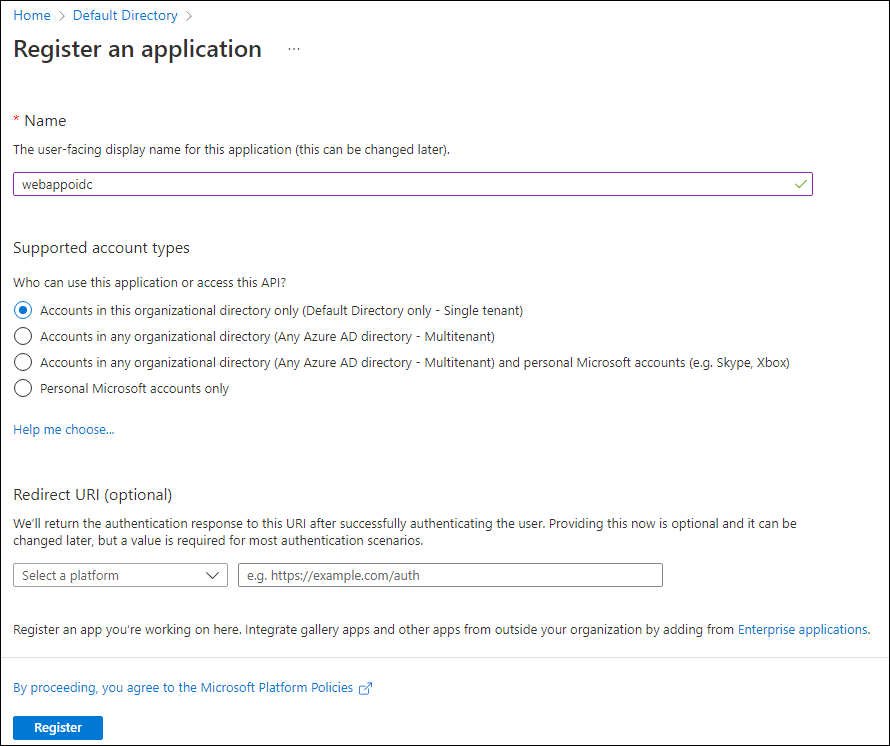

---
lab:
  az204Title: 'Lab 06: Authenticate by using OpenID Connect, MSAL, and .NET SDKs'
  az204Module: 'Learning Path 06: Implement user authentication and authorization'
---

# Laboratório 06: Autenticar usando SDKs do OpenID Connect, MSAL e .NET

## Interface de usuário do Microsoft Azure

Dada a natureza dinâmica das ferramentas de nuvem da Microsoft, você pode se deparar com alterações na IU do Azure que ocorram após o desenvolvimento deste conteúdo do treinamento. Como resultado, as instruções do laboratório e as etapas do laboratório podem não estar alinhadas corretamente.

A Microsoft atualiza este curso de treinamento quando a comunidade nos alerta sobre as alterações necessárias. No entanto, as atualizações na nuvem ocorrem com frequência, portanto você pode encontrar alterações na interface de usuário antes que esse conteúdo de treinamento seja atualizado. **Se isso ocorrer, adapte-se às alterações e trabalhe com elas nos laboratórios, conforme necessário.**

## Instruções

### Antes de começar

#### Entrar no ambiente de laboratório

Entre na máquina virtual (VM) do Windows 10 usando as seguintes credenciais:

- Nome de usuário: `Admin`
- Senha: `Pa55w.rd`

> **Observação**: Seu instrutor fornecerá instruções para se conectar ao ambiente de laboratório virtual.

#### Examinar os aplicativos instalados

Encontre a barra de tarefas na área de trabalho do Windows 10. A barra de tarefas contém os ícones dos aplicativos que você usará neste laboratório, incluindo:
    
-   Microsoft Edge
-   Visual Studio Code

## Cenário do laboratório

Neste laboratório, você registrará um aplicativo no Microsoft Entra ID, adicionará um usuário e, em seguida, testará o acesso do usuário ao aplicativo para validar que o Entra ID pode assegurá-lo. Você também usará a ferramenta Explorador do Graph para criar e testar solicitações na API do Graph para uma conta de usuário do Entra ID.

## Diagrama de arquitetura


### Exercício 1: Configurar um ambiente do Entra ID de locatário único

#### Tarefa 1: Abrir o portal do Azure

1. Na barra de tarefas, selecione o ícone **Microsoft Edge**.

1. Na janela aberta do navegador, navegue até o portal do Azure em `https://portal.azure.com` e entre com a conta que você usará para este laboratório.

    > **Observação**: Se esta for a primeira vez que entra no portal do Azure, você receberá um tour pelo portal. Selecione **Introdução** para ignorar o tour e começar a usar o portal.

#### Tarefa 2: Registrar um aplicativo no Entra ID Directory

1. No portal do Azure, use a caixa de texto **Pesquisar recursos, serviços e documentos** para encontrar o **Entra ID** e, na lista de resultados, selecione **Microsoft Entra ID**.

    > **Observação**: Isso redireciona a sessão do navegador para a folha do locatário do Microsoft Entra ID associado à sua assinatura do Azure.

1. Na folha **Microsoft Entra ID** , selecione **Registros de aplicativo** na seção **Gerenciar**.

1. Na seção **Registros de aplicativo**, selecione **+ Novo registro**.

1. Na seção **Registrar um aplicativo**, realize as seguintes ações e selecione **Registrar**:
    
    | Configuração | Ação |
    | -- | -- |
    | Caixa de texto **Nome** | Insira **webappoidc** |
    | Lista **Tipos de conta com suporte** | Selecionar **Apenas contas neste diretório organizacional (apenas Diretório Padrão - Locatário único)** |

    > **Observação**: O nome do locatário pode ser diferente dependendo da sua assinatura do Azure.
   
    A captura de tela a seguir exibe as configurações definidas na seção **Registrar um aplicativo**.
          
     
      
    
#### Tarefa 3: Registrar identificadores exclusivos

1. Na folha de registro de aplicativo **webappoidc**, selecione **Visão Geral**.

1. Na seção **Visão geral**, localize e registre o valor na caixa de texto **ID do aplicativo (cliente)**. Você usará esse valor mais adiante no laboratório.

1. Na seção **Visão Geral**, localize e registre o valor na caixa de texto **ID do diretório (locatário)**. Você usará esse valor mais adiante no laboratório.

#### Tarefa 4: Definir as configurações de autenticação de aplicativo

1. Na folha do registro de aplicativo **webappoidc**, selecione **Autenticação** na seção **Gerenciar**.

1. Na seção **Autenticação**, realize as seguintes ações e selecione **Configurar**:

    | Configuração | Ação |
    | -- | -- |
    | Seção **Configurações de plataforma** | Selecione **+ Adicionar uma plataforma** |
    | Folha **Configurar plataformas** | Selecione **Web** |
    | Caixa de texto**Redirecionar URIs** | Inserir `https://localhost:5001/` |
    | Caixa de texto **URL de logoff de canal frontal** | Inserir `https://localhost:5001/signout-oidc` |
        
1. Voltando para a seção **Configurações de plataforma**, selecione **Adicionar URI** e insira `https://localhost:5001/signin-oidc`.

1. Na seção **Concessão implícita e fluxos híbridos**, selecione **Tokens de ID (usados para fluxos implícitos e híbridos)**. 

1. Selecione **Salvar**.

    A captura de tela a seguir exibe as configurações definidas na folha **Autenticação**.
          
     
       

#### Tarefa 5: Criar um usuário do Azure AD

1. No portal do Azure, selecione o ícone **Cloud Shell**  para abrir uma nova sessão do PowerShell. Se o Cloud Shell tiver como padrão uma sessão do Bash, selecione **Bash** e, no menu suspenso, selecione **PowerShell**.

     > **Observação**: Se esta for a primeira vez que você está iniciando o **Cloud Shell**, quando solicitado a selecionar **Bash** ou **PowerShell**, selecione **PowerShell**. Quando aparecer a mensagem **Você não tem nenhum armazenamento montado**, selecione a assinatura que você está usando no laboratório e selecione **Criar armazenamento**.

1. No painel do **Cloud Shell**, execute o seguinte comando para entrar no locatário do Azure AD associado à sua assinatura do Azure:

    ```powershell
    Connect-AzureAD
    ```

1. Execute o seguinte comando para recuperar e exibir o nome de domínio DNS (Sistema de Nomes de Domínio) primário do locatário do Azure AD:

    ```powershell
    $aadDomainName = ((Get-AzureAdTenantDetail).VerifiedDomains)[0].Name
    $aadDomainName
    ```

    > **Observação**: Registre o valor do nome de domínio DNS. Você usará esse valor mais adiante no laboratório.

1. Execute os seguintes comandos para criar usuários do Azure AD que você usará para testar a autenticação do Azure AD:

    ```powershell
    $passwordProfile = New-Object -TypeName Microsoft.Open.AzureAD.Model.PasswordProfile
    $passwordProfile.Password = 'Pa55w.rd1234'
    $passwordProfile.ForceChangePasswordNextLogin = $false
    New-AzureADUser -AccountEnabled $true -DisplayName 'aad_lab_user1' -PasswordProfile $passwordProfile -MailNickName 'aad_lab_user1' -UserPrincipalName "aad_lab_user1@$aadDomainName" 
    ```

1. Execute o seguinte comando para identificar o UPN do usuário do Azure AD recém-criado:

    ```powershell
    (Get-AzureADUser -Filter "MailNickName eq 'aad_lab_user1'").UserPrincipalName
    ```

    > **Observação**: Registre o UPN. Você usará esse valor mais adiante no laboratório.

1. Feche o painel do Cloud Shell.

#### Revisão

Neste exercício, você registrou um aplicativo do Azure AD de locatário único e criou uma conta de usuário do Azure AD.

### Exercício 2: Criar um aplicativo Web do ASP.NET de locatário único

#### Tarefa 1: Criar um projeto de aplicativo Web do ASP.NET

1. No computador do laboratório, inicie um **Prompt de comando**.

1. No prompt de comando, execute os seguintes comandos para criar e definir o diretório atual como **Allfiles (F):\\Allfiles\\Labs\\06\\Starter\\OIDCClient**:

    ```cmd
    F:
    cd F:\Allfiles\Labs\06\Starter\OIDCClient
    ```

1. Execute os seguintes comandos para criar um novo aplicativo Web do .NET Core com base no modelo de Controlador de Exibição de Modelo (MVC) (substitua os espaços reservados `<application_ID>`, `<tenant_ID>` e `<domain_Name>` pelos valores correspondentes registrados anteriormente neste laboratório):

    ```cmd
    dotnet new mvc --auth SingleOrg --client-id <application_ID> --tenant-id <tenant_ID> --domain <domain_Name>
    rmdir .\obj /S /Q
    ```
    
    > **Observação**: Se você recebeu um erro no terminal, pode ser que esteja usando o PowerShell. Nesse caso, remova os sinalizadores `/S /Q` e execute novamente o comando.

1. Execute o seguinte comando para iniciar o Visual Studio Code. 

    ```cmd
    code .
    ```
    > Caso tenha sido solicitado **Você confia nos autores de todos os arquivos nesta pasta?**, selecione **Sim, confio nos autores**.


1. No painel **Explorer** do Visual Studio Code, examine a estrutura de pastas gerada automaticamente que representa um aplicativo Web MVC.

1. Navegue até a pasta **Propriedades**, abra o arquivo **launchSettings.json** e aplique as seguintes alterações:

    
    | Seção | Propriedade | Valor |
    | -- | -- | -- |
    | **iisSettings** | **sslPort** | **44321** |
    | **OIDCClient**  | **applicationUrl** | `https://localhost:5001` |
    

    > **Observação**: Os números da porta devem corresponder ao valor especificado ao criar o registro do aplicativo do Azure AD.

1. Salve e feche o arquivo.

1. No painel **Explorer** do Visual Studio Code, selecione **OIDCClient.csproj**.

1. Verifique se o valor do elemento `<TargetFramework>` está definido como **net6.0**.

1. Verifique se a versão dos pacotes do NuGet `Microsoft.AspNetCore.Authentication.JwtBearer` e `Microsoft.AspNetCore.Authentication.OpenIdConnect` está definida como **6.0.9**.

1. Defina a versão dos pacotes do NuGet `Microsoft.Identity.Web` e `Microsoft.Identity.Web.UI` como **1.25.3**.

1. Verifique se conteúdo do arquivo **OIDCClient.csproj** é semelhante à listagem a seguir (o valor do `UserSecretsId`será diferente) e salve as alterações.

    ```csharp
    <Project Sdk="Microsoft.NET.Sdk.Web">
      <PropertyGroup>
        <TargetFramework>net6.0</TargetFramework>
        <UserSecretsId>aspnet-OIDCClient-737DEB13-25D4-4C52-93C5-F485367E3C8C</UserSecretsId>
        <ImplicitUsings>enable</ImplicitUsings>
      </PropertyGroup>

      <ItemGroup>
        <PackageReference Include="Microsoft.AspNetCore.Authentication.JwtBearer" Version="6.0.9" NoWarn="NU1605" />
        <PackageReference Include="Microsoft.AspNetCore.Authentication.OpenIdConnect" Version="6.0.9" NoWarn="NU1605" />
        <PackageReference Include="Microsoft.Identity.Web" Version="1.25.3" />
        <PackageReference Include="Microsoft.Identity.Web.UI" Version="1.25.3" />
      </ItemGroup>
    </Project>
    ```

1. Feche o arquivo **OIDCClient.csproj**.

1. Navegue até a pasta **Views\Shared** e abra o arquivo **_LoginPartial.cshtml**.

1. Verifique se o atributo `asp-area` de cada elemento span referencia `MicrosoftIdentity`, como na linha a seguir:

    ```csharp
    <a class="nav-link text-dark" asp-area="MicrosoftIdentity" asp-controller="Account" asp-action="SignOut">Sign out</a>
    ```

1. Feche o arquivo sem fazer alterações.

1. Abra o arquivo **appsettings.json** e examine o conteúdo do objeto **AzureAd**, incluindo os seguintes elementos:

    | Elemento | Valor |
    | -- | -- |
    | `Instance` | `https://login.microsoftonline.com/`|
    | `Domain` | Domínio DNS primário do locatário do Azure AD associado à sua assinatura do Azure |
    | `TenantId` | GUID do locatário do Azure AD |
    | `ClientId` | A ID de Aplicativo (cliente) do aplicativo registrado no locatário do Azure AD. |
    | `CallbackPath` | `/signin-oidc` |

1. Feche o arquivo sem fazer alterações.

1. No painel **Explorer** do Visual Studio Code, selecione **Program.cs**.

1. Verifique se o arquivo contém as seguintes diretivas de **uso**:

    ```csharp
    using Microsoft.AspNetCore.Authentication.OpenIdConnect;
    using Microsoft.Identity.Web;
    using Microsoft.Identity.Web.UI;
    ```

1. Verifique se o arquivo contém as seguintes linhas que adicionam os serviços de autenticação relevantes ao contêiner:

    ```csharp
    // Add services to the container.
    builder.Services.AddAuthentication(OpenIdConnectDefaults.AuthenticationScheme)
      .AddMicrosoftIdentityWebApp(builder.Configuration.GetSection("AzureAd"));
    ```

1. Verifique se o arquivo contém as seguintes linhas que adicionam um controlador e páginas Razor para gerenciamento de contas:

    ```csharp
    builder.Services.AddRazorPages()
      .AddMicrosoftIdentityUI();
    ```

1. Salve e feche o arquivo.

### Tarefa 2: Testar o aplicativo Web de locatário único em um cenário de locatário único

1. Na janela **Visual Studio Code**, na barra de menus superior, procure o menu **Terminal** e selecione **Novo Terminal**.

1. No painel **Terminal**, o caminho atual do diretório de trabalho atual deve ser **F:\Allfiles\Labs\06\Starter\OIDCClient**. Execute os seguintes comandos para criar o aplicativo Web do .NET:

    ```
    dotnet build
    ```

    > **Observação**: Se você encontrar algum erro de compilação, faça uma revisão dos arquivos na pasta **Allfiles (F):\\Allfiles\\Labs\\06\\Solution\\OIDCClient**. Ignore eventuais mensagens de aviso.

1. Execute o seguinte comando para gerar um certificado autoassinado e configurar o computador local para confiar nele:

    ```
    dotnet dev-certs https --trust
    ```

1. Se for solicitado a instalar o certificado gerado automaticamente, selecione **Sim**.

1. No prompt do terminal, execute o comando a seguir para executar o aplicativo Web do .NET:

    ```
    dotnet run
    ```

1. Inicie o navegador Microsoft Edge no modo **InPrivate** e navegue até a `https://localhost:5001` URL.

1. Caso seja apresentada a mensagem **Sua conexão não é particular**, selecione **Avançado** e, em seguida, selecione o link **Continuar para localhost (não seguro)**.

1. Na janela do navegador aberta, quando solicitado, faça a autenticação usando o UPN da conta do Azure AD **aad_lab_user1** criada anteriormente neste laboratório com a senha **Pa55w.rd1234**.

    > **Observação**: Se você for solicitado com uma janela **Ajude-nos a proteger sua conta**, selecione **Ignorar por enquanto**.

1. A janela do navegador abrirá automaticamente a página da Web **Permissões solicitadas**.

1. Examine as permissões solicitadas, que incluem **Exibir seu perfil básico** e **Manter o acesso aos dados que você permitiu que ele acessasse**.

1. Selecione **Aceitar**.

1. Examine a Home page **inicial** do site de destino exibida pelo navegador e verifique se o UPN da conta do Azure AD **aad_user1** aparece na janela do navegador.

1. Na Página **inicial**, selecione **Sair**.

1. Quando solicitado a selecionar a conta para desconectar, selecione a conta do Azure AD **aad_lab_user1**. Você será redirecionado automaticamente para a página **Desconectado**.

1. Feche o navegador Microsoft Edge.

#### Revisão 

Neste exercício, você implementou um aplicativo Web de locatário único e o testou em um ambiente do Azure de locatário único.
