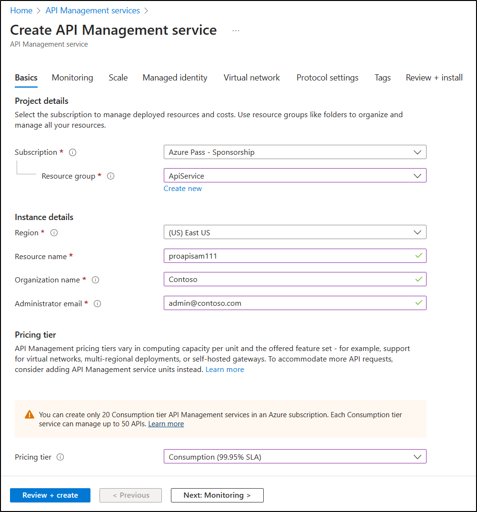

---
lab:
  az204Title: 'Lab 08: Create a multi-tier solution by using Azure services'
  az204Module: 'Learning Path 08: Implement API Management'
---

# Laboratório 08: Criar uma solução de vários níveis usando os serviços do Azure

## Interface de usuário do Microsoft Azure

Dada a natureza dinâmica das ferramentas de nuvem da Microsoft, você pode se deparar com alterações na IU do Azure que ocorram após o desenvolvimento deste conteúdo do treinamento. Como resultado, as instruções do laboratório e as etapas do laboratório podem não estar alinhadas corretamente.

A Microsoft atualiza este curso de treinamento quando a comunidade nos alerta sobre as alterações necessárias. No entanto, as atualizações na nuvem ocorrem com frequência, portanto você pode encontrar alterações na interface de usuário antes que esse conteúdo de treinamento seja atualizado. **Se isso ocorrer, adapte-se às alterações e trabalhe com elas nos laboratórios, conforme necessário.**

## Instruções

### Antes de começar

#### Entrar no ambiente de laboratório

Entre na máquina virtual (VM) do Windows 11 usando as seguintes credenciais:

- Nome de usuário: `Admin`
- Senha: `Pa55w.rd`

> **Observação**: Seu instrutor fornecerá instruções para se conectar ao ambiente de laboratório virtual.

#### Examinar os aplicativos instalados

Localize a barra de tarefas na área de trabalho do Windows 11. A barra de tarefas contém os ícones dos aplicativos que você usará neste laboratório:
    
-   Microsoft Edge

## Cenário do laboratório

Nesta prova de conceito, você criará um aplicativo conteinerizado para hospedar um aplicativo Web no Azure, como a fonte de informações para a API. Em seguida, você criará um proxy de API usando as capacidades do Gerenciamento de API do Azure para expor e testar suas APIs. Os desenvolvedores podem consultar as APIs para testar o serviço e validar sua aplicabilidade.

## Diagrama de arquitetura


### Exercício 1: Criar um recurso de Serviço de Aplicativo do Azure usando uma imagem de contêiner do Docker

#### Tarefa 1: Abrir o portal do Azure

1. Na barra de tarefas, selecione o ícone **Microsoft Edge**.

1. Na janela do navegador que se abrir, navegue até o portal do Azure em `https://portal.azure.com` e entre com a conta que você usará neste laboratório.

    > **Observação**: Se esta for a primeira vez que entra no portal do Azure, você receberá um tour pelo portal. Selecione **Introdução** para ignorar o tour e começar a usar o portal.

#### Tarefa 2: Criar um aplicativo Web usando um recurso do Serviço de Aplicativo do Azure com uma imagem de contêiner httpbin

1. No portal do Azure, use a caixa de texto **Pesquisar recursos, serviços e documentos** para pesquisar **Serviços de Aplicativos** e, na lista de resultados, selecione **Serviços de Aplicativos**.

1. Na folha **Serviços de Aplicativos**, selecione **+ Criar**.

1. Na folha **Criar aplicativo Web**, na guia **Básico**, realize as ações a seguir:
    
    | Configuração | Ação |
    | -- | -- |
    | Lista suspensa **Assinatura** | Manter o valor padrão |
    | Seção **Grupo de recursos** | Selecionar **Criar novo**, inserir **ApiService** e selecionar **OK** |
    | Caixa de texto **Nome** | Inserir **httpapi** *[yourname]* |
    | Seção **Publicar** | Selecionar **Contêiner** |
    | Seção **Sistema operacional** | Selecione **Linux** |
    | Lista suspensa **Região** | Selecione a mesma região do Azure que o local do grupo de recursos |
    | Seção**Plano do Linux** | Selecione **Criar novo**, insira o valor **ApiPlan** na caixa de texto **Nome** e selecione **OK** |
    | Seção **Plano de preços** | Selecione **Explorar os planos de preços**, na página **Selecionar Plano de Preços do Serviço de Aplicativo**, selecione **B1 Básico** e selecione **Selecionar** |

1. Selecione **Avançar: Banco de dados >**.
   
1. Selecione **Avançar: Contêiner >**.

1. Na guia **Docker**, realize as seguintes ações e selecione **Revisar + criar**:

    | Configuração | Ação |
    | -- | -- |
    | Lista suspensa **Fonte da imagem** | Selecione **Hub do Docker ou outros registros** |
    | Lista suspensa **Opções** | Selecione **Contêiner único** |
    | Lista suspensa **Tipo de acesso** | Selecione **Público** |
    | Caixa de texto **Imagem e marca** | Insira **kennethreitz/httpbin:latest** |

1. Na guia **Revisar + criar**, revise as opções selecionadas nas etapas anteriores.

1. Selecione **Criar** para criar o aplicativo Web usando a configuração especificada.

    > **Observação**: Aguarde a conclusão da tarefa de criação antes de prosseguir neste laboratório.

#### Tarefa 3: Testar o aplicativo Web httpbin

1. No portal do Azure, use a caixa de texto **Pesquisar recursos, serviços e documentos** para pesquisar **Serviços de Aplicativos** e, na lista de resultados, selecione **Serviços de Aplicativos**.

1. Na folha **Serviços de Aplicativos**, selecione o aplicativo Web recém-criado.

1. Na folha que exibe as propriedades do aplicativo recém-criado, selecione **Procurar**.

1. No aplicativo Web, execute as seguintes ações:

    a.  Selecione **Formatos de resposta**.

    b.  Selecione **GET /html**.

    c.  Selecione **Vamos experimentar**.

    A captura de tela a seguir exibe a seção **Vamos experimentar** do aplicativo Web.

    

    d.  Selecione **Executar**.

    e.  Examine o valor nas caixas de texto **Corpo da resposta** e **Cabeçalhos de resposta**.

    f.  Examine o valor na caixa de texto **URL da solicitação**.

1. No aplicativo Web, execute as seguintes ações:

    a.  Selecione **Dados dinâmicos**.

    b.  Selecione **GET /bytes/{n}**.

    c.  Selecione **Vamos experimentar**.

    d.  Na caixa de texto **n**, insira **25**.

    e.  Selecione **Executar**.

    f.  Examine o valor nas caixas de texto **Corpo da resposta** e **Cabeçalhos de resposta**.

    g.  Selecione **Baixar arquivo** e, depois que o arquivo for baixado, abra-o no Bloco de Notas, examine seu conteúdo e feche-o.

    > **Observação**: O arquivo contém uma sequência de bytes gerados de forma aleatória.

    A captura de tela a seguir exibe a seção de dados dinâmicos do aplicativo Web.
  
    

1. No aplicativo Web, execute as seguintes ações:

    a.  Selecione **Códigos de status**.

    b.  Selecione **GET /status/{codes}**.

    c.  Selecione **Vamos experimentar**.

    d.  Na caixa de texto **códigos**, insira **404**.

    e.  Selecione **Executar**.

    f.  Examine a **Resposta do servidor** e observe que ela inclui a entrada **Erro: NÃO ENCONTRADO**.
     
1. Feche a janela do navegador que exibe o aplicativo Web.

1. Volte para a janela do navegador que exibe o aplicativo Web **httpapi**_[yourname]_.

1. Na folha **Visão Geral do Serviço de Aplicativo**, em **Essentials**, registre o valor do link do **Domínio padrão**. Você usará esse valor mais adiante no laboratório para enviar solicitações à API correspondente.

#### Revisão

Neste exercício, você criou um novo aplicativo Web do Azure usando uma imagem de contêiner originada do Docker Hub.

### Exercício 2: Criar uma camada de proxy de API usando o Gerenciamento de API do Azure

#### Tarefa 1: Criar um recurso do Gerenciamento de API

1. No portal do Azure, use a caixa de texto **Pesquisar recursos, serviços e documentos** para pesquisar **Serviços de Gerenciamento de API** e, na lista de resultados, selecione **Serviços de Gerenciamento de API**.

1. Na folha **Serviços de Gerenciamento de API**, selecione **+ Criar**.

1. Na folha **Criar serviço de Gerenciamento de API**, realize as seguintes ações e selecione **Revisar + criar**:

    
    | Configuração | Ação |
    | -- | -- |
    | **Assinatura** lista suspensa | Manter o valor padrão. |
    | Seção **Grupo de recursos** | Selecionar o grupo de **ApiService** criado anteriormente neste laboratório |
    | Lista **Região** | Selecione a mesma região escolhida no exercício anterior |
    | Caixa de texto **Nome do recurso** | Inserir **proapi** *[yourname]* |
    | Caixa de texto **Nome da Organização** | Inserir **Contoso** |
    | Caixa de texto **Email do Administrador** | Inserir `admin@contoso.com` |
    | Lista suspensa **Tipo de preço** | **Consumo (SLA de 99,95%)** |

    A captura de tela a seguir exibe as configurações definidas na folha **Criar Gerenciamento de API** do aplicativo Web.
    
    

1. Na guia **Revisar + criar**, examine a opção especificada na etapa anterior e selecione **Criar**.

    > **Observação**: Aguarde a conclusão da tarefa de criação antes de avançar neste laboratório.

1. Na folha **Visão Geral de implantação**, selecione **Ir para o recurso**.

#### Tarefa 2: Definir uma nova API

1. Na folha **Serviço de Gerenciamento de API**, na seção **APIs**, selecione **APIs**.

1. Na seção **Definir uma nova API**, selecione **HTTP**.

1. Na janela **Criar uma API de HTTP**, realize as seguintes ações e selecione **Criar**:
    
    | Configuração | Ação |
    | -- | -- |
    | Caixa de texto **Nome de exibição** | Inserir **API HTTPBin** |
    | Caixa de texto **Nome** | Inserir **httpbin-api** |
    | Caixa de texto **URL de serviço Web** | Insira a URL do aplicativo Web que você copiou anteriormente neste laboratório. **Observação**: Verifique se a URL inicia com o prefixo https:// |
    | Caixa de texto **Sufixo de URL de API** | Deixar vazio |
 
    A captura de tela a seguir exibe as configurações definidas na janela **Criar uma API em branco** do aplicativo Web.

    

    > **Observação**: Aguarde o fim da criação da API.

1. Na guia **Design**, selecione **+ Adicionar operação**.

1. Na seção **Adicionar operação**, realize as seguintes ações e selecione **Salvar**:


    | Configuração | Ação |
    | -- | -- |
    | Caixa de texto **Nome de exibição** | Inserir **Cabeçalhos de Eco** |
    | Caixa de texto **Nome** | Verifique se o valor está definido como **echo-headers** |
    | Lista **URL** | Selecione **GET** |
    | Caixa de texto **URL** | Inserir **/** |

    A captura de tela a seguir exibe as configurações definidas na seção **Adicionar operação**.
    
    

    
1. Voltando para a guia **Design**, na lista de operações, selecione **Cabeçalhos de Eco**.

1. Na seção **Design**, no bloco **Processamento de entrada** selecione **+ Adicionar política**.

1. Na seção**Adicionar política de entrada**, selecione o bloco **Definir cabeçalhos**.

1. Na seção **Definir cabeçalhos**, realize as seguintes ações e selecione **Salvar**:
    
    | Configuração | Ação |
    | -- | -- |
    | Caixa de texto **Nome**    | Inserir **fonte** |
    | Caixa de texto **Valor** | Selecione a lista, selecione **Adicionar Valor** e insira **azure-api-mgmt** |
    | Lista de **ações** | Selecionar **acrescentar** |

    A captura de tela a seguir exibe as configurações definidas na seção **Design**.

    

1. Voltando para a guia **Design**, na lista de operações, selecione **Cabeçalhos de Eco**.

1. Na seção **Design** para **Cabeçalhos de eco**, no bloco **Back-end**, selecione o ícone de lápis.

1. Na seção **Back-end**, realize as seguintes ações e selecione **Salvar**:

    | Configuração | Ação |
    | -- | -- |
    | Seção **URL de serviço** | Marque a caixa de seleção **Substituir** |
    | Caixa de texto **URL de serviço** | Acrescente o valor **/headers** ao valor atual. **Observação**: Por exemplo, se o valor atual for `https://httpapi[yourname].azurewebsites.net`, o novo valor será `https://httpapi[yourname].azurewebsites.net/headers` |
    
1. Voltando para a guia **Design**, na lista de operações, selecione **Cabeçalhos de Eco** e, depois, selecione a guia **Testar**.

1. Na seção **Cabeçalhos de eco**, selecione **Enviar**.

    A captura de tela a seguir exibe as configurações definidas na seção **Cabeçalhos de eco**.

    
    
1. Examine os resultados da solicitação de API.

    > **Observação**: Verifique se há muitos cabeçalhos enviados como parte de sua solicitação que são ecoados na resposta. Eles devem incluir o novo cabeçalho **Fonte** que você criou como parte dessa tarefa.
     
    A captura de tela a seguir exibe a resposta à solicitação dos **Cabeçalhos de eco**.

    
     
1. Selecione a guia **Design** para retornar à lista de operações.

#### Tarefa 3: Manipular uma resposta da API

1. Na guia **Design**, selecione **+ Adicionar operação**.

1. Na seção **Adicionar operação**, realize as seguintes ações e selecione **Salvar**:

    | Configuração | Ação |
    | -- | -- |
    | Caixa de texto **Nome de exibição** | Insira **Obter dados herdados** |
    | Caixa de texto **Nome** | Verifique se o valor está definido como **get-legacy-data** |
    | Lista **URL** | Verifique se o valor está definido como **GET** |
    | Caixa de texto **URL** | Insira **/xml** |

1. Voltando para a guia **Design**, na lista de operações, selecione **Obter dados herdados**.

1. Selecione a guia **Testar** e, então, selecione **Enviar**.

1. Examine os resultados da solicitação de API.

    > **Observação**: Neste ponto, os resultados devem estar no formato XML.

    A captura de tela a seguir exibe os resultados da solicitação da API.
    
    

    
1. Selecione a guia **Design** e, então, selecione **Obter dados herdados**.

1. No painel **Design**, na seção **Processamento de saída**, selecione **Adicionar política**.
    
    A captura de tela a seguir exibe a seção **Processamento de saída**.
    
    
    
1. Na seção **Adicionar política de saída**, selecione o bloco **Outras políticas**.

1. No editor de código de política, localize o seguinte bloco de conteúdo XML:

    ```
    <outbound>
        <base />
    </outbound>
    ```

1. Substitua esse bloco de XML pelo seguinte XML:

    ```
    <outbound>
        <base />
        <xml-to-json kind="direct" apply="always" consider-accept-header="false" />
    </outbound>
    ```

1. No editor de código de política, selecione **Salvar**.

1. Voltando para a guia **Design**, na lista de operações, selecione **Obter dados herdados** e, então, selecione **Testar**.

1. Na seção **Obter dados herdados**, selecione **Enviar**.

1. Examine os resultados da solicitação de API.

    > **Observação**: Os novos resultados estão no formato JSON (JavaScript Object Notation).

1. Na seção **Resposta HTTP**, realize as seguintes ações:

    1. Selecione **Rastreamento**.

    1. Se solicitado, selecione **Habilitar rastreamento por uma hora**.

    1. Selecione a guia **Rastrear**, examine o conteúdo no **Back-end** e caixas de texto de **Saída** e observe que elas incluem detalhes das operações de API correspondentes com suas informações de tempo.

#### Tarefa 4: Manipular uma solicitação da API

1. Na guia **Design**, selecione **+ Adicionar operação**.

1. Na seção **Adicionar operação**, realize as seguintes ações e selecione **Salvar**:

    | Configuração  | Ação |
    | -- | -- |
    | Caixa de texto **Nome de exibição** | Inserir **Modificar código de status** |
    | Caixa de texto **Nome** | Verifique se o valor está definido como **modify-status-code** |
    | Lista **URL** | Selecione **GET** |
    | Caixa de texto **URL** | Insira **/status/404** |

1. Voltando para a guia **Design**, na lista de operações, selecione **Modificar código de status**.

1. Na seção **Design**, no bloco **Processamento de entrada**, selecione **+ Adicionar política**.

1. Na seção **Adicionar política de entrada**, selecione o bloco **Reescrever URL**.

1. Na seção **Reescrever URL**, realize as seguintes ações:
       
    a.  Na caixa de texto **Back-end**, insira **/status/200**.
    
    b.  Selecione **Salvar**.

1. Voltando para a guia **Design**, na lista de operações, selecione **Modificar código de status** e, depois, selecione a guia **Testar**.
    
1. Na seção **Modificar código de status**, selecione **Enviar**.

1. Examine os resultados da solicitação de API.

    > **Observação**: Verifique se a solicitação obteve a resposta **HTTP/1.1 200 OK**.
   
#### Revisão

Neste exercício, você criou um nível de proxy entre seu recurso do Serviço de Aplicativo e todos os desenvolvedores que desejem fazer consultas à sua API.
