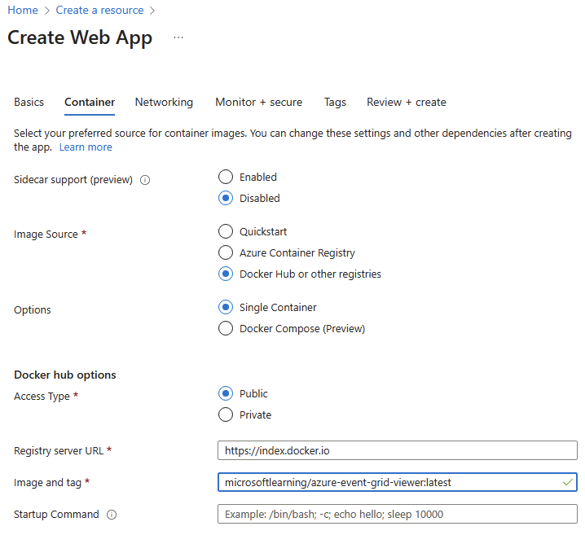
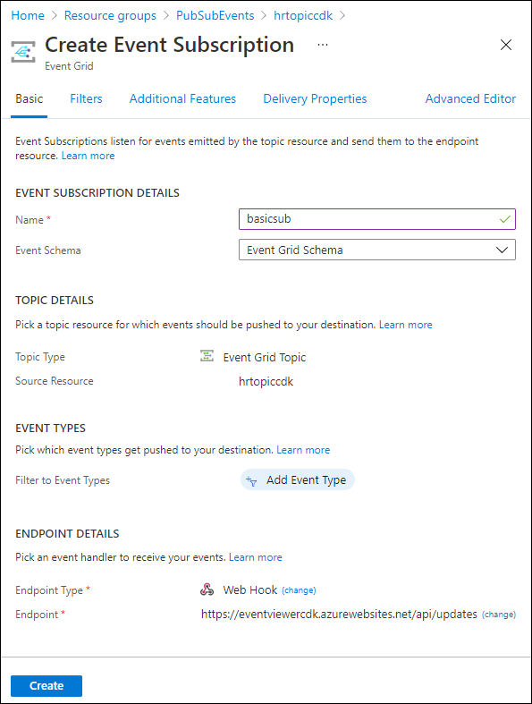

---
lab:
  az204Title: 'Lab 09: Publish and subscribe to Event Grid events'
  az204Module: 'Learning Path 09: Develop event-based solutions'
---

# Laboratório 09: Publicar e assinar eventos da Grade de Eventos

## Interface de usuário do Microsoft Azure

Dada a natureza dinâmica das ferramentas de nuvem da Microsoft, você pode se deparar com alterações na IU do Azure que ocorram após o desenvolvimento deste conteúdo do treinamento. Como resultado, as instruções do laboratório e as etapas do laboratório podem não estar alinhadas corretamente.

A Microsoft atualiza este curso de treinamento quando a comunidade nos alerta sobre as alterações necessárias. No entanto, as atualizações na nuvem ocorrem com frequência, portanto você pode encontrar alterações na interface de usuário antes que esse conteúdo de treinamento seja atualizado. **Se isso ocorrer, adapte-se às alterações e trabalhe com elas nos laboratórios, conforme necessário.**

## Instruções

### Antes de começar

#### Entrar no ambiente de laboratório

Entre na máquina virtual (VM) do Windows 10 usando as seguintes credenciais:

- Nome de usuário: `Admin`
- Senha: `Pa55w.rd`

> **Observação**: Seu instrutor fornecerá instruções para se conectar ao ambiente de laboratório virtual.

#### Examinar os aplicativos instalados

Encontre a barra de tarefas na área de trabalho do Windows 10. A barra de tarefas contém os ícones dos aplicativos que você usará neste laboratório, incluindo:

- Microsoft Edge
- Microsoft Visual Studio Code

## Cenário do laboratório

Neste laboratório, você começará com um aplicativo Web de prova de conceito, hospedado em um contêiner, que será usado para assinar sua Grade de Eventos. Este aplicativo permitirá que você envie eventos e receba mensagens de confirmação de que os eventos foram bem-sucedidos.

## Diagrama de arquitetura


### Exercício 1: Criar recursos do Azure

#### Tarefa 1: Abrir o portal do Azure

1. Na barra de tarefas, selecione o ícone **Microsoft Edge**.

1. Na janela aberta do navegador, navegue até o portal do Azure em `https://portal.azure.com` e entre com a conta que você usará para este laboratório.

    > **Observação**: Se esta for a primeira vez que entra no portal do Azure, você receberá um tour pelo portal. Selecione **Introdução** para ignorar o tour e começar a usar o portal.

#### Tarefa 2: abrir o Azure Cloud Shell

1. No portal do Azure, selecione o ícone **Cloud Shell**  para abrir uma nova sessão do Bash. Se o Cloud Shell tiver como padrão uma sessão do PowerShell, selecione **PowerShell** e, no menu suspenso, selecione **Bash**.

    > **Observação**: se esta for a primeira vez que você está iniciando o **Cloud Shell**, quando solicitado a selecionar **Bash** ou **PowerShell**, selecione **Bash**. Quando receber a mensagem **Você não tem nenhum armazenamento montado**, selecione a assinatura que você está usando no laboratório e selecione **Criar armazenamento**.

1. No portal do Azure, no prompt de comando do **Cloud Shell**, execute o seguinte comando para obter a versão da ferramenta de interface de linha de comando do Azure (CLI do Azure):

    ```bash
    az --version
    ```

#### Tarefa 3: Examinar o registro do provedor do Microsoft.EventGrid

1. No **painel do Cloud Shell**, execute o seguinte comando para verificar se o provedor de recursos “Microsoft.EventGrid” foi registrado:

    ```bash
    az provider show --namespace Microsoft.EventGrid --query "registrationState"
    ```

1. Observe que o provedor **Microsoft.EventGrid** foi registrado.

1. Feche o painel do **Cloud Shell**.

#### Tarefa 4: Criar um tópico de Grade de Eventos personalizado

1. No painel de navegação do portal do Azure, selecione **Criar um recurso**.

1. Na folha **Criar um recurso** na caixa de texto **Serviços Pesquisa e marketplace**, insira **Tópico de Grade de Eventos** e selecione Inserir.

1. Na folha de resultados da pesquisa do **Marketplace**, selecione o resultado **Tópico de Grade de Eventos** e, então, selecione **Criar**.

1. Na folha **Criar tópico**, na guia **Básico**, execute as seguintes ações e selecione a guia **Avançado**:

    | Configuração | Ação |
    | -- | -- |
    | Lista suspensa **Assinatura**  | Manter o valor padrão |
    | Lista suspensa **Grupo de recursos** | Selecionar **Criar novo**, inserir **PubSubEvents** e selecionar **OK** |
    | Caixa de texto **Nome** | Inserir **hrtopic**_[yourname]_ |
    | Lista suspensa **Região** | Selecione **Leste dos EUA** |

   A captura de tela a seguir exibe as configurações definidas na guia **Básico**.

   

1. Na guia **Avançado**, na lista suspensa **Esquema de eventos**, verifique se a entrada **Esquema da Grade de Eventos** está selecionada e, então, selecione **Revisar + criar**.

1. Na guia **Revisar + criar**, revise as opções selecionadas nas etapas anteriores.

1. Selecione **Criar** para criar um tópico de grade de eventos usando a configuração especificada.
  
    > **Observação**: Aguarde até que o Azure conclua a criação do tópico antes de avançar neste laboratório. Você receberá uma notificação quando o tópico for criado.

#### Tarefa 5: Implantar o visualizador da Grade de Eventos do Azure em um aplicativo Web

1. No painel de navegação do portal do Azure, selecione **Criar um recurso**.

1. Na folha **Criar um recurso **na caixa de texto **serviço Pesquisa e marketplace**, digite **Aplicativo Web** e selecione Enter.

1. Na folha de resultados da pesquisa de **Marketplace**, selecione o resultado **Aplicativo Web** e, então, selecione **Criar**.

1. Na folha **Criar aplicativo Web**, na guia **Básico**, realize as seguintes ações e selecione **Avançar: Docker**:

   | Configuração | Ação |
   | -- | -- |
   | Lista suspensa **Assinatura** | Manter o valor padrão |
   | Lista suspensa **Grupo de recursos** | Selecionar **PubSubEvents** na lista |
   | Caixa de texto**Nome**  | Inserir **eventviewer**_[yourname]_ |
   | Seção **Publicar** | Selecione **Contêiner do Docker** |
   | Seção **Sistema operacional** | Selecione **Linux** |
   | Lista suspensa **Região** | Selecione **Leste dos EUA** |
   | Seção **Plano Linux (Leste dos EUA)** | Selecione **Criar novo**,na caixa de texto **Nome**, insira **EventPlan** e selecione **OK** |
   | Seção **Plano de preços** | Manter o valor padrão |

   A captura de tela a seguir exibe as configurações definidas na folha **Criar aplicativo Web**.

   

1. Na guia **Docker**, realize as seguintes ações e selecione **Revisar + criar**:

    | Configuração | Ação |
    | -- | -- |
    | Lista suspensa **Opções** | Selecione **Contêiner único** |
    | Lista suspensa **Fonte da imagem** | Selecione **Docker Hub** |
    | Lista suspensa **Tipo de acesso** | Selecione **Público** |
    | Caixa de texto **Imagem e marca** | Insira **microsoftlearning/azure-event-grid-viewer:latest** |

   A captura de tela a seguir exibe as configurações definidas na guia **Docker**.

   

1. Na guia **Revisar + criar**, revise as opções selecionadas nas etapas anteriores.

1. Selecione **Criar** para criar o aplicativo Web usando a configuração especificada.
  
    > **Observação**: Aguarde até que o Azure conclua a criação do aplicativo Web antes de avançar neste laboratório. Você receberá uma notificação quando o aplicativo for criado.

#### Revisão

Neste exercício, você criou o tópico de Grade de Eventos e um aplicativo Web que será usado no restante do laboratório.

### Exercício 2: Criar uma assinatura na Grade de Eventos

#### Tarefa 1: Acessar o aplicativo Web Event Grid Viewer

1. No painel de navegação do portal do Azure, selecione **Grupos de recursos**.

1. Na folha **Grupos de recursos**, selecione o grupo de recursos **PubSubEvents**.

1. Na folha **PubSubEvents**, selecione o aplicativo Web **eventviewer**_[yourname]_. Você verá a seção **Visão Geral**.

1. Na seção **Visão Geral**, registre o valor do **Domínio padrão** no painel de itens essenciais. Você usará esse valor mais adiante no laboratório.

1. Clique no botão **Procurar** enquanto ainda estiver na seção **Visão geral**.

1. Observe o aplicativo Web **Azure Event Grid Viewer**, que está em execução no momento. Deixe este aplicativo Web em execução o restante do laboratório.

    > **Observação**: Este aplicativo Web será atualizado em tempo real à medida que os eventos forem enviados para o ponto de extremidade. Você usará este aplicativo para monitorar eventos em todo o laboratório.

1. Retorne à janela do navegador aberta no momento que exibe o portal do Azure.

#### Tarefa 2: Criar uma nova assinatura

1. No painel de navegação do portal do Azure, selecione **Grupos de recursos**.

1. Na folha **Grupos de recursos**, selecione o grupo de recursos **PubSubEvents** criado anteriormente neste laboratório.

1. Na folha **PubSubEvents**, selecione o tópico de Grade de Eventos **hrtopic**_[yourname]_ criado anteriormente neste laboratório.

1. Na folha **Tópico de Grade de Eventos**, selecione **+ Assinatura de Evento**.

1. Na folha **Criar assinatura de evento**, realize as seguintes ações e selecione **Criar**:

    | Configuração | Ação |
    | -- | -- |
    | Caixa de texto**Nome**  | Insira **basicsub** |
    | Lista suspensa**Esquema de Evento** | Selecionar **Esquema de Grade de Eventos** |
    | Lista suspensa **Tipo de ponto de Extremidade** | Selecionar **Web Hook** |
    | **Ponto de extremidade** | Selecione **Configurar um ponto de extremidade**. Na caixa de texto **Ponto de Extremidade do Assinante**, insira o valor de **URL de Aplicativo Web** registrado anteriormente, garantindo que ele use um prefixo **https://** e o sufixo **/api/updates**, e selecione **Confirmar Seleção**. Por exemplo, se o valor da **URL do Aplicativo Web** for ``http://eventviewerstudent.azurewebsites.net/``, o **Ponto de Extremidade do Assinante** será ``https://eventviewerstudent.azurewebsites.net/api/updates`` |

   A captura de tela a seguir exibe as configurações definidas na folha **Criar assinatura de Evento**.

   

    > **Observação**: Aguarde até que o Azure conclua a criação da assinatura antes de avançar neste laboratório. Você receberá uma notificação quando a assinatura for criada.

#### Tarefa 3: Observar o evento de validação de assinatura

1. Retorne à janela do navegador que exibe o aplicativo Web **Azure Event Grid Viewer**.

1. Examine o evento **Microsoft.EventGrid.SubscriptionValidationEvent** que foi criado como parte do processo de criação da assinatura..

1. Selecione o evento e examine seu conteúdo JSON.

1. Retorne à janela do navegador aberta no momento com o portal do Azure.

#### Tarefa 4: Registrar credenciais de assinatura

1. No painel de navegação do portal do Azure, selecione **Grupos de recursos**.

1. Na folha **Grupos de recursos**, selecione o grupo de recursos **PubSubEvents** criado anteriormente neste laboratório.

1. Na folha **PubSubEvents**, selecione o tópico de Grade de Eventos **hrtopic**_[yourname]_ criado anteriormente neste laboratório.

1. Na folha **Tópico de Grade de Eventos**, registre o valor do campo **Ponto de extremidade do tópico**. Você usará esse valor mais adiante no laboratório.

1. Na categoria **Configurações**, selecione o link **Chaves de acesso**.

1. Na seção **Chaves de acesso**, registre o valor da caixa de texto **Chave 1**. Você usará esse valor mais adiante no laboratório.

#### Revisão

Neste exercício, você criou uma nova assinatura, validou o registro dela e registrou as credenciais necessárias para publicar um novo evento no tópico.

### Exercício 3: Publicar eventos da Grade de Eventos do .NET

#### Tarefa 1: Criar um projeto do .NET

1. Na tela **inicial**, selecione o bloco **Visual Studio Code**.

1. No menu **Arquivo**, selecione **Abrir Pasta**.

1. Na janela **Explorador de Arquivos** que se abre, navegue até **Allfiles (F):\\Allfiles\\Labs\\09\\Starter\\EventPublisher** e selecione **Selecionar Pasta**.

1. Na janela **Visual Studio Code**, na barra de menus superior, procure o menu **Terminal** e selecione **Novo Terminal**.

1. Execute o seguinte comando para criar um novo projeto do .NET chamado **EventPublisher** na pasta atual:

    ```powershell
    dotnet new console --framework net8.0 --name EventPublisher --output . 
    ```

    > **Observação**: O comando **dotnet new** cria um novo projeto de **console** em uma pasta com o mesmo nome que o projeto.

1. Execute o seguinte comando para importar a versão 4.11.0 do **Azure.Messaging.EventGrid** do NuGet:

    ```powershell
    dotnet add package Azure.Messaging.EventGrid --version 4.11.0
    ```
    

    > **Observação**: O comando **dotnet add package** adicionará o pacote **Microsoft.Azure.EventGrid** do NuGet. Para obter mais informações, consulte [Azure.Messaging.EventGrid](https://www.nuget.org/packages/Azure.Messaging.EventGrid/4.11.0).


1. Execute o seguinte comando para criar o aplicativo Web do .NET:

    ```powershell
    dotnet build
    ```

1. Selecione **Encerrar Terminal** ou o ícone da **Lixeira** para fechar o terminal aberto no momento e eventuais processos associados.

#### Tarefa 2: Modificar a classe do programa para se conectar à Grade de Eventos

1. No painel **Explorer** da janela do **Visual Studio Code**, abra o arquivo **Program.cs**.

1. Na guia do editor de código do arquivo **Program.cs** , exclua todo o código no arquivo existente.
  
1. Adicione o seguinte do código:

    ```csharp
    using Azure;
    using Azure.Messaging.EventGrid;
    using System;
    using System.Threading.Tasks;    
    public class Program
    {
        private const string topicEndpoint = "<topic-endpoint>";
        /* Update the topicEndpoint string constant by setting its value to the Topic
           Endpoint of the Event Grid topic that you recorded previously in this lab. */
        private const string topicKey = "<topic-key>";   
        /* Update the topicKey string constant by setting its value to the Key of the Event Grid topic that you recorded previously in this lab. */     
        public static async Task Main(string[] args)
        {
            //Add Main code here
        }
    }
    ```
1. Na linha 7, substitua o espaço reservado `<topic-endpoint>`pelo valor do ponto de extremidade do tópico Grade de Eventos que você registrou anteriormente neste laboratório.

1. Na linha 10, substitua o espaço reservado `<topic-key>`pelo valor da chave de acesso do tópico Grade de Eventos que você registrou anteriormente neste laboratório.

#### Tarefa 3: Publicar novos eventos

1. Adicione o código a seguir ao método **Main** do arquivo **Program.cs** :
   
    ```csharp
    public static async Task Main(string[] args)
    {   
        /* To create a new variable named "endpoint" of type "Uri", 
           using the "topicEndpoint" string constant as a constructor parameter */
        Uri endpoint = new Uri(topicEndpoint);

        /* To create a new variable named "credential" of type "AzureKeyCredential",
           use the "topicKey" string constant as a constructor parameter. */
        AzureKeyCredential credential = new AzureKeyCredential(topicKey);

        /* To create a new variable named "client" of type "EventGridPublisherClient", 
           using the "endpoint" and "credential" variables as constructor parameters */
        EventGridPublisherClient client = new EventGridPublisherClient(endpoint, credential);

        /* To create a new variable named "firstEvent" of type "EventGridEvent",
           and populate that variable with sample data */        
        EventGridEvent firstEvent = new EventGridEvent(
            subject: $"New Employee: Alba Sutton",
            eventType: "Employees.Registration.New",
            dataVersion: "1.0",
            data: new
            {
                FullName = "Alba Sutton",
                Address = "4567 Pine Avenue, Edison, WA 97202"
            }
        );

        /* To create a new variable named "secondEvent" of type "EventGridEvent",
           and populate that variable with sample data */
        EventGridEvent secondEvent = new EventGridEvent(
            subject: $"New Employee: Alexandre Doyon",
            eventType: "Employees.Registration.New",
            dataVersion: "1.0",
            data: new
            {
                FullName = "Alexandre Doyon",
                Address = "456 College Street, Bow, WA 98107"
            }
        );

        /* To asynchronously invoke the "EventGridPublisherClient.SendEventAsync"
           method using the "firstEvent" variable as a parameter */
        await client.SendEventAsync(firstEvent);
        Console.WriteLine("First event published");

        /* To asynchronously invoke the "EventGridPublisherClient.SendEventAsync"
           method using the "secondEvent" variable as a parameter */
        await client.SendEventAsync(secondEvent);
        Console.WriteLine("Second event published");
    }
    ```
    > **Observação**: Para saber mais sobre o **[AzureKeyCredential](https://docs.microsoft.com/dotnet/api/azure.azurekeycredential)**
  
    > **Observação**: Para saber mais sobre a Grade de Eventos, clique nos links a seguir: 
    - **[EventGridPublisherClient](https://learn.microsoft.com/dotnet/api/azure.messaging.eventgrid.eventgridpublisherclient)**
    
    - **[EventGridEvent](https://learn.microsoft.com/dotnet/api/azure.messaging.eventgrid.eventgridevent)**

    - **[EventGridPublisherClient.SendEventAsync](https://learn.microsoft.com/dotnet/api/azure.messaging.eventgrid.eventgridpublisherclient.sendeventasync)**


1. Salve o arquivo **Program.cs** .

1. Na janela **Visual Studio Code**, na Barra de menus, selecione **Terminal** e, em seguida, selecione **Novo Terminal**.

1. Execute o seguinte comando para executar o aplicativo Web do .NET:

    ```powershell
    dotnet run
    ```

    > **Observação**: Se você encontrar algum erro de compilação, faça uma revisão do arquivo **Program.cs** na pasta **Allfiles (F):\\Allfiles\\Labs\\09\\Solution\\EventPublisher**.

1. Observe a saída da mensagem de êxito do aplicativo de console em execução no momento.

1. Selecione **Encerrar Terminal** ou o ícone da **Lixeira** para fechar o terminal aberto no momento e eventuais processos associados.

#### Tarefa 4: Observar eventos publicados

1. Retorne à janela do navegador com o aplicativo Web **Azure Event Grid Viewer**.

1. Examine os **eventos Employees.Registration.New** que foram criados pelo aplicativo de console.

1. Selecione um evento e examine seu conteúdo JSON.

1. Retorne ao portal do Azure.

#### Revisão

Neste exercício, você publicou novos eventos no tópico da Grade de Eventos usando um aplicativo de console do .NET.
