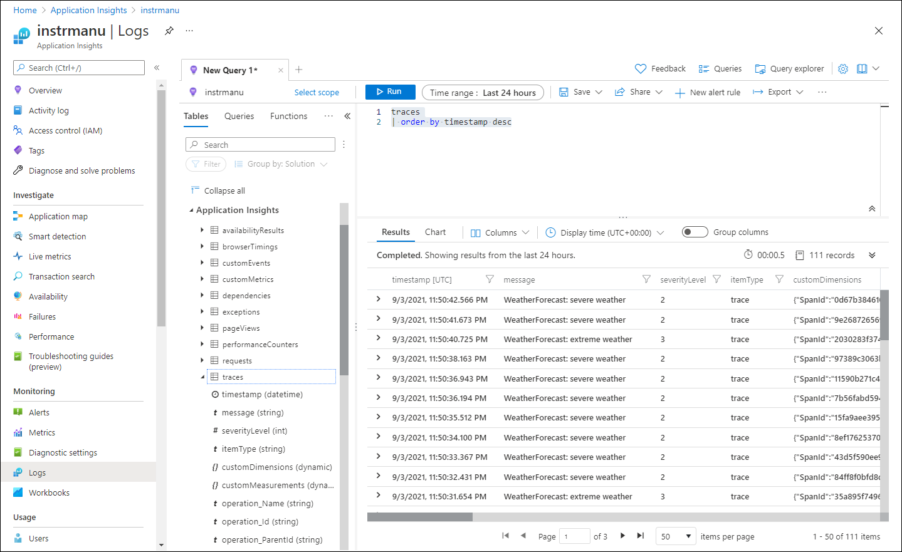

---
lab:
  az204Title: 'Lab 11: Monitor services that are deployed to Azure'
  az204Module: 'Learning Path 11: Troubleshoot solutions by using Application Insights'
---

# Laboratório 11: Monitorar serviços implantados no Azure

## Interface de usuário do Microsoft Azure

Dada a natureza dinâmica das ferramentas de nuvem da Microsoft, você pode se deparar com alterações na IU do Azure que ocorram após o desenvolvimento deste conteúdo do treinamento. Como resultado, as instruções do laboratório e as etapas do laboratório podem não estar alinhadas corretamente.

A Microsoft atualiza este curso de treinamento quando a comunidade nos alerta sobre as alterações necessárias. No entanto, as atualizações na nuvem ocorrem com frequência, portanto você pode encontrar alterações na interface de usuário antes que esse conteúdo de treinamento seja atualizado. **Se isso ocorrer, adapte-se às alterações e trabalhe com elas nos laboratórios, conforme necessário.**

## Instruções

### Antes de começar

#### Entrar no ambiente de laboratório

Entre na máquina virtual (VM) do Windows 10 usando as seguintes credenciais:

- Nome de usuário: `Admin`
- Senha: `Pa55w.rd`

> **Observação**: Seu instrutor fornecerá instruções para se conectar ao ambiente de laboratório virtual.

#### Examinar os aplicativos instalados

Encontre a barra de tarefas na área de trabalho do Windows 10. A barra de tarefas contém os ícones dos aplicativos que você usará neste laboratório, incluindo:
    
-   Microsoft Edge
-   Explorador de Arquivos
-   Visual Studio Code
-   PowerShell do Azure

## Cenário do laboratório

Neste laboratório, você criará um recurso do Application Insights no Azure que será usado para monitorar e registrar dados de ideias de aplicativo para análise posterior. A API será configurada para ajustar escala de forma automática caso a demanda aumente para um determinado limite e registrar os dados ajudará a verificar como o serviço está sendo utilizado.

## Diagrama de arquitetura


### Exercício 1: Criar e configurar recursos do Azure

#### Tarefa 1: Abrir o portal do Azure

1. Na barra de tarefas, selecione o ícone **Microsoft Edge**.

1. Na janela do navegador, navegue até o portal do Azure em `https://portal.azure.com` e entre com a conta que você usará neste laboratório.

    > **Observação**: Se esta for a primeira vez que entra no portal do Azure, você receberá um tour pelo portal. Selecione **Introdução** para ignorar o tour e começar a usar o portal.

#### Tarefa 2: Criar um recurso do Application Insights

1. No portal do Azure, use a caixa de texto **Pesquisar recursos, serviços e documentos** no topo da página para pesquisar o **Application Insights** e, na lista de resultados, selecione **Application Insights**.

1. Na folha **Application Insights**, selecione **+ Criar**.

1. Na folha **Application Insights**, na guia **Básico**, execute as seguintes ações e selecione **Revisar + Criar**:
    
    | Configuração | Ação |
    | -- | -- |
    | **Assinatura** lista suspensa | Manter o valor padrão |
    | Seção **Grupo de recursos** | Selecionar **Criar novo**, inserir **MonitoredAssets** e selecionar **OK** |
    | Caixa de texto**Nome**  | **instrm**_[yourname]_ |
    | Lista suspensa **Região** | Selecione qualquer região do Azure na qual você possa implantar um Barramento de Serviço do Azure |
    | Seção **Modo de recursos** | Selecione a opção **Baseado no Workspace** |
    | Seção **DETALHES DO WORKSPACE** | Manter os valores padrão das listas suspensas **Assinatura** e **Workspace do Log Analytics** |
    
    A captura de tela a seguir exibe as configurações definidas na folha **Application Insights**.

    
     
1. Na guia **Revisar + Criar**, revise as opções selecionadas nas etapas anteriores.

1. Selecione **Criar** para criar a instância do **Application Insights** usando a configuração especificada.

    > **Observação**: Aguarde a conclusão da tarefa de criação antes de prosseguir neste laboratório.

1. Na folha **Visão Geral do \| Microsoft.AppInsights**, selecione o botão **Ir para o recurso** para navegar até a folha do recurso do **Application Insights** recém-criado.

1. Na folha **Application Insights**, na seção **Configurar**, selecione o link **Propriedades**.

1. Na folha**Propriedades**, ao lado da entrada **Chave de Instrumentação**, selecione o botão **Copiar para a área de transferência** e registre o valor copiado. Você o usará posteriormente neste laboratório.

    > **Observação**: A chave é usada por aplicativos cliente para se conectar a um recurso específico do **Application Insights**.

### Tarefa 3: Criar um recurso API Web do Azure

1. No portal do Azure, use a caixa de texto **Pesquisar recursos, serviços e documentos** no topo da página para pesquisar os **Serviços de Aplicativos** e, na lista de resultados, selecione **Serviços de Aplicativos**.

1. Na folha **Serviços de Aplicativos**, selecione **+ Criar**.
    
1. Na folha **Criar Aplicativo Web**, na guia **Básico**, execute as seguintes ações e selecione a guia **Monitoramento**:

    | Configuração | Ação |
    | -- | -- |
    | **Assinatura** lista suspensa | Manter o valor padrão |
    | Lista suspensa **Grupo de recursos** |Selecionar **MonitoredAssets** |
    | Caixa de texto**Nome**  | Inserir **smpapi**_[yourname]_ |
    | Seção **Publicar** | Selecione **Código** |
    | Lista suspensa**Pilha de runtime** | Selecionar **.NET 6 (LTS)** |
    | Seção **Sistema operacional** |  Selecione **Windows** |
    | Lista suspensa**Região**  |  Selecionar a mesma região escolhida como o local do recurso **Instância do Aplicativo** |
    | Seção**Plano do Windows (Leste dos EUA)** | Selecione **Criar novo** e, na caixa de texto **Nome**, insira **MonitoredPlan** e selecione **OK** |
    | Seção **Plano de preços** |  Manter o valor padrão |

1. Na guia**Monitoramento**, execute as seguintes ações e selecione **Revisar + Criar**:
    
    | Configuração | Ação |
    | -- | -- |
    | Seção**Habilitar o Application Insights** | Verificar se **Sim** está selecionado |
    | Lista suspensa**Application Insights** | Selecionar o recurso **instrm**_[yourname]_ do Application Insights que você criou anteriormente neste laboratório |
    
1. Na guia **Revisar + Criar**, revise as opções selecionadas nas etapas anteriores.

1. Selecione **Criar** para criar a API Web usando a configuração especificada.

    > **Observação**: Aguarde a conclusão da tarefa de criação antes de prosseguir neste laboratório.

1. Na folha **Visão Geral** de implantação, selecione o botão **Ir para o recurso** para navegar até a folha da API Web do Azure recém-criada.

1. Na folha **Serviço de Aplicativo**, na seção **Configurações**, selecione o link **Configuração**.

1. Na seção **Configuração**, execute as seguintes ações:
    
    a.  Na guia **Configurações do aplicativo**, selecione **Mostrar valores** para exibir segredos associados à sua API Web.

    b.  Observe o valor que representa a chave **APPLICATIONINSIGHTS_CONNECTION_STRING**. Esse valor foi configurado automaticamente quando você criou o recurso de API Web.

1. Na folha **Serviço de Aplicativo**, na seção **Configurações**, selecione o link **Propriedades**.

1. Na seção **Propriedades**, registre o valor do link da **URL**. Você usará esse valor posteriormente no laboratório para enviar solicitações à API Web.

#### Tarefa 4: Configurar opções de dimensionamento automático da API Web

1. Na folha **Serviço de Aplicativo**, na seção **Configurações**, selecione o link **Escalar horizontalmente (Plano do Serviço de Aplicativo)**.

1. Role para baixo até ver o **Método de escalar horizontalmente**. Clique na opção **Baseado em Regras** e selecione **Gerenciar dimensionamento baseado em regras**.

1. Na seção **Escalar horizontalmente**, execute as seguintes ações e selecione **Salvar**:
    
    | Configuração | Ação |
    | -- | -- |
    | Seção**Escalar horizontalmente** | Selecione **Dimensionamento automático personalizado**. |
    | Caixa de texto**Nome da configuração de dimensionamento automático** | Inserir **ComputeScaler** |
    | Lista suspensa **Grupo de recursos** |Selecionar **MonitoredAssets** |
    | Seção**Modo de escala** | Selecionar **Escala baseada em métrica** |
    | Caixa de texto** Mínimo** na seção **Limites de instância** | Insira **1** |
    | Caixa de texto** Máximo** na seção **Limites de instância** | Insira **8** |
    | Caixa de texto** Padrão** na seção **Limites de instância** | Insira **3** |
   
    A captura de tela a seguir exibe as configurações definidas na seção **Escalar horizontalmente** na folha **Serviço de Aplicativo**.
    
    

    | Configuração | Ação |
    | -- | -- |
    | Seção de**Regras** | Selecione **Adicionar uma regra** |
    | Folha**Regra de escala** | Manter os valores padrão de todas as configurações e selecionar **Adicionar** |

    A captura de tela a seguir exibe configurações adicionais na seção **Escalar horizontalmente** na folha **Serviço de Aplicativo**.

   

    > **Observação**: Aguarde a conclusão da operação de salvamento antes de continuar com este laboratório.

#### Revisão

Neste exercício, você criou os recursos do Azure que usará no restante do laboratório.

### Exercício 2: Monitorar uma API Web local usando o Application Insights

#### Tarefa 1: Criar um projeto API Web do .NET

1. No computador do laboratório, inicie o **Visual Studio Code**.

1. No Visual Studio Code, no menu **Arquivo**, selecione **Abrir Pasta**.

1. Na janela **Abrir Pasta**, navegue até **Allfiles (F):\\Allfiles\\Labs\\11\\Starter\\Api** e selecione **Selecionar Pasta**.

1. Na janela **Visual Studio Code**, na Barra de menus, selecione **Terminal** e, em seguida, selecione **Novo Terminal***.

1. No prompt do terminal, execute o seguinte comando para criar um novo aplicativo de API Web do .NET chamado **SimpleApi** no diretório atual:

    ```
    dotnet new webapi --output . --name SimpleApi --framework net6.0
    ```

1. Execute o seguinte comando para importar a versão 2.20.0 do **Microsoft.ApplicationInsights** do NuGet para o projeto atual:

    ```
    dotnet add package Microsoft.ApplicationInsights --version 2.20.0
    ```

    > **Observação**: O comando **dotnet add package** adicionará o pacote **Microsoft.ApplicationInsights** do NuGet. Para obter mais informações, consulte [Microsoft.ApplicationInsights](https://www.nuget.org/packages/Microsoft.ApplicationInsights/).

1. Execute o seguinte comando para importar a versão 2.20.0 do **Microsoft.ApplicationInsights.AspNetCore** do NuGet:

    ```
    dotnet add package Microsoft.ApplicationInsights.AspNetCore --version 2.20.0
    ```

    > **Observação**: O comando **dotnet add package** adicionará o pacote **Microsoft.ApplicationInsights.AspNetCore** do NuGet. Para obter mais informações, consulte [Microsoft.ApplicationInsights.AspNetCore](https://www.nuget.org/packages/Microsoft.ApplicationInsights.AspNetCore).

1. No prompt do terminal, execute o seguinte comando para importar a versão 2.20.0 do **Microsoft.ApplicationInsights.PerfCounterCollector** do NuGet para o projeto atual:

    ```
    dotnet add package Microsoft.ApplicationInsights.PerfCounterCollector --version 2.20.0
    ```

    > **Observação**: O comando **dotnet add package** adicionará o pacote **Microsoft.ApplicationInsights.PerfCounterCollector** do NuGet. Para obter mais informações, consulte [Microsoft.ApplicationInsights.PerfCounterCollector](https://www.nuget.org/packages/Microsoft.ApplicationInsights.PerfCounterCollector/).

1. No prompt do terminal, execute o seguinte comando para importar a versão 2.4.0 do **Microsoft.ApplicationInsights.Profiler.AspNetCore** do NuGet para o projeto atual:

    ```
    dotnet add package Microsoft.ApplicationInsights.Profiler.AspNetCore --version 2.4.0
    ```

    > **Observação**: O comando **dotnet add package** adicionará o pacote **Microsoft.ApplicationInsights.Profiler.AspNetCore** do NuGet. Para obter mais informações, consulte [Microsoft.ApplicationInsights.Profiler.AspNetCore](https://www.nuget.org/packages/Microsoft.ApplicationInsights.Profiler.AspNetCore/).

1. No prompt do terminal, execute o comando a seguir para criar a API Web do .NET:

    ```
    dotnet build
    ```
    
#### Tarefa 2: Atualizar o código do aplicativo para desabilitar o HTTPS e usar o Application Insights

1. Na janela **Visual Studio Code**, no painel **Explorer**, selecione o arquivo **Program.cs** para abrir o arquivo no painel do **editor**.

1. No painel do **editor**, localize e exclua o seguinte código na linha 19:

    ```csharp
    app.UseHttpsRedirection();
    ```

    > **Observação**: Esta linha de código força a API Web a usar HTTPS. Para este laboratório, isso é desnecessário.

1. No arquivo **Program.cs**, adicione as duas linhas a seguir, começando com a linha 9, para habilitar o Profiler, registrando-o junto com o Application Insights na coleção Serviço:

    ```csharp
    builder.Services.AddApplicationInsightsTelemetry();
    builder.Services.AddServiceProfiler();
    ```

1. Salve as alterações e feche o arquivo **Program.cs**.

1. Na janela **Visual Studio Code**, no painel **Explorer**, selecione o arquivo **appsettings.json** para abrir o arquivo no painel do **editor**.

1. Adicione o seguinte elemento ao arquivo **appsettings.json** logo após o elemento ** Registrar em log**, substituindo o espaço reservado`instrumentation-key` pelo valor da chave de instrumentação de recurso do Application Insights que você registrou anteriormente neste laboratório:

    ```json
       "ApplicationInsights":
       {
          "InstrumentationKey": "instrumentation-key"
       },
    ```

    > **Observação**: Se a seção que você está adicionando for o último elemento do arquivo, remova a vírgula à direita.

1. Salve as alterações no arquivo **appsettings.json** e feche-o.

1. No prompt do terminal, execute o comando a seguir para criar a API Web do .NET.

    ```
    dotnet build
    ```

#### Tarefa 3: Testar um aplicativo de API no local

1. No prompt do terminal, execute o seguinte comando e selecione **Inserir** para criar um certificado. Selecione **SIM** na opção solicitada.

    ```
    dotnet dev-certs https --trust
    ```

1. No prompt do terminal, execute o comando a seguir para iniciar a API Web do .NET.

    ```
    dotnet run
    ```

1. Examine a saída do comando e observe a URL HTTPS que o site está ouvindo.

1. Na barra de tarefas, abra o menu de contexto do ícone do **Microsoft Edge** e abra uma nova janela do navegador.

1. Na janela do navegador que é aberta, navegue até a URL `https://localhost` e adicione o caminho relativo **/weatherforecast** da API Web.
    
    > **Observação**: A URL completa é `https://localhost:[port-number]/weatherforecast`, sendo que o espaço reservado `[port-number]` identifica o número da porta na qual o aplicativo Web é acessível por meio do protocolo HTTPS.

    > **Observação**: A página deve conter uma saída no seguinte formato:

    ```
    [{"date":"2021-09-04T10:15:04.0969996-07:00","temperatureC":54,"temperatureF":129,"summary":"Sweltering"},{"date":"2021-09-05T10:15:04.0972401-07:00","temperatureC":44,"temperatureF":111,"summary":"Balmy"},{"date":"2021-09-06T10:15:04.0976549-07:00","temperatureC":41,"temperatureF":105,"summary":"Scorching"},{"date":"2021-09-07T10:15:04.0976613-07:00","temperatureC":-4,"temperatureF":25,"summary":"Freezing"},{"date":"2021-09-08T10:15:04.0976618-07:00","temperatureC":33,"temperatureF":91,"summary":"Balmy"}]
    ```

1. Feche a janela do navegador que está exibindo a página gerada pelo `https://localhost:[port-number]/weatherforecast`.

1. No Visual Studio Code, selecione **Encerrar Terminal** (o ícone da **Lixeira**)para fechar o painel do **terminal** e eventuais processos associados.

#### Tarefa 4: Examinar métricas no Application Insights

1. No computador do laboratório, alterne para a janela do navegador do **Microsoft Edge** que está exibindo o portal do Azure.

1. No portal do Azure, navegue de volta para a folha do recurso **recurso instrm**_[yourname]_ do Application Insights que você criou anteriormente neste laboratório.

1. Na folha **Application Insights**, nos blocos no centro da folha, localize as métricas exibidas. Especificamente, localize o número de solicitações de servidor e a média do tempo de resposta do servidor.

    A captura de tela a seguir exibe as métricas do **Application Insights** do aplicativo Web local.

    

    > **Observação**: pode levar até cinco minutos para observar solicitações nos gráficos de métricas do Application Insights.

#### Revisão

Neste exercício, você criou um aplicativo de API usando ASP.NET e o configurou para transmitir métricas de aplicativo para o Application Insights. Em seguida, você usou o painel do Application Insights para examinar detalhes de desempenho sobre sua API.

### Exercício 3: Monitorar uma API Web usando o Application Insights

#### Tarefa 1: Implantar um aplicativo para a API Web

1. No computador do laboratório, alterne para o Visual Studio Code.

1. Na janela **Visual Studio Code**, no painel **Explorer**, navegue até o diretório **bin\Debug\net6.0**.

    > **Observação**: Para verificar se você está no diretório **bin\Debug\net6.0**, no Visual Studio Code, no menu Arquivo, selecione Abrir Pasta, navegue até **Allfiles (F):\\Allfiles\\Labs\\11\\Starter\\Api\\bin\\Debug\\net6.0** e, então selecione **Selecionar Pasta**.

1. Adicione um arquivo chamado **web.config** ao diretório.

1. Abra o arquivo **web.config** e adicione o seguinte conteúdo:

    ```xml
    <?xml version="1.0" encoding="utf-8"?>
    <configuration>
      <location path="." inheritInChildApplications="false">
       <system.webServer>
        <handlers>
          <add name="aspNetCore" path="*" verb="*" modules="AspNetCoreModuleV2" resourceType="Unspecified" />
        </handlers>
        <aspNetCore processPath="dotnet" arguments=".\SimpleApi.dll" stdoutLogEnabled="false" stdoutLogFile=".\logs\stdout" hostingModel="inprocess" />
       </system.webServer>
      </location>
    </configuration>
    ```

1. Salve e feche o arquivo.

1. Na janela **Visual Studio Code**, na Barra de menus, selecione **Terminal** e, em seguida, selecione **Novo Terminal**.

1. No prompt do terminal, execute o seguinte comando para garantir que o diretório atual esteja definido como **Allfiles (F):\\Allfiles\\Labs\\11\\Starter\\Api\\bin\\Debug\\net6.0**, onde se encontram os arquivos de implantação:

    ```
    cd F:\Allfiles\Labs\11\Starter\Api\bin\Debug\net6.0
    ```

1. Execute o seguinte comando para criar um arquivo zip contendo o projeto inicial que você implantará ao lado da API Web do Azure:

    ```powershell
    Compress-Archive -Path * -DestinationPath api.zip
    ```

1. No prompt do terminal, execute o seguinte comando para entrar em sua assinatura do Azure usando o Azure PowerShell:

    ```powershell
    Connect-AzAccount
    ```

1. Siga as instruções exibidas no prompt do terminal alternando para o navegador do Microsoft Edge que exibe o portal do Azure, abrindo outra guia na janela do navegador, navegando até `https://microsoft.com/devicelogin`, quando solicitado, inserindo o código fornecido e entrando com a conta que você usará neste laboratório.

    > **Observação**: Aguarde a conclusão do processo de entrada.

1. Feche a guia do navegador recém-aberta e volte para o prompt do terminal na janela do Visual Studio Code.

1. Execute o seguinte comando para exibir a listagem de todos os aplicativos Web no grupo de recursos **MonitoredAssets**:

    ```powershell
    Get-AzWebApp -ResourceGroupName MonitoredAssets
    ```

1. Execute o seguinte comando para exibir a lista de todos os aplicativos Web no grupo de recursos **MonitoredAssets**, cujos nomes iniciam com **smpapi\***:

    ```powershell
    Get-AzWebApp -ResourceGroupName MonitoredAssets | Where-Object {$_.Name -like 'smpapi*'}
    ```

1. Execute os seguintes comandos para exibir o nome do primeiro dos aplicativos Web identificados na etapa anterior e armazená-lo em uma variável chamada **$webAppName**:

    ```powershell
    Get-AzWebApp -ResourceGroupName MonitoredAssets | Where-Object {$_.Name -like 'smpapi*'} | Select-Object -ExpandProperty Name
    $webAppName = (Get-AzWebApp -ResourceGroupName MonitoredAssets | Where-Object {$_.Name -like 'smpapi*'})[0] | Select-Object -ExpandProperty Name
    ```

1. Execute o seguinte comando para que o arquivo **api.zip** criado anteriormente nesta tarefa seja implantado na API Web cujo nome você identificou na etapa anterior e selecione **Y** quando solicitado pelo comando:

    ```powershell
    Publish-AzWebApp -ResourceGroupName MonitoredAssets -Name $webAppName -ArchivePath "F:\Allfiles\Labs\11\Starter\Api\bin\Debug\net6.0\api.zip"
    ```

    > **Observação**: Aguarde a conclusão da implantação antes de continuar com este laboratório.

1. No computador do laboratório, inicie outra janela do navegador do Microsoft Edge.

1. Na janela do navegador, navegue até o aplicativo de API Web do Azure no qual você implantou o aplicativo de API anteriormente nesta tarefa, acrescentando à URL (que você registrou anteriormente neste laboratório) o sufixo **/weatherforecast**.

    > **Observação**: Por exemplo, se a sua URL for `https://smpapianu.azurewebsites.net`, a nova URL será `https://smpapianu.azurewebsites.net/weatherforecast`.

1. Verifique se a saída é semelhante à gerada ao executar o aplicativo de API localmente.

    > **Observação**: A saída incluirá valores diferentes, mas deve ter o mesmo formato.

    > **Observação**: Se você estiver recebendo uma exceção, verifique se o conteúdo do arquivo **web.config** corresponde à amostra mostrada anteriormente nesta tarefa. Caso não corresponda, faça as alterações necessárias e regenere o arquivo **api.zip** e refaça a implantação.

#### Tarefa 2: Configurar uma coleção de métricas detalhada para Aplicativos Web

1. No computador do laboratório, alterne para a janela do navegador do **Microsoft Edge** que está exibindo o portal do Azure.

1. No portal do Azure, navegue de volta para a folha do recurso do aplicativo Web **smpapi**_[yourname]_ que você criou anteriormente neste laboratório.

1. Na folha **Serviço de Aplicativo**, selecione **Application Insights**.

1. Na folha **Application Insights**, execute as seguintes ações, selecione **Aplicar** e, na caixa de diálogo de confirmação, selecione **Sim**:

    | Configuração | Ação |
    | -- | -- |
    | Controle deslizante **Application Insights** | Verifique se ele está definido como ** Habilitar** |
    | Seção **Instrumentar seu aplicativo** | Selecionar a guia **.NET** |
    | Seção **Nível de coleção** | Selecionar **Recomendado** |
    | Seção **Profiler** | Selecionar **Ativado**. |
    | Seção **Depurador de instantâneo** | Selecione **Desativado** |
    | Seção **Comandos SQL** | Selecione **Desativado** |

    
    A captura de tela a seguir exibe as configurações do **Application Insights** da API Web do Azure.
    
    

1. Alterne para a guia do navegador aberta na tarefa anterior para exibir os resultados da implantação do seu aplicativo de API no aplicativo de API do Azure de destino (incluindo o caminho relativo **/weatherforecast** na URL de destino) e atualize a página do navegador várias vezes.

1. Examine a saída formatada em JSON gerada pela API.

1. Registre a URL usada para acessar a saída formatada em JSON.

    > **Observação**: A URL deve estar no formato `https://smpapianu.azurewebsites.net/weatherforecast` se o nome do site que você criou anteriormente foi **smpapianu**.

#### Tarefa 3: Obter métricas atualizadas no Application Insights

1. Volte para a janela do navegador que está exibindo o aplicativo Web do Azure no portal do Azure.

1. Na folha **Application Insights** do aplicativo Web, selecione o link **Exibir dados do Application Insights**.

1. Na folha **Application Insights**, examine as métricas coletadas nos blocos no centro da folha, incluindo o número de solicitações de servidor e a média do tempo de resposta do servidor.
 
    A captura de tela a seguir exibe as métricas do **Application Insights** do aplicativo Web do Azure no portal do Azure.
     
    

    > **Observação**: Pode levar até cinco minutos para que as métricas atualizadas apareçam nos gráficos de métricas do Application Insights.

#### Tarefa 4: Exibir métricas em tempo real no Application Insights

1. Na folha **Application Insights**, na seção **Investigar**, selecione **Métricas ao vivo**.

1. Volte para a janela do navegador que exibe o aplicativo de API de destino em execução no aplicativo Web do Azure de destino (que tem como alvo o caminho relativo **/weatherforecast** na URL de destino) e atualize a página do navegador várias vezes.

1. Alterne para a janela do navegador que exibe a folha **Métricas ao vivo** e examine seu conteúdo.

    > **Observação**: A seção **Solicitações recebidas** deve ser atualizada em segundos, mostrando as solicitações feitas à API Web.

### Exercício 4: Registrar em log o Application Insights com o .NET

#### Tarefa 1: Configurar o registro em log de um aplicativo de API do .NET

1. Alterne para a janela do **Visual Studio Code**.

1. No prompt do terminal, execute o seguinte comando para definir diretório atual como **Allfiles (F):\\Allfiles\\Labs\\11\\Starter\\Api**, onde se encontram os arquivos de implantação:

    ```
    cd F:\Allfiles\Labs\11\Starter\Api
    ```

1. Execute o seguinte comando para importar a versão 2.20.0 do **Microsoft.Extensions.Logging.ApplicationInsights** do NuGet para o projeto atual:

    ```
    dotnet add package Microsoft.Extensions.Logging.ApplicationInsights --version 2.20.0
    ```

    > **Observação**: O comando **dotnet add package** adicionará o pacote **Microsoft.ApplicationInsights** do NuGet. Para obter mais informações, consulte [Microsoft.Extensions.Logging.ApplicationInsights](https://www.nuget.org/packages/Microsoft.Extensions.Logging.ApplicationInsights).

1. Na janela **Visual Studio Code**, no painel do **Explorer**, navegue até a pasta **Controladores** e abra o arquivo **WeatherForecastController.cs**.

1. Examine o conteúdo do arquivo e observe que ele inclui uma injeção de construtor para a interface genérica `ILogger<WeatherForecastController>`.

    ```csharp
    using Microsoft.AspNetCore.Mvc;
    namespace SimpleApi.Controllers;
    [ApiController]
    [Route("[controller]")]
    public class WeatherForecastController : ControllerBase
    {
        private static readonly string[] Summaries = new[]
        {
            "Freezing", "Bracing", "Chilly", "Cool", "Mild", "Warm", "Balmy", "Hot", "Sweltering", "Scorching"
        };
        private readonly ILogger<WeatherForecastController> _logger;
        public WeatherForecastController(ILogger<WeatherForecastController> logger)
        {
            _logger = logger;
        }
        [HttpGet(Name = "GetWeatherForecast")]
        public IEnumerable<WeatherForecast> Get()
        {
            return Enumerable.Range(1, 5).Select(index => new WeatherForecast
            {
                Date = DateTime.Now.AddDays(index),
                TemperatureC = Random.Shared.Next(-20, 55),
                Summary = Summaries[Random.Shared.Next(Summaries.Length)]
            })
            .ToArray();
        }
    }
    ```

    > **Observação**: Você aproveitará essa configuração para implementar o registro em log personalizado. Atualmente, o construtor exibe um grupo de cinco previsões do tempo geradas aleatoriamente. Você modificará o controlador para exibir uma previsão de cada vez. Para cada previsão, você gerará uma entrada de log de informações, aviso ou erro indicando o tipo de condições meteorológicas (ameno, severo e extremo). Depois que essas entradas de log forem registradas pelo Application Insights no workspace do Log Analytics correspondente, cada entrada terá um nível de severidade 1, 2 ou 3, atribuído de forma automática. 

1. Substitua a definição do método `public IEnumerable<WeatherForecast> Get()`no arquivo **WeatherForecastController.cs** pelo seguinte conteúdo:

    ```csharp
        {
            var rng = new Random();            
            int temperatureC = rng.Next(-20, 55);
            var summaryId = rng.Next(Summaries.Length);
            switch (summaryId)
            {
                case 0: case 9:
                _logger.LogError("WeatherForecast: extreme weather");
                break;
                case 1: case 2: case 7: case 8:
                _logger.LogWarning("WeatherForecast: severe weather");
                break;
                default:
                _logger.LogInformation("WeatherForecast: mild weather");
                break;
            }
            return Enumerable.Range(1, 1).Select(index => new WeatherForecast
            {
                Date = DateTime.Now.AddDays(index),
                TemperatureC = temperatureC,
                Summary = Summaries[summaryId]
            })
            .ToArray();
        }
    ```

1. Salve e feche o arquivo.

1. No prompt do terminal, execute o comando a seguir para criar a API Web do .NET:

    ```
    dotnet build
    ```

#### Tarefa 2: Testar o registro em log de um aplicativo de API do .NET Core

1. Execute o comando a seguir para iniciar a API Web do .NET.

    ```
    dotnet run
    ```

    > **Observação**: Mantenha o API Web em execução e monitore a saída do painel do **terminal** do Visual Studio Code pane enquanto realiza as próximas etapas nesta tarefa.

1. Examine a saída do comando e observe a URL HTTPS que o site está ouvindo.

1. Na barra de tarefas, abra o menu de contexto do ícone do **Microsoft Edge** e abra uma nova janela do navegador.

    > **Observação**: Posicione a janela do navegador de forma que ela não bloqueie o painel de **terminal** do Visual Studio Code.

1. Na janela do navegador que é aberta, navegue até a URL que você identificou, adicione o caminho relativo **/weatherforecast** da API Web e atualize a página várias vezes.
    
    > **Observação**: A URL completa é `https://localhost:[port-number]/weatherforecast`, sendo que o espaço reservado `[port-number]` identifica o número da porta na qual o aplicativo Web é acessível por meio do protocolo HTTPS.

    > **Observação**: Cada vez que você atualiza a página, ela deve exibir uma previsão do tempo diferente no formato a seguir.

    ```
    [{"date":"2021-09-04T14:35:29.0789168-07:00","temperatureC":2,"temperatureF":35,"summary":"Sweltering"}]
    ```

    > **Observação**: Cada atualização da página deve resultar na exibição de uma mensagem informativa, de aviso ou de erro no prompt do terminal, no seguinte formato:

    ```
    warn: SimpleApi.Controllers.WeatherForecastController[0]
      WeatherForecast: severe weather
    ```

    > **Observação**: Atualize a página várias vezes para garantir que gerou pelo menos uma mensagem de cada tipo (**informações**, **aviso** e **falha**).

1. Deixe o aplicativo de API em execução.

#### tarefa 3: Examinar o registro em log do Application Insights

1. No computador do laboratório, alterne para a janela do navegador do **Microsoft Edge** que está exibindo o portal do Azure.

1. No portal do Azure, navegue de volta para a folha do recurso **recurso instrm**_[yourname]_ do Application Insights que você criou anteriormente neste laboratório.

1. Na folha **Application Insights**, na seção **Monitoramento**, selecione **Logs**.

1. Caso necessário, feche o painel **Bem-vindo(a) ao Log Analytics** e o painel **Consultas**.

1. No painel **Nova Consulta**, digite a consulta a seguir e selecione **Executar**:

    ```
    traces
    | order by timestamp desc
    ```

1. Examine os resultados da consulta.

    > **Observação**: Os resultados devem incluir entradas de log correspondentes às mensagens de aviso e erro geradas pelo aplicativo de API do .NET Core, com seus respectivos níveis de gravidade (2 e 3).

    > **Observação**: pode levar até cinco minutos para observar solicitações nos gráficos de métricas do Application Insights.

    A captura de tela a seguir exibe os resultados de consulta de log na folha **Logs do Application Insights**.

    

    > **Observação**: Você pode implantar o aplicativo de API atualizado em um aplicativo Web do Azure para coletar os logs usando o Application Insights de maneira equivalente.

    > **Observação**: Você pode estender o nível de registro em log do Application Insights para incluir eventos informativos modificando o arquivo **appsettings.Development.json** (ou **appsettings.json**), conforme ilustrado na listagem de código a seguir. No entanto, você deve ter em mente que isso aumentará consideravelmente o volume de logs, o que pode levar a implicações no preço e desempenho da rede:

    ```
    {
      "Logging": {
        "LogLevel": {
          "Default": "Information",
          "Microsoft": "Warning",
          "Microsoft.Hosting.Lifetime": "Information"
        },
        "ApplicationInsights": {
          "LogLevel": {
            "Microsoft": "Information"
          }
        }
      }
    }
    ```

1. Feche a janela do navegador que exibe a saída do seu aplicativo de API.

1. Alterne para a janela do **Visual Studio Code** e selecione **Encerrar Terminal** (o ícone **Lixeira**) para fechar o painel do **terminal** e eventuais processos associados.

#### Revisão

Neste exercício, você configurou e testou o registro em log do Application Insights do seu aplicativo de API Web.
