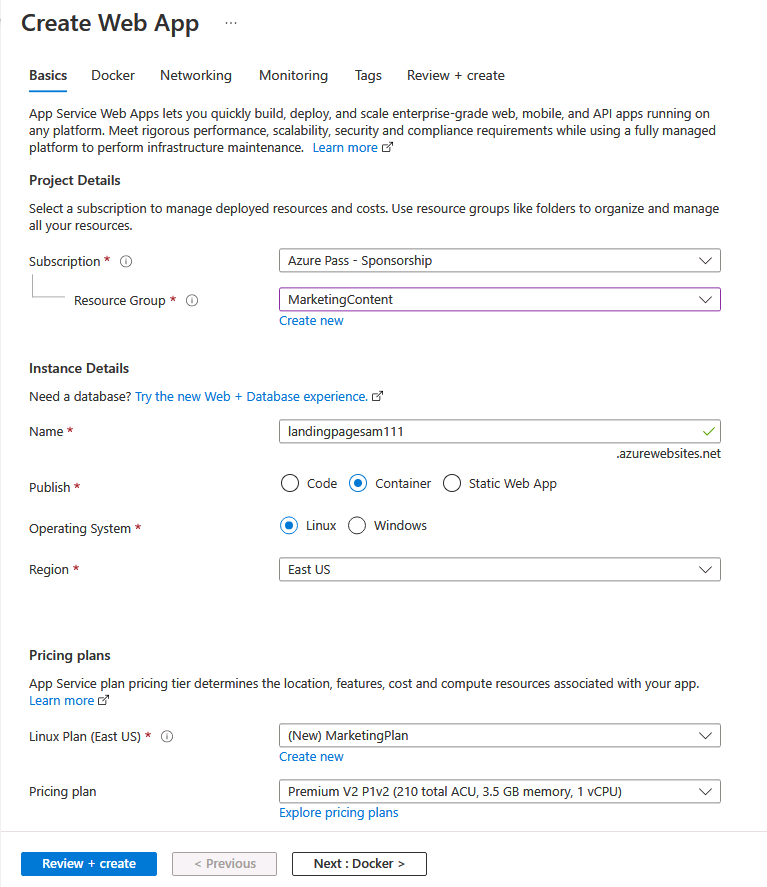

---
lab:
  az204Title: 'Lab 12: Enhance a web application by using the Azure Content Delivery Network'
  az204Module: 'Learning Path 12: Implement caching for solutions'
---

# Laboratório 12: Aprimorar um aplicativo Web usando a rede de distribuição de conteúdo do Azure

## Interface de usuário do Microsoft Azure

Dada a natureza dinâmica das ferramentas de nuvem da Microsoft, você pode se deparar com alterações na IU do Azure que ocorram após o desenvolvimento deste conteúdo do treinamento. Como resultado, as instruções do laboratório e as etapas do laboratório podem não estar alinhadas corretamente.

A Microsoft atualiza este curso de treinamento quando a comunidade nos alerta sobre as alterações necessárias. No entanto, as atualizações na nuvem ocorrem com frequência, portanto você pode encontrar alterações na interface de usuário antes que esse conteúdo de treinamento seja atualizado. **Se isso ocorrer, adapte-se às alterações e trabalhe com elas nos laboratórios, conforme necessário.**

## Instruções

### Antes de começar

#### Entrar no ambiente de laboratório

Entre na máquina virtual (VM) do Windows 11 usando as seguintes credenciais:

- Nome de usuário: `Admin`
- Senha: `Pa55w.rd`

> **Observação**: Seu instrutor fornecerá instruções para se conectar ao ambiente de laboratório virtual.

#### Examinar os aplicativos instalados

Localize a barra de tarefas na área de trabalho do Windows 11. A barra de tarefas contém o ícone do aplicativo que você usará neste laboratório:

- Microsoft Edge

## Cenário do laboratório

Neste laboratório, você implementará os recursos da rede de distribuição de conteúdo do Azure para fornecer uma solução de cache com base nos locais do cliente. O laboratório configura uma conta de armazenamento para arquivos de imagem e vídeo, que são os mais afetados pelos problemas de latência. Você usará a rede de distribuição de conteúdo do Azure para implementar a solução de cache de modo a ajudar a reduzir a latência desses arquivos de imagem e vídeo.

## Diagrama de arquitetura


### Exercício 1: Criar recursos do Azure

#### Tarefa 1: Abrir o portal do Azure

1. Na barra de tarefas, selecione o ícone **Microsoft Edge**.

1. Na janela aberta do navegador, navegue até o portal do Azure em `https://portal.azure.com` e entre com a conta que você usará para este laboratório.

   > **Observação**: Se esta for a primeira vez que entra no portal do Azure, você receberá um tour pelo portal. Selecione **Introdução** para ignorar o tour e começar a usar o portal.

#### Tarefa 2: Criar uma conta de armazenamento

1. No portal do Azure, use a caixa de texto **Pesquisar recursos, serviços e documentos** para procurar por **Conta de armazenamento** e selecione **Contas de armazenamento**.

1. Na folha **Contas de armazenamento**, selecione **+ Criar**.

1. Na folha **Criar uma conta de armazenamento**, na guia **Informações básicas**, realize as seguintes ações e selecione **Próximo: Avançado >**:

   | Configuração | Ação |
   | -- | -- |
   | Lista suspensa **Assinatura** | Manter o valor padrão |
   | Seção **Grupo de recursos** | Selecione **Criar novo**, digite **MarketingContent** e selecione **OK** |
   | Caixa de texto **Nome da conta de armazenamento** | Digite **contenthost**_[yourname]_ |
   | Lista suspensa **Região** | Selecione **(EUA) Leste dos EUA** |
   | Seção **Desempenho** | Selecione a opção **Padrão** |
   | Lista suspensa **Redundância** | Selecione **LRS (Armazenamento com redundância local)** |

    A captura de tela a seguir exibe as configurações definidas na folha **Criar uma conta de armazenamento**.

    

1. Na guia **Avançado**, verifique se a opção **Permitir a habilitação do acesso anônimo em contêineres individuais** está habilitada. Marque a caixa se não estiver habilitada.

1. Na guia **Revisão**, revise as opções selecionadas nas etapas anteriores.

1. Selecione **Criar** para criar a conta de armazenamento usando a configuração especificada.

    > **Observação**: aguarde a conclusão da tarefa de criação antes de avançar neste laboratório.

#### Tarefa 3: Criar um aplicativo Web usando o Serviço de Aplicativo do Azure

1. No painel de navegação do portal do Azure, selecione **Criar um recurso**.

1. Na folha **Criar um recurso** na caixa de texto **serviço Pesquisa e marketplace**, digite **Aplicativo Web** e selecione Enter.

1. Na folha de resultados da pesquisa, selecione o resultado **Aplicativo Web** e clique em **Criar**.

1. Na folha **Criar aplicativo Web**, na guia **Básico**, realize as seguintes ações e selecione **Avançar: Docker**:

   | Configuração | Ação |
   | -- | -- |
   | Lista suspensa **Assinatura** | Manter o valor padrão |
   | Lista suspensa **Grupo de recursos** | Selecione **MarketingContent** na lista |
   | Caixa de texto **Nome** | Digite **landingpage**_[yourname]_ |
   | Seção **Publicar** | Selecione **Contêiner do Docker** |
   | Seção **Sistema operacional** | Selecione **Linux** |
   | Lista suspensa **Região** | Selecione **Leste dos EUA** |
   | Seção **Plano Linux (Leste dos EUA)** | Selecione **Criar novo**. Na caixa de texto **Nome**, digite **MarketingPlan** e clique em **OK**. |
   | Seção **Plano de preços** | Manter o valor padrão |

   A captura de tela a seguir exibe as configurações definidas na folha **Criar aplicativo Web**.

   

1. Na guia **Docker**, realize as seguintes ações e selecione **Revisar + criar**:

   | Configuração | Ação |
   | -- | -- |
   | Lista suspensa **Opções** | Selecione **Contêiner único** |
   | Lista suspensa **Fonte da imagem** | Selecione **Docker Hub** |
   | Lista suspensa **Tipo de acesso** | Selecione **Público** |
   | Caixa de texto **Imagem e marca** | Digite **microsoftlearning/edx-html-landing-page:latest** |

   A captura de tela a seguir exibe as configurações definidas na guia **Docker**.

   

1. Na guia **Revisar + criar**, revise as opções selecionadas nas etapas anteriores.

1. Selecione **Criar** para criar o aplicativo Web usando a configuração especificada.

    > **Observação**: aguarde a conclusão da tarefa de criação antes de avançar neste laboratório.

1. Na folha **Implantação**, selecione **Ir para recurso**.

1. Na folha **Visão Geral do Serviço de Aplicativo**, em **Essentials**, registre o valor do link do **Domínio padrão**. Você usará esse valor mais adiante no laboratório.

#### Revisão

Neste exercício, você criou uma conta de armazenamento do Azure e um aplicativo Web do Azure que usará posteriormente neste laboratório.

### Exercício 2: configurar a rede de distribuição de conteúdo e os pontos de extremidade

#### Tarefa 1: Abrir o Azure Cloud Shell

1. No portal do Azure, selecione o ícone **Cloud Shell**  para abrir uma nova sessão do Bash. Se o Cloud Shell tiver como padrão uma sessão do PowerShell, selecione **PowerShell** e, no menu suspenso, selecione **Bash**.

    > **Observação**: Se esta for a primeira vez que você está iniciando o **Cloud Shell**, quando solicitado a selecionar **Bash** ou **PowerShell**, selecione **Bash**. Quando receber a mensagem **Você não tem nenhum armazenamento montado**, selecione a assinatura que você está usando no laboratório e selecione **Criar armazenamento**.

1. No portal do Azure, no prompt de comando do **Cloud Shell**, execute o seguinte comando para obter a versão da ferramenta de interface de linha de comando do Azure (CLI do Azure):

    ```bash
    az --version
    ```

#### Tarefa 2: Registrar o provedor Microsoft.CDN

1. No prompt de comando do **Cloud Shell** no portal, realize as seguintes ações:

    a.  Digite o comando a seguir para verificar se o Microsoft.CDN foi registrado. Passe para a etapa 2. se o Microsoft.CDN já tiver sido registrado:

    ```bash
    az provider show --namespace Microsoft.CDN --query "registrationState"
    ```

    b.  Se o Microsoft.CDN não tiver sido registrado. Insira o seguinte comando e selecione Enter para registrar o namespace **Microsoft.CDN** com sua assinatura atual:

    ```bash
    az provider register --namespace Microsoft.CDN
    ```

1. Feche o painel do **Cloud Shell** no portal.

#### Tarefa 3: Criar um perfil de rede de distribuição de conteúdo

1. No painel de navegação do portal do Azure, selecione **Criar um recurso**.

1. Na folha **Criar um recurso** na caixa de texto **serviço Pesquisa e marketplace**, digite **CDN** e selecione Enter.

1. Na folha de resultados da pesquisa **Marketplace**, selecione o resultado **Front Door e perfis de CDN** e clique em **Criar**.

1. Na página **Comparar ofertas**, selecione **Explorar outras ofertas**, selecione **CDN Standard do Azure da Microsoft (clássico)** e, em seguida, selecione **Continuar**.

1. Na folha **Perfil de CDN**, na guia **Noções básicas**, realize as seguintes ações e selecione **Revisar + criar**:

   | Configuração | Ação |
   | -- | -- |
   | Lista suspensa **Assinatura** | Manter o valor padrão |
   | Lista suspensa **Grupo de recursos** | Selecione **MarketingContent** na lista |
   | Caixa de texto **Nome** | Digite **contentdeliverynetwork** |
   | Caixa de texto **Região** | Mantenha o valor padrão **Global** |
   | Lista suspensa **Tipo de preço** | Mantenha o valor padrão **CDN da Microsoft (clássico)** |
   | Caixa de seleção **Criar um novo ponto de extremidade de CDN** | Não selecionado |

   A captura de tela a seguir exibe as configurações definidas na guia **Perfil de CDN**.

   

1. Na guia **Revisar + criar**, revise as opções selecionadas nas etapas anteriores.

1. Selecione **Criar** para criar o perfil de CDN usando a configuração especificada.
  
    > **Observação**: aguarde até que o Azure termine de criar o perfil de CDN antes de avançar neste laboratório. Você receberá uma notificação quando o perfil for criado.

#### Tarefa 4: Configurar contêineres de armazenamento

1. No painel de navegação do portal do Azure, selecione **Grupos de recursos**.

1. Na folha **Grupos de recursos**, selecione o grupo de recursos **MarketingContent** criado anteriormente neste laboratório.

1. Na folha **MarketingContent**, selecione a conta de armazenamento **contenthost**_[yourname]_ criada anteriormente neste laboratório.

1. Na folha **Conta de armazenamento**, selecione o link **Contêineres** na seção **Armazenamento de dados**.

1. Na seção **Contêineres**, selecione **+ Contêiner**.

1. Na janela pop-up **Novo contêiner**, realize as seguintes ações e selecione **Criar**:

   | Configuração | Ação |
   | -- | -- |
   | Caixa de texto **Nome** | Digite **media** |
   | Lista suspensa **Nível de acesso público** | Selecione **Blob (acesso de leitura anônimo somente para blobs)** |

1. Na seção **Contêineres**, selecione **+ Contêiner** novamente.

1. Na janela pop-up **Novo contêiner**, realize as seguintes ações e selecione **Criar**:

   | Configuração | Ação |
   | -- | -- |
   | Caixa de texto **Nome** | Digite **video** |
   | Lista suspensa **Nível de acesso público** | Selecione **Blob (acesso de leitura anônimo somente para blobs)** |

1. Observe a lista atualizada de contêineres e confirme se os contêineres **media** e **video** estão listados.

#### Tarefa 5: Criar os pontos de extremidade da rede de distribuição de conteúdo

1. No painel de navegação do portal do Azure, selecione o link **Grupos de recursos**.

1. Na folha **Grupos de recursos**, selecione o grupo de recursos **MarketingContent** criado anteriormente neste laboratório.

1. Na folha **MarketingContent**, selecione o perfil de CDN **contentdeliverynetwork** criado anteriormente neste laboratório.

1. Na folha **Perfil de CDN**, selecione **+ Ponto de extremidade**.

1. Na caixa de diálogo pop-up **Adicionar um ponto de extremidade**, realize as seguintes ações e selecione **Adicionar**:

   | Configuração | Ação |
   | -- | -- |
   | Caixa de texto **Nome** | Digite **cdnmedia**_[yourname]_ |
   | Lista suspensa **Tipo de origem** | Selecione **Armazenamento** |
   | Lista suspensa **Nome do host de origem** | Selecione a opção **contenthost *[yourname]*.blob.core.windows.net** para a Conta de armazenamento criada anteriormente neste laboratório. |
   | Caixa de texto **Caminho de origem** | Digite **/media** |
   | Caixa de texto **Cabeçalho de host de origem** | Manter o valor padrão |
   | Seções **Protocolo** e **Porta de origem** | Mantenha os valores padrão |
   | Lista suspensa **Otimizado para** | Selecione **Entrega web geral** |

   A captura de tela a seguir exibe as configurações definidas na caixa de diálogo **Adicionar um ponto de extremidade**.

   

1. Na folha **Perfil de CDN**, selecione **+ Ponto de extremidade** novamente.

1. Na caixa de diálogo pop-up **Adicionar um ponto de extremidade**, realize as seguintes ações e selecione **Adicionar**:

   | Configuração | Ação |
   | -- | -- |
   | Caixa de texto **Nome** | Digite **cdnvideo**_[yourname]_ |
   | Lista suspensa **Tipo de origem** | Selecione **Armazenamento** |
   | Lista suspensa **Nome do host de origem** | Selecione a opção **contenthost *[yourname]*.blob.core.windows.net** para a Conta de armazenamento criada anteriormente neste laboratório. |
   | Caixa de texto **Caminho de origem** | Digite **/video** |
   | Caixa de texto **Cabeçalho de host de origem** | Manter o valor padrão |
   | Seções **Protocolo** e **Porta de origem** | Mantenha os valores padrão |
   | Lista suspensa **Otimizado para** | Selecione **Entrega web geral** |

   A captura de tela a seguir exibe as configurações definidas na caixa de diálogo **Adicionar um ponto de extremidade**.

   

1. Na folha **Perfil de CDN**, selecione **+ Ponto de extremidade** novamente.

1. Na caixa de diálogo pop-up **Adicionar um ponto de extremidade**, realize as seguintes ações e selecione **Adicionar**:

   | Configuração | Ação |
   | -- | -- |
   | Caixa de texto **Nome** | Digite **cdnweb**_[yourname]_ |
   | Lista suspensa **Tipo de origem** | Selecione **Aplicativo Web**. |
   | Lista suspensa **Nome do host de origem** | Selecione a opção **landingpage *[yourname]*.azurewebsites.net** para o aplicativo Web criado anteriormente neste laboratório |
   | Caixa de texto **Caminho de origem** | Manter o valor padrão |
   | Caixa de texto **Cabeçalho de host de origem** | Manter o valor padrão |
   | Seções **Protocolo** e **Porta de origem** | Mantenha os valores padrão |
   | Lista suspensa **Otimizado para** | Selecione **Entrega web geral** |

   A captura de tela a seguir exibe as configurações definidas na caixa de diálogo **Adicionar um ponto de extremidade**.

   

#### Revisão

Neste exercício, você registrou o provedor de recursos para a rede de distribuição de conteúdo (CDN) e usou o provedor para criar um perfil de CDN e recursos de ponto de extremidade.

### Exercício 3: carregar e configurar conteúdo estático da Web

#### Tarefa 1: Observar a página de aterrissagem

1. No painel de navegação do portal do Azure, selecione **Grupos de recursos**.

1. Na folha **Grupos de recursos**, selecione o grupo de recursos **MarketingContent** criado anteriormente neste laboratório.

1. Na folha **MarketingContent**, selecione o aplicativo Web **landingpage**_[yourname]_ criado anteriormente neste laboratório.

1. Na folha **Serviço de Aplicativo**, selecione **Procurar**. Uma nova guia do navegador é aberta e retorna o site atual. Observe a mensagem de erro exibida na tela. O site não funcionará até que você defina as configurações especificadas para fazer referência ao conteúdo multimídia.

1. Retorne à janela do navegador aberta no momento que exibe o portal do Azure.

#### Tarefa 2: Carregar blobs de armazenamento

1. No painel de navegação do portal do Azure, selecione **Grupos de recursos**.

1. Na folha **Grupos de recursos**, selecione o grupo de recursos **MarketingContent** criado anteriormente neste laboratório.

1. Na folha **MarketingContent**, selecione a conta de armazenamento **contenthost**_[yourname]_ criada anteriormente neste laboratório.

1. Na folha **Conta de armazenamento**, selecione o link **Contêineres** na seção **Armazenamento de dados**.

1. Na seção **Contêineres**, selecione o contêiner **media** e clique em **Carregar**.

1. Na janela pop-up **Carregar blob**, realize as seguintes ações:

    a.  Na seção **Arquivos**, selecione **Procurar arquivos** ou use o recurso de arrastar e soltar.

    b.  Na janela do **Explorador de Arquivos**, navegue até **Allfiles (F):\\Allfiles\\Labs\\12\\Starter**, selecione os seguintes arquivos e clique em **Abrir**:

    - **campus.jpg**

    - **conference.jpg**

    - **poster.jpg**

    c.  Verifique se a opção **Substituir se os arquivos já existirem** está selecionada e clique em **Carregar**.  

    > **Observação**: aguarde o carregamento do blob antes de continuar com este laboratório.

1. Na folha **Contêiner**, selecione **Propriedades** na seção **Configurações**.

1. Registre o valor na caixa de texto **URL**. Você usará esse valor mais adiante no laboratório.

1. Feche a folha do **Contêiner**.

1. Na folha **Contêineres**, selecione o contêiner **video** e clique em **Carregar**.

1. Na janela pop-up **Carregar blob**, realize as seguintes ações:

    a.  Na seção **Arquivos**, selecione **Procurar arquivos** ou use o recurso de arrastar e soltar.

    b.  Na janela do **Explorador de Arquivos**, navegue até **Allfiles (F):\\Allfiles\\Labs\\12\\Starter**, selecione o arquivo **welcome.mp4** e clique em **Abrir**:

    c.  Verifique se a opção **Substituir se os arquivos já existirem** está selecionada e clique em **Carregar**.  

    > **Observação**: aguarde o carregamento do blob antes de continuar com este laboratório.

1. Na folha **Contêiner**, selecione **Propriedades** na seção **Configurações**.

1. Registre o valor na caixa de texto **URL**. Você usará esse valor mais adiante no laboratório.

#### Tarefa 3: Definir as configurações de do aplicativo Web

1. No painel de navegação do portal do Azure, selecione **Grupos de recursos**.

1. Na folha **Grupos de recursos**, selecione o grupo de recursos **MarketingContent** criado anteriormente neste laboratório.

1. Na folha **MarketingContent**, selecione o aplicativo Web **landingpage**_[yourname]_ criado anteriormente neste laboratório.

1. Na folha **Serviço de Aplicativo**, na categoria **Configurações**, selecione o link **Configuração**.

1. Na seção **Configuração**, selecione a guia **Configurações do aplicativo** e selecione **Nova configuração do aplicativo**.

1. Na janela pop-up **Adicionar/editar configuração do aplicativo**, defina as configurações a seguir e selecione **OK**.

   | Configuração | Ação |
   | -- | -- |
   | Caixa de texto **Nome** | Digite **CDNMediaEndpoint** |
   | Caixa de texto **Valor** | Insira o valor de **URI** do contêiner **media** na conta de armazenamento **contenthost**_[yourname]_ registrada anteriormente neste laboratório |
   | Caixa de seleção **Configuração do slot de implantação** | Não selecionar |

1. Retorne à seção **Configuração** e selecione **Nova configuração do aplicativo**.

1. Na janela pop-up **Adicionar/editar configuração do aplicativo**, defina as configurações a seguir e selecione **OK**.

   | Configuração | Ação |
   | -- | -- |
   | Caixa de texto **Nome** | Digite **CDNVideoEndpoint** |
   | Caixa de texto **Valor** | Insira o valor de **URI** do contêiner **video** na conta de armazenamento **contenthost**_[yourname]_ registrada anteriormente neste laboratório |
   | Caixa de seleção **Configuração do slot de implantação** | Não selecionar |

1. Retorne à seção **Configuração** e selecione **Salvar**. Selecione **Continuar** para confirmar as alterações.

   > **Observação**: aguarde até que as configurações do aplicativo sejam persistidas antes de avançar neste laboratório.

#### Tarefa 4: Validar a página de aterrissagem corrigida

1. No painel de navegação do portal do Azure, selecione **Grupos de recursos**.

1. Na folha **Grupos de recursos**, selecione o grupo de recursos **MarketingContent** criado anteriormente neste laboratório.

1. Na folha **MarketingContent**, selecione o aplicativo Web **landingpage**_[yourname]_ criado anteriormente neste laboratório.

1. Na folha **Serviço de Aplicativo**, selecione **Reiniciar** e clique em **Sim** para confirmar o processo de reinicialização do aplicativo.

   > **Observação**: aguarde o término da operação de reinicialização antes de avançar neste laboratório. Você receberá uma notificação quando a operação terminar.

1. Na folha **Serviço de Aplicativo**, selecione **Procurar**. Uma nova janela ou guia do navegador será aberta e retornará ao site atual. Observe o site atualizado renderizar os diferentes tipos de conteúdo multimídia.

1. Retorne à janela do navegador aberta no momento que exibe o portal do Azure.

#### Revisão

Neste exercício, você carregou conteúdo multimídia como blobs em contêineres de armazenamento e, em seguida, atualizou seu aplicativo Web para apontar diretamente para os blobs de armazenamento.

### Exercício 4: Usar pontos de extremidade da Rede de Distribuição de Conteúdo

#### Tarefa 1: Recuperar URIs (Uniform Resource Identifiers) de ponto de extremidade

1. No painel de navegação do portal do Azure, selecione o link **Grupos de recursos**.

1. Na folha **Grupos de recursos**, selecione o grupo de recursos **MarketingContent** criado anteriormente neste laboratório.

1. Na folha **MarketingContent**, selecione o perfil de CDN **contentdeliverynetwork** criado anteriormente neste laboratório.

1. Na folha **Perfil de CDN**, selecione o ponto de extremidade **cdnmedia**_[yourname]_.

1. Na folha **Ponto de extremidade**, copie o valor do link **Nome do host do ponto de extremidade**. Você usará esse valor mais adiante no laboratório.

1. Feche a folha do **Ponto de extremidade**.

1. Na folha **Perfil de CDN**, selecione o ponto de extremidade **cdnvideo**_[yourname]_.

1. Na folha **Ponto de extremidade**, copie o valor do link **Nome do host do ponto de extremidade**. Você usará esse valor mais adiante no laboratório.

1. Feche a folha do **Ponto de extremidade**.

#### Tarefa 2: Testar o conteúdo multimídia

1. Construa uma URL para o recurso **campus.jpg** combinando a URL do **nome do host** do ponto de extremidade **cdnmedia**_[yourname]_ copiado anteriormente neste laboratório com o caminho relativo **/campus.jpg**.

    > **Observação**: por exemplo, se a URL do **Nome do host do ponto de extremidade** for `https://cdnmediastudent.azureedge.net/`, a URL recém-construída será `https://cdnmediastudent.azureedge.net/campus.jpg`.

1. Construa uma URL para o recurso **conference.jpg** combinando a URL do **nome do host** do ponto de extremidade **cdnmedia**_[yourname]_ copiado anteriormente neste laboratório com o caminho relativo **/conference.jpg**.

    > **Observação**: por exemplo, se a URL do **Nome do host do ponto de extremidade** for `https://cdnmediastudent.azureedge.net/`, a URL recém-construída será `https://cdnmediastudent.azureedge.net/conference.jpg`.

1. Construa uma URL para o recurso **poster.jpg** combinando a URL do **nome do host** do ponto de extremidade **cdnmedia**_[yourname]_ copiado anteriormente neste laboratório com o caminho relativo **/poster.jpg**.

    > **Observação**: por exemplo, se a URL do **Nome do host do ponto de extremidade** for `https://cdnmediastudent.azureedge.net/`, a URL recém-construída será `https://cdnmediastudent.azureedge.net/poster.jpg`.

1. Construa uma URL para o recurso **welcome.mp4** combinando a URL do **nome do host** do ponto de extremidade **cdnmedia**_[yourname]_ copiado anteriormente neste laboratório com o caminho relativo **/welcome.mp4**.

    > **Observação**: por exemplo, se a URL do **Nome do host do ponto de extremidade** for `https://cdnvideostudent.azureedge.net/`, a URL recém-construída será `https://cdnvideostudent.azureedge.net/welcome.mp4`.

1. Na barra de tarefas, ative o menu de atalho para o ícone do **Microsoft Edge** e selecione **Nova janela**.

1. Na nova janela do navegador, acesse a URL que você construiu para o recurso de mídia **campus.jpg** e verifique se ele é encontrado com sucesso.

    > **Observação**: se o conteúdo ainda não estiver disponível, o ponto de extremidade da CDN ainda estará inicializando. Esse processo de inicialização pode levar de 5 a 15 minutos.

1. Acesse a URL que você construiu para o recurso de mídia **conference.jpg** e verifique se ele é encontrado com sucesso.

1. Acesse a URL que você construiu para o recurso de mídia **poster.jpg** e verifique se ele é encontrado com sucesso.

1. Acesse a URL que você construiu para o recurso de vídeo **welcome.mp4** e verifique se ele é encontrado com sucesso.

1. Feche a janela do navegador que você criou nesta tarefa.

#### Tarefa 3: Atualizar as configurações do aplicativo Web

1. No painel de navegação do portal do Azure, selecione **Grupos de recursos**.

1. Na folha **Grupos de recursos**, selecione o grupo de recursos **MarketingContent** criado anteriormente neste laboratório.

1. Na folha **MarketingContent**, selecione o aplicativo Web **landingpage**_[yourname]_ criado anteriormente neste laboratório.

1. Na folha **Serviço de Aplicativo**, na categoria **Configurações**, selecione o link **Configuração**.

1. Na seção **Configuração**, selecione a guia **Configurações do aplicativo**.

1. Selecione a configuração do aplicativo **CDNMediaEndpoint** existente.

1. Na caixa de diálogo pop-up **Adicionar/editar configuração do aplicativo**, atualize a caixa de texto **Valor** inserindo a URL do **Nome do host** do ponto de extremidade **cdnmedia**_[yourname]_ copiado anteriormente neste laboratório e selecione **OK**.

1. Selecione a configuração do aplicativo **CDNVideoEndpoint** existente.

1. Na caixa de diálogo pop-up **Adicionar/editar configuração do aplicativo**, atualize a caixa de texto **Valor** inserindo a URL do **Nome do host** do ponto de extremidade **cdnvideo**_[yourname]_ copiado anteriormente neste laboratório e selecione **OK**.

1. Selecione **Salvar** e depois **Continuar** para confirmar as alterações.  

   > **Observação**: aguarde até que as configurações do aplicativo sejam persistidas antes de avançar neste laboratório.

1. Na seção **Configuração**, selecione **Visão geral**.

1. Na seção **Visão geral**, selecione **Reiniciar** e clique em **Sim** para confirmar o processo de reinicialização do aplicativo.

   > **Observação**: aguarde o término da operação de reinicialização antes de continuar com este laboratório. Você receberá uma notificação quando a operação terminar.

#### Tarefa 4: Testar o conteúdo da Web

1. No painel de navegação do portal do Azure, selecione o link **Grupos de recursos**.

1. Na folha **Grupos de recursos**, selecione o grupo de recursos **MarketingContent** criado anteriormente neste laboratório.

1. Na folha **MarketingContent**, selecione o perfil de CDN **contentdeliverynetwork** criado anteriormente neste laboratório.

1. Na folha Perfil da **CDN**, selecione o ponto de extremidade **cdnweb**_[yourname]_.

1. Na folha **Ponto de extremidade**, copie o valor do link **Nome do host do ponto de extremidade**.

1. Na barra de tarefas, ative o menu de atalho para o ícone do **Microsoft Edge** e selecione **Nova janela**.

1. Na nova janela do navegador, acesse a URL do **Nome do host** do ponto de extremidade **cdnweb**_[yourname]_.

1. Observe o site e o conteúdo multimídia que são exibidos usando a rede de distribuição de conteúdo.

#### Revisão

Neste exercício, você atualizou seu aplicativo Web para usar a rede de distribuição de conteúdo para exibir conteúdo multimídia e o próprio aplicativo Web.
